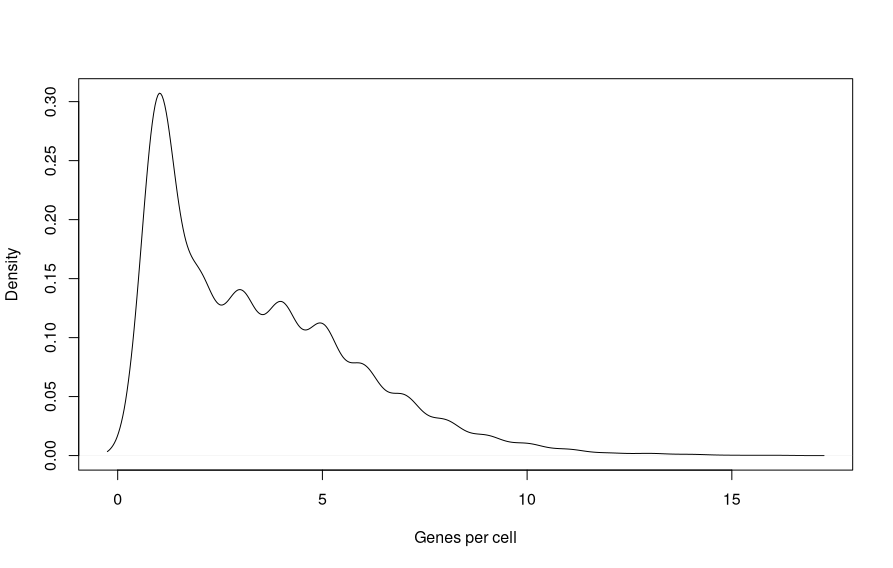
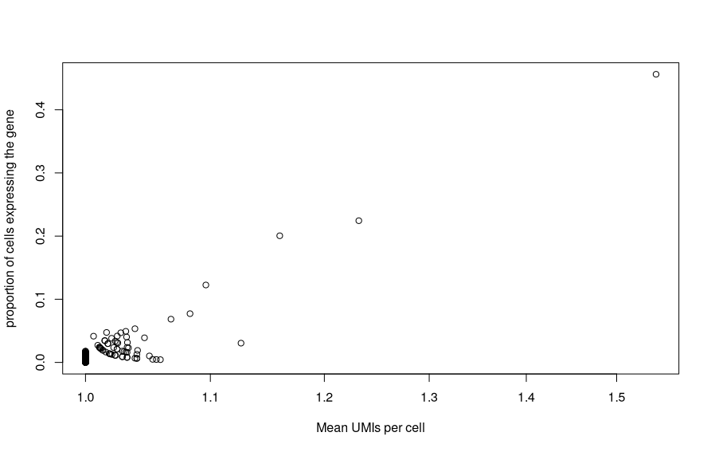
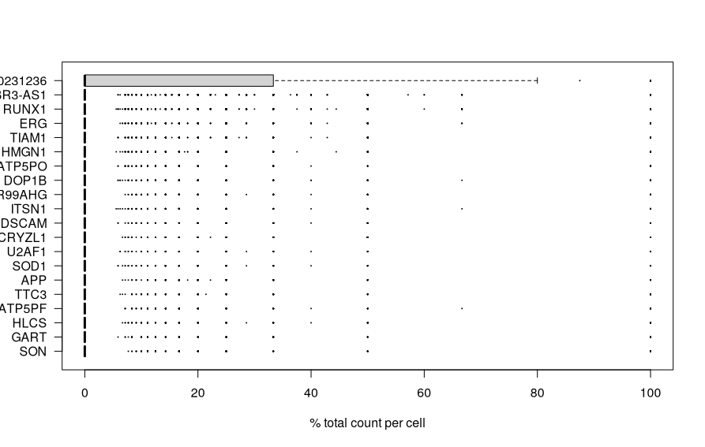

# QC and Exploratory Analysis


!!! r-project "code"

    ```r
    library(DropletUtils)
    library(scater)
    library(ensembldb)
    library(AnnotationHub)
    library(BiocParallel)
    library(tidyverse)
    library(patchwork)
    library(ggvenn)
    ```

!!! r-project "code"

    ```r
    setwd("/nesi/project/nesi02659/sc-rna")
    samplesheet <- read.csv("Data/sample_sheet.tsv")
    ```

    - Here were are selecting to use forked processes with MulticoreParam and instructing the function to use 4 cores 
    ```r
    bp.params <- MulticoreParam(workers = 4)
    ```
    ```r
    sample.path <- "Data/CellRanger_Outputs/SRR9264343/outs/filtered_feature_bc_matrix/"
    sce.sing <- read10xCounts(sample.path, col.names=TRUE, BPPARAM = bp.params)
    sce.sing
    ```
    ??? circle-check "Output"

        ```bash
        class: SingleCellExperiment 
        dim: 37764 3153 
        metadata(1): Samples
        assays(1): counts
        rownames(37764): ENSG00000243485 ENSG00000237613 ...
          ENSG00000278817 ENSG00000277196
        rowData names(3): ID Symbol Type
        colnames(3153): AAACCTGAGACTTTCG-1 AAACCTGGTCTTCAAG-1 ...
          TTTGTCACAGGCTCAC-1 TTTGTCAGTTCGGCAC-1
        colData names(2): Sample Barcode
        reducedDimNames(0):
        mainExpName: NULL
        altExpNames(0):
        ```
### The SingleCellExperiment object

!!! quote ""

    The data have been loaded as a [SingleCellExperiment](https://bioconductor.org/packages/release/bioc/html/SingleCellExperiment.html) object. The details of the structure of the object are described here. In summary, it stores various data types in a single object. Currently it will contain:
    
    - the count matrix
    - feature (gene) metadata
    - cell (droplet) metadata
    
    Later we will also add the outcomes of downstream analysis such as normalisation and dimensionality reduction.
    
    


### The counts matrix 
!!! r-project "code"

    ```
    dim(counts(sce.sing))
    counts(sce.sing)[1:10, 1:10]
    ```
    ??? circle-check "Output"
        ```r
        10 x 10 sparse Matrix of class "dgCMatrix"
          [[ suppressing 10 column names 'AAACCTGAGACTTTCG-1', 'AAACCTGAGGTAGCCA-1', 'AAACCTGCAACGATGG-1' ... ]]
                                           
        ENSG00000289905 . . . . . . . . . .
        ENSG00000279669 . . . . . . . . . .
        ENSG00000279094 . . . . . . . . . .
        ENSG00000274333 . . . . . . . . . .
        ENSG00000279784 . . . . . . . . . .
        ENSG00000279064 . . . . . . . . . .
        ENSG00000288187 . . . . . . . . . .
        ENSG00000275496 . . . . . . . . . .
        ENSG00000278903 . . . . . . . . . .
        ENSG00000280145 . . . . . . . . . .
        ```
!!! r-project "code"

    ```r
    rowData(sce.sing)
    ```
    ??? circle-check "Output"

        ```r
        DataFrame with 558 rows and 3 columns
                                     ID          Symbol            Type
                            <character>     <character>     <character>
        ENSG00000289905 ENSG00000289905 ENSG00000289905 Gene Expression
        ENSG00000279669 ENSG00000279669 ENSG00000279669 Gene Expression
        ENSG00000279094 ENSG00000279094       LINC01670 Gene Expression
        ENSG00000274333 ENSG00000274333 ENSG00000274333 Gene Expression
        ENSG00000279784 ENSG00000279784 ENSG00000279784 Gene Expression
        ...                         ...             ...             ...
        ENSG00000160305 ENSG00000160305           DIP2A Gene Expression
        ENSG00000223692 ENSG00000223692       DIP2A-IT1 Gene Expression
        ENSG00000160307 ENSG00000160307           S100B Gene Expression
        ENSG00000160310 ENSG00000160310           PRMT2 Gene Expression
        ENSG00000289511 ENSG00000289511 ENSG00000289511 Gene Expression
        ```
    ```r
    rownames(counts(sce.sing))[1:6]
    ```
!!! r-project "code"

    ```r
    colData(sce.sing)
    colnames(counts(sce.sing))[1:6]
    ```

## Properties of scRNA-seq data

### Number of genes detected per cell

!!! r-project "code"
    ```r
    genesPerCell <- colSums(counts(sce.sing) > 0)
    plot(density(genesPerCell), main="", xlab="Genes per cell")
    ```
    {width="600"}

###  Total UMI for a gene versus the number of times detected

!!! r-project "code"

    ```r
    plot(rowSums(counts(sce.sing)) / rowSums(counts(sce.sing) > 0),
         rowMeans(counts(sce.sing) > 0),
         log = "x",
         xlab="Mean UMIs per cell",
         ylab="proportion of cells expressing the gene"
    )
    ```
    {width="600"}

### Distribution of counts for a gene across cells

!!! r-project "code"

    ```r
    rel_expression <- t( t(counts(sce.sing)) / colSums(counts(sce.sing))) * 100
    rownames(rel_expression) <- rowData(sce.sing)$Symbol
    most_expressed <- sort(rowSums( rel_expression ), decreasing = T)[20:1]
    plot_data <- as.matrix(t(rel_expression[names(most_expressed),]))
    
    boxplot(plot_data, cex=0.1, las=1, xlab="% total count per cell", horizontal=TRUE)
    ```

    ??? circle-check "Output"
    
        

## Quality Control 

### Load multiple samples