# QC and Exploratory Analysis


!!! r-project "code"

    ```r
    library(DropletUtils)
    library(scater)
    library(ensembldb)
    library(AnnotationHub)
    library(BiocParallel)
    library(tidyverse)
    library(patchwork)
    library(ggvenn)
    ```

!!! r-project "code"

    ```r
    setwd("/nesi/project/nesi02659/sc-rna")
    samplesheet <- read.tsv("Data/sample_sheet.tsv")
    ```

    - Here were are selecting to use forked processes with MulticoreParam and instructing the function to use 4 cores 
    ```r
    bp.params <- MulticoreParam(workers = 7)
    ```
    ```r
    sample.path <- "Data/CellRanger_Outputs/SRR9264343/outs/filtered_feature_bc_matrix/"
    sce.sing <- read10xCounts(sample.path, col.names=TRUE, BPPARAM = bp.params)
    sce.sing
    ```
    ??? circle-check "Output"

        ```bash
        class: SingleCellExperiment 
        dim: 37764 3153 
        metadata(1): Samples
        assays(1): counts
        rownames(37764): ENSG00000243485 ENSG00000237613 ...
          ENSG00000278817 ENSG00000277196
        rowData names(3): ID Symbol Type
        colnames(3153): AAACCTGAGACTTTCG-1 AAACCTGGTCTTCAAG-1 ...
          TTTGTCACAGGCTCAC-1 TTTGTCAGTTCGGCAC-1
        colData names(2): Sample Barcode
        reducedDimNames(0):
        mainExpName: NULL
        altExpNames(0):
        ```
### The SingleCellExperiment object

!!! quote ""

    The data have been loaded as a [SingleCellExperiment](https://bioconductor.org/packages/release/bioc/html/SingleCellExperiment.html) object. The details of the structure of the object are described here. In summary, it stores various data types in a single object. Currently it will contain:
    
    - the count matrix
    - feature (gene) metadata
    - cell (droplet) metadata
    
    Later we will also add the outcomes of downstream analysis such as normalisation and dimensionality reduction.
    
    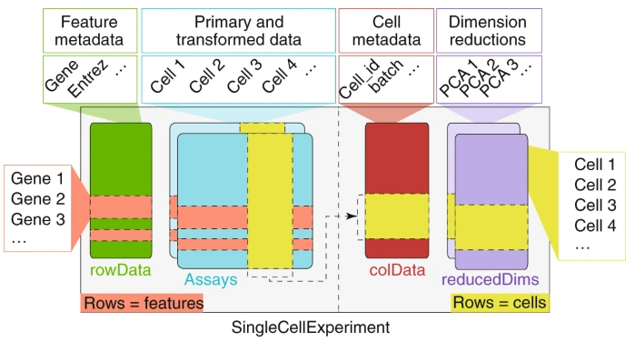


### The counts matrix 

Compared to bulk RNA-seq, Single-cell RNA-seq data is sparse, i.e. there many missing values or zeroes. This is particularly true with droplet-based methods such as 10X, mostly because:

- any given cell does not express each gene
- the library preparation does not capture all transcript the cell does express
- the sequencing depth per cell is far lower and so fewer of the expressed genes are detected

We can access the counts matrix with counts. Given the large number of droplets in a sample, count matrices can be large.

!!! r-project "code"

    ```r
    dim(counts(sce.sing))
    ```

    - They are however very sparse, that is, most of the entries are 0’s. To save memory the counts can be stored in a ‘sparse matrix’ that only stores non-zero values, in this case as a dgCMatrix object.
    ```r
    counts(sce.sing)[1:10, 1:10]
    ```
    ??? circle-check "Output"
        ```r
        10 x 10 sparse Matrix of class "dgCMatrix"
          [[ suppressing 10 column names 'AAACCTGAGACTTTCG-1', 'AAACCTGGTCTTCAAG-1', 'AAACCTGGTGCAACTT-1' ... ]]
                                           
        ENSG00000243485 . . . . . . . . . .
        ENSG00000237613 . . . . . . . . . .
        ENSG00000186092 . . . . . . . . . .
        ENSG00000238009 . . . . . . . . . .
        ENSG00000239945 . . . . . . . . . .
        ENSG00000239906 . . . . . . . . . .
        ENSG00000241860 . . . . . . . . . .
        ENSG00000241599 . . . . . . . . . .
        ENSG00000286448 . . . . . . . . . .
        ENSG00000236601 . . . . . . . . . .
        ```

### Features

Details about the “features” (in this case genes) can by accessed using the rowData function. Currently it contains the ensembl gene ID and the gene symbol, which have been derived from the 10x reference used by CellRanger. It also contains a “Type” column, which tells us what sort of data we are looking at; in this case it is “Gene Expression”. If we wish to, we can add further annotation to the features by adding extra columns to this data frame.

!!! r-project "code"

    ```r
    rowData(sce.sing)
    ```
    ??? circle-check "Output - The rows of this table correspond to the rows of the count matrix; the row names of this table will match the row names of the counts matrix - currently these are the Ensembl IDS:"

        ```r
        DataFrame with 37764 rows and 3 columns
                                     ID          Symbol            Type
                            <character>     <character>     <character>
        ENSG00000243485 ENSG00000243485     MIR1302-2HG Gene Expression
        ENSG00000237613 ENSG00000237613         FAM138A Gene Expression
        ENSG00000186092 ENSG00000186092           OR4F5 Gene Expression
        ENSG00000238009 ENSG00000238009 ENSG00000238009 Gene Expression
        ENSG00000239945 ENSG00000239945 ENSG00000239945 Gene Expression
        ...                         ...             ...             ...
        ENSG00000277836 ENSG00000277836 ENSG00000277836 Gene Expression
        ENSG00000278633 ENSG00000278633 ENSG00000278633 Gene Expression
        ENSG00000276017 ENSG00000276017 ENSG00000276017 Gene Expression
        ENSG00000278817 ENSG00000278817 ENSG00000278817 Gene Expression
        ENSG00000277196 ENSG00000277196 ENSG00000277196 Gene Expression
        ```
    ```r
    rownames(counts(sce.sing))[1:6]
    ```
### Droplet annotation

!!! r-project "code"

    ```r
    colData(sce.sing)
    colnames(counts(sce.sing))[1:6]
    ```

## Properties of scRNA-seq data

### Number of genes detected per cell

The number and identity of genes detected in a cell varies greatly across cells: the total number of genes detected across all cells is far larger than the number of genes detected in each cell.

For the current set of samples the total number of genes detected across cells was 26468 out of 37764 gene in the reference, but if we look at the number of genes detected in each cell, we can see that this ranges from 40 to 5547, with a median of 2562.


!!! r-project "code"
    ```r
    genesPerCell <- colSums(counts(sce.sing) > 0)
    plot(density(genesPerCell), main="", xlab="Genes per cell")
    ```
    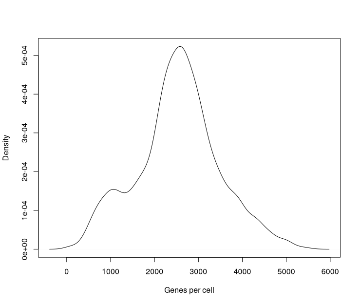{width="600"}

###  Total UMI for a gene versus the number of times detected

If we compare the number of UMI’s assigned to an individual gene to the number of cells in which that gene is detected, we can see that highly expressed genes tend to be detected in a higher proportion of cells than lowly expressed genes.


!!! r-project "code"

    ```r
    plot(rowSums(counts(sce.sing)) / rowSums(counts(sce.sing) > 0),
         rowMeans(counts(sce.sing) > 0),
         log = "x",
         xlab="Mean UMIs per cell",
         ylab="proportion of cells expressing the gene"
    )
    ```
    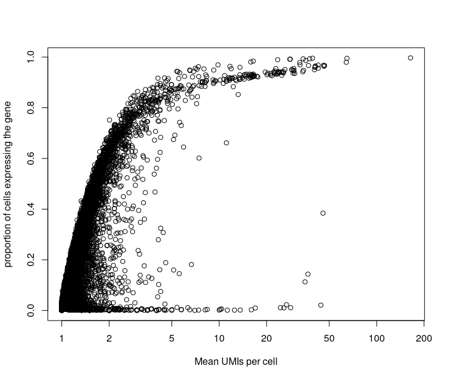{width="600"}

### Distribution of counts for a gene across cells

We could also look at the distribution of counts for individual genes across all cells. The plot below shows this distribution for the top 20 genes detected.

!!! r-project "code"

    ```r
    rel_expression <- t( t(counts(sce.sing)) / colSums(counts(sce.sing))) * 100
    rownames(rel_expression) <- rowData(sce.sing)$Symbol
    most_expressed <- sort(rowSums( rel_expression ), decreasing = T)[20:1]
    plot_data <- as.matrix(t(rel_expression[names(most_expressed),]))
    
    boxplot(plot_data, cex=0.1, las=1, xlab="% total count per cell", horizontal=TRUE)
    ```

    ??? circle-check "Output"
    
        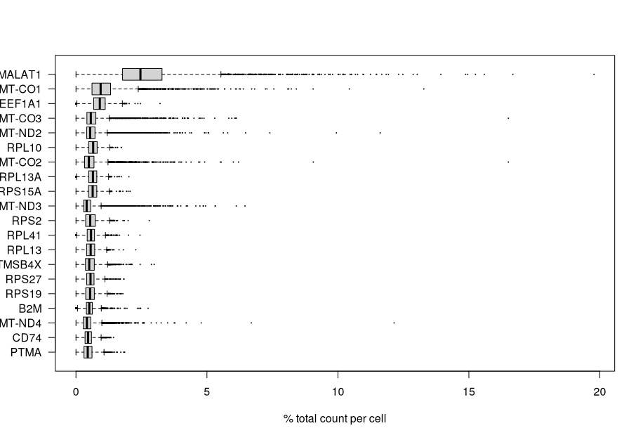

## Quality Control 

??? circle-info "info"

    The cell calling performed by CellRanger does not always retain only droplets containing cells. Poor-quality cells, or rather droplets, may be caused by cell damage during dissociation or failed library preparation. They usually have low UMI counts, few genes detected and/or high mitochondrial content. The presence of these droplets in the data set may affect normalisation, assessment of cell population heterogeneity, and clustering:
    
    - Normalisation: Contaminating genes, ‘the ambient RNA’, are detected at low levels in all libraries. In low quality libraries with low RNA content, scaling will increase counts for these genes more than for better-quality cells, resulting in their apparent upregulation in these cells and increased variance overall.
    - Cell population heterogeneity: variance estimation and dimensionality reduction with PCA where the first principal component will be correlated with library size, rather than biology.
    - Clustering: higher mitochondrial and/or nuclear RNA content may cause low-quality cells to cluster separately or form states or trajectories between distinct cell types.
    In order to remove or reduce the impact of poor-quality droplets on our downstream analysis we will attempt to filter them out using some QC metrics. The three principle means of doing this are to apply thresholds for inclusion on three characteristics:
    
    - The library size defined as the total sum of UMI counts across all genes; cells with small library sizes are considered to be of low quality as the RNA has not been efficiently captured, i.e. converted into cDNA and amplified, during library preparation.
    
    - The number of expressed genes in each cell defined as the number of genes with non-zero counts for that cell; any cell with very few expressed genes is likely to be of poor quality as the diverse transcript population has not been successfully captured.
    
    - The proportion of UMIs mapped to genes in the mitochondrial genome; high proportions are indicative of poor-quality cells, possibly because of loss of cytoplasmic RNA from perforated cells (the reasoning is that mitochondria are larger than individual transcript molecules and less likely to escape through tears in the cell membrane).
    
    The [scater](https://bioconductor.org/packages/3.11/bioc/html/scater.html) function `addPerCellQC()` will compute various per droplet QC metrics and will add this information as new columns in the droplet annotation (`colData`) of the single cell object.
    
### Load multiple samples

We can load multiple samples at the same time using the read10xCounts command. This will create a single object containing the data for multiple samples. We can then QC and filter the samples in conjunction. As we will see later, this is not always optimal when samples have been processed in multiple batches.

As an example we will one sample from each sample group. Again we will start with the filtered counts matrix, which only contains cells called by CellRanger. We pass the read10xCounts a named vector containing the paths to the filtered counts matrices that we wish to load; the names of the vector will be used as the sample names in the Single Cell Experiment object.

!!! r-project "code"

    ```r
    samples <- samplesheet$Sample[c(1,5,7,9)]
    list_of_files <- str_c("Data/CellRanger_Outputs/", 
                           samples, 
                           "/outs/filtered_feature_bc_matrix")
    names(list_of_files) <- samples
    list_of_files
    
    sce <- read10xCounts(list_of_files, col.names=TRUE, BPPARAM = bp.params)
    sce
    ```

    ??? circle-check "Output"
        ```bash
        class: SingleCellExperiment 
        dim: 37764 14809 
        metadata(1): Samples
        assays(1): counts
        rownames(37764): ENSG00000243485 ENSG00000237613 ... ENSG00000278817 ENSG00000277196
        rowData names(3): ID Symbol Type
        colnames(14809): 1_AAACCTGAGACTTTCG-1 1_AAACCTGGTCTTCAAG-1 ... 4_TTTGGTTAGGTGCTAG-1 4_TTTGGTTGTGCATCTA-1
        colData names(2): Sample Barcode
        reducedDimNames(0):
        mainExpName: NULL
        altExpNames(0):
        ```
### Modify the droplet annotation

Currently, the droplet annotation in `colData` slot of the `sce` object has two columns: “Sample” and “Barcode”. The “Sample” is the name of the sample as we provided it to `read10xCounts`, the “Barcode” is the barcode for the droplet (cell).

!!! r-project "code"

    ```r
    colData(sce)
    ```
The “Barcode” column contains the cell/droplet barcode and comprises the actual sequence and a ‘group ID’, e.g. AAACCTGAGAAACCAT-1. The ‘group ID’ helps distinguish cells from different samples that have identical barcode sequences, however, as each sample was processed separately with CellRanger, the group ID is set to 1 in all data sets. In the rownames DropUtils has helpfully add a prefix to each barcode to distinguish between samples. We will replace the “Barcode” column with the these.

We will also add information from the sample metadata table to the `colData` object. We will be using the merge function to do this. Unfortunately, this function removes the rownames from the DFrame, so we will need to replace them.

!!! r-project "code"
    ```r
    sce$Barcode <- rownames(colData(sce))
    colData(sce) <- merge(colData(sce), samplesheet, by="Sample", sort=FALSE)
    rownames(colData(sce)) <- sce$Barcode
    ```

### Undetected genes

Although the count matrix has 37764 genes, many of these will not have been detected in any droplet.

About a fifth of the genes have not been detected in any droplet. We can remove these before proceeding in order to reduce the size of the single cell experiment object.

!!! r-project "code"
    ```r
    detected_genes <- rowSums(counts(sce)) > 0
    table(detected_genes)
    sce <- sce[detected_genes,]
    ```
### Annotate genes

In order to assess the percentage of mitochondrial UMIs, we will need to be able to identify mitochondrial genes. The simplest way to do this is to annotate the genes with their chromosome of origin.

There are many ways we could annotate our genes in R. We will use AnnotationHub. `AnnotationHub` has access to a large number of annotation databases. Our genes are currently annotated with Ensembl IDs, so we will use Ensembl human database. We will also specify that we want the database corresponding to Ensembl release 107 as this the release from which the CellRanger gene annotation was generated.


!!! r-project "code"

    -  Running following command for the first time will prompt the question `/home/$USER/.cache/R/AnnotationHub does not exist, create directory? (yes/no):` . Reply `yes` to it 

    ```r
    ah <- AnnotationHub()
    ```
    ```r
    ens.hs.107<- query(ah, c("Homo sapiens", "EnsDb", 107))[[1]] 
    
    genes <- rowData(sce)$ID
    gene_annot <- AnnotationDbi::select(ens.hs.107, 
                                        keys = genes,
                                        keytype = "GENEID",
                                        columns = c("GENEID", "SEQNAME")) %>%
        set_names(c("ID", "Chromosome"))
    rowData(sce) <- merge(rowData(sce), gene_annot, by = "ID", sort=FALSE)
    rownames(rowData(sce)) <- rowData(sce)$ID
    
    rowData(sce)
    ```
### Add per cell QC metrics

We can now add per cell QC metrics to the droplet annotation using the function addPerCellQC. In order to get the metrics for the subset of mitochondrial genes, we need to pass the function a vector indicating which genes are mitochondrial.

!!! r-project "code"

    ```r
    is.mito <- which(rowData(sce)$Chromosome=="MT")
    sce <- addPerCellQC(sce, subsets=list(Mito=is.mito), BPPARAM = SerialParam())
    colData(sce)
    ```
!!! info "Info"
    
    The function has added six columns to the droplet annotation:
    
    - **sum**: total UMI count
    - **detected:** number of features (genes) detected
    - **subsets_Mito_sum:** number of UMIs mapped to mitochondrial transcripts
    - **subsets_Mito_detected:** number of mitochondrial genes detected
    - **subsets_Mito_percent:** percentage of UMIs mapped to mitochondrial transcripts
    - **total:** also the total UMI count

    We will use sum, detected, and subsets_Mito_percent to further filter the cells.

### QC metric distribution

Before moving on to do the actual cell filtering, it is always a good idea to explore the distribution of the metrics across the droplets.

We can use the `scater` function `plotColData` to generate plots that provide a look at these distributions on a per sample basis.

!!! r-project "code"

    ```r
    plotColData(sce, x="SampleName", y="sum") + 
        scale_y_log10() + 
        ggtitle("Total count")
    ```
    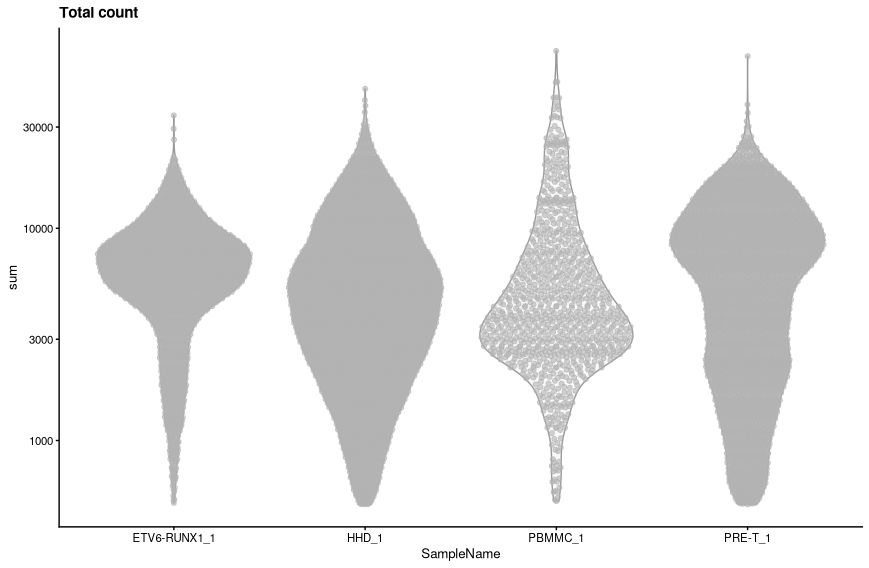{width="600"}

    ```r 
    plotColData(sce, x="SampleName", y="detected") + 
    scale_y_log10() + 
    ggtitle("Detected features")
    ```
    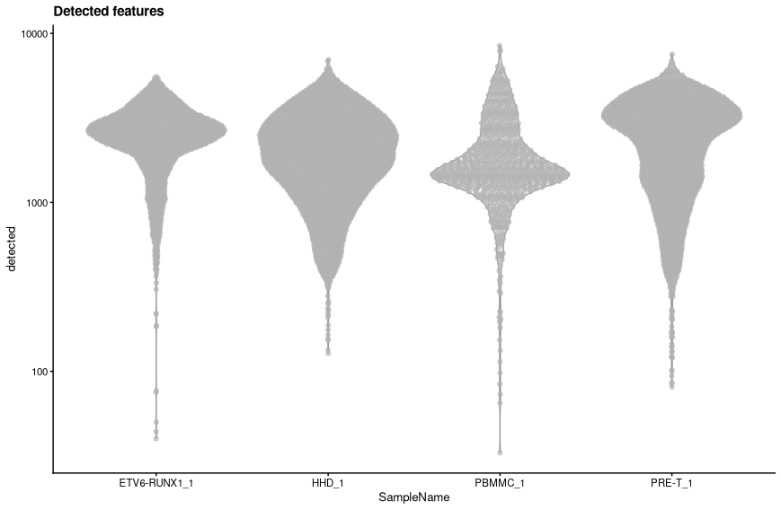{width="600"}

    ```r
    plotColData(sce, x="SampleName", y="subsets_Mito_percent") + 
    ggtitle("Mito percent")
    ```

    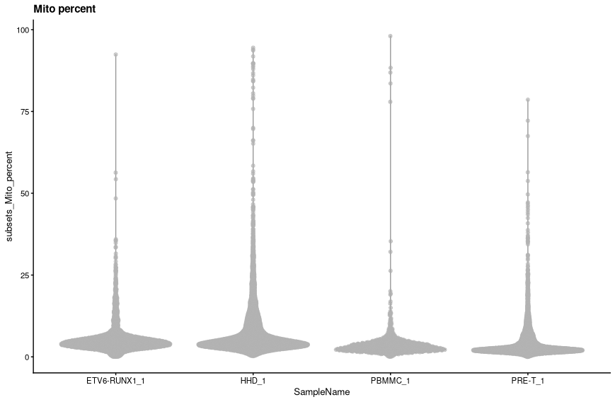{width="600"}

    A scatter plot shows the extent to which library size and numbers of genes detected are correlated.

    ```r
    colData(sce) %>% 
        as.data.frame() %>% 
        arrange(subsets_Mito_percent) %>% 
        ggplot(aes(x = sum, y = detected)) +
        geom_point(aes(colour = subsets_Mito_percent > 10)) + 
        facet_wrap(vars(SampleGroup))
    ```
    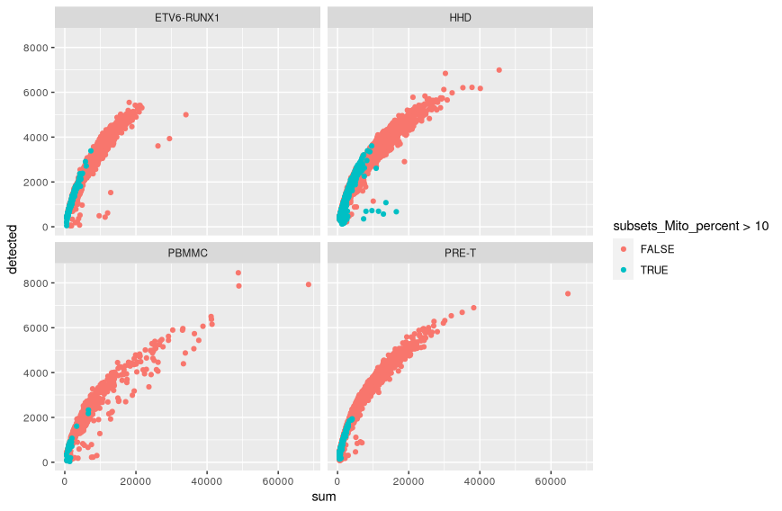{width="600"}

###  Identification of low-quality cells with adaptive thresholds

One could use hard threshold for the library size, number of genes detected and mitochondrial content based on the distributions seen above. These would need vary across runs and the decision making process is somewhat arbitrary. It may therefore be preferable to rely on outlier detection to identify cells that markedly differ from most cells.

We saw above that the distribution of the QC metrics is close to Normal. Hence, we can detect outliers using the median and the [median absolute deviation (MAD) from the median](https://en.wikipedia.org/wiki/Median_absolute_deviation) (not the mean and the standard deviation which both are sensitive to outliers).

For a given metric, an outlier value is one that lies over some number of MADs away from the median. A cell will be excluded if it is an outlier in the part of the range to avoid, for example low gene counts, or high mitochondrial content. For a normal distribution, a threshold defined with a distance of 3 MADs from the median retains about 99% of values.

The `scater` function `isOutlier` can be used to detect outlier cells based on any metric in the `colData` table. It returns a boolean vector that identifies outliers. By default it will mark any cell that is 3 MADS in either direction from the median as an outlier.

#### Library size

With library size we wish to identify outliers that have very low library sizes, this indicates that the droplets either contain poor quality cells, perhaps damaged or dying, or do not contain a cell at all.

The library size distribution tends to have a long tail to the right (small numbers of cells with very high UMI counts). We therefore log transform the library size in order to the make the distribution closer to normal. This also improves the resolution of the smaller library sizes and ensures that we do not end up with negative threshold.

!!! r-project "code"
    ```r
    low_lib_size <- isOutlier(sce$sum, log=TRUE, type="lower")
    table(low_lib_size)
    ```

    - This has excluded 0 cells. We can view the threshold values to check that they seem reasonable.
    ```r
    attr(low_lib_size, "thresholds")
    ```

    - We can view the effect of the filtering using `plotColData`.
    ```r
    colData(sce)$low_lib_size <- low_lib_size
    plotColData(sce, x="SampleName", y="sum", colour_by = "low_lib_size") + 
        scale_y_log10() + 
        labs(y = "Total count", title = "Total count") +
        guides(colour=guide_legend(title="Discarded"))
    ```
    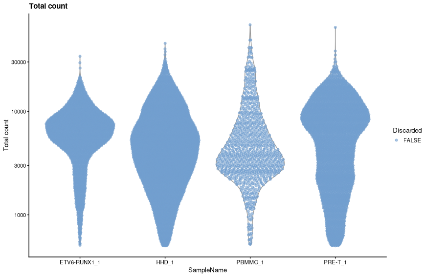{width="600"}

#### Number of genes 

As with the library size, we will log tranform the number of genes detected prior to filtering using the median absolute deviation.

!!! r-project "code"
    ```r
    low_n_features <- isOutlier(sce$detected, log=TRUE, type="lower")
    table(low_n_features)
    ```

    - This has excluded out 173 cells. The threshold value was:
    ```r
    attr(low_n_features, "thresholds")[1]
    ```

    - We can view the effect of the filtering using plotColData.
    ```r
    colData(sce)$low_n_features <- low_n_features
    plotColData(sce, x="SampleName", y="detected", colour_by = "low_n_features") + 
        scale_y_log10() + 
        labs(y = "Genes detected", title = "Genes detected") +
        guides(colour=guide_legend(title="Discarded"))
    ```

    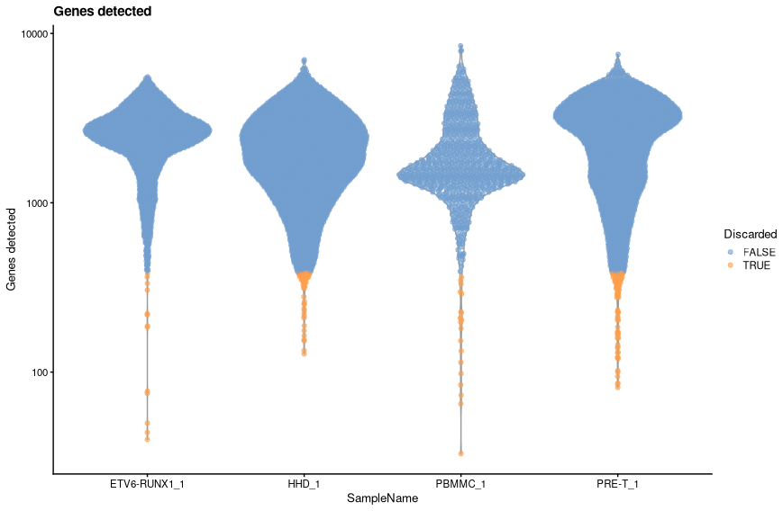{width="600"}

#### Mitochondrial content 


For the mitochondrial content the exclusion zone is in the higher part of the distribution. For this reason we do not need to worry about log transforming the data as want to remove the long right hand tail anyway.

!!! r-project "code"
    ```r
    high_Mito_percent <- isOutlier(sce$subsets_Mito_percent, type="higher")
    table(high_Mito_percent)  
    ```

    - This has removed 1720 cells in total. The upper threshold value:
    ```r
    attr(high_Mito_percent, "thresholds")[2]
    ```

    - We can view the effect of the filtering using plotColData.
    ```r
    colData(sce)$high_Mito_percent <- high_Mito_percent
    plotColData(sce,
                x="SampleName",
                y="subsets_Mito_percent",
                colour_by = "high_Mito_percent") + 
        labs(y = "Percentage mitochondrial UMIs",
             title = "Mitochondrial UMIs") +
        guides(colour=guide_legend(title="Discarded"))
    ```
    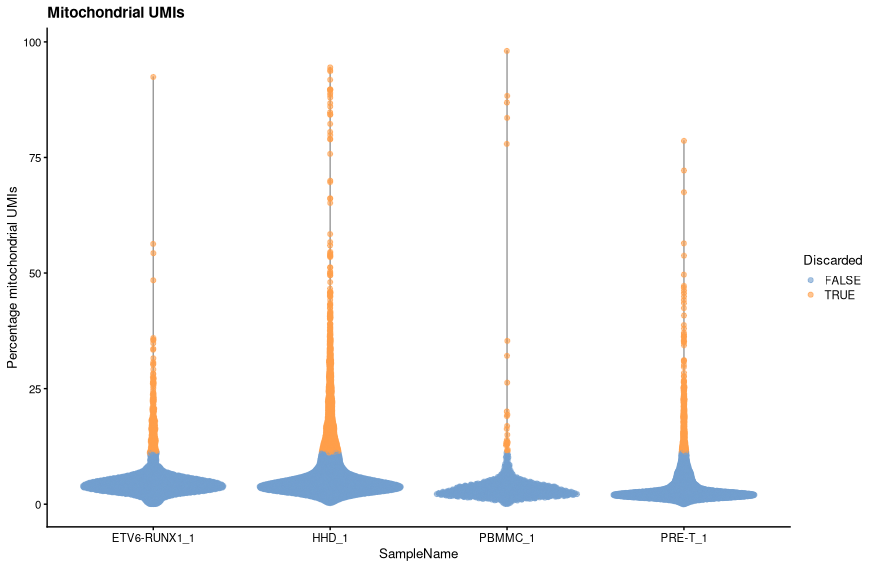{width="600"}

#### Summary of discarded cells

Having applied each of the three thresholds separately, we can now combine them to see how many droplets in total we will be excluding.

!!! r-project "code"
    ```r
    tibble(low_lib_size, low_n_features, high_Mito_percent) %>%
      mutate(discard = low_lib_size | low_n_features | high_Mito_percent) %>% 
      mutate(SampleName=colData(sce)$SampleName) %>% 
      group_by(SampleName)  %>%
      summarise(across(where(is.logical), sum))
    ```

#### All three filter steps at once

The three steps above may be run in one go using the quickPerCellQC function. This creates a DataFrame with 4 columns containing TRUE/FALSE - one for each filter metric and one called “discard” that combined the three logicals.

!!! r-project "code"

    ```r
    cell_qc_results <- quickPerCellQC(colData(sce), sub.fields = TRUE)
    ```
    ```r
    cell_qc_results %>%
      as.data.frame() %>% 
      mutate(SampleName=colData(sce)$SampleName) %>% 
      group_by(SampleName) %>%
      summarise(across(where(is.logical), sum))
    ```

#### Assumptions

Data quality depends on the tissue analysed, some being difficult to dissociate, e.g. brain, so that one level of QC stringency will not fit all data sets.

Filtering based on QC metrics as done here assumes that these QC metrics are not correlated with biology. This may not necessarily be true in highly heterogenous data sets where some cell types represented by good-quality cells may have low RNA content or high mitochondrial content.

#### Considering experimental factors when filtering
The samples analysed here may have been processed in different batches leading to differences in the overall distribution of UMI counts, numbers of genes detected and mitochondrial content. Such differences would affect the adaptive thesholds discussed above - that is, as the distributions of the metrics differ, perhaps we should really apply the adaptive thresholding for each batch rather than universally across all samples. The `quickPerCellQC has a “batch” argument that allows us to specify with samples belong to which batches. The batches are then filtered independently.

!!! r-project "code"

    ```r
    batch.cell_qc_results <- quickPerCellQC(colData(sce), 
                                             sub.fields = TRUE,
                                             batch=sce$Sample)
    ```
    ```r
    batch.cell_qc_results %>%
      as.data.frame() %>% 
      mutate(SampleName=colData(sce)$SampleName) %>% 
      group_by(SampleName) %>%
      summarise(across(where(is.logical), sum))
    ```
The table below shows how the thresholds for each metric differ between the batch-wise analysis and the analysis using all samples.

!!! r-project "code"

    ```r
    all.thresholds <- tibble(`SampleName`="All",
                             `Library Size`=attr(cell_qc_results$low_lib_size, "thresholds")[1],
                             `Genes detected`=attr(cell_qc_results$low_n_features, "thresholds")[1],
                             `Mitochondrial UMIs`=attr(cell_qc_results$high_subsets_Mito_percent, "thresholds")[2])
    
    
    tibble(`Sample`=names(attr(batch.cell_qc_results$low_lib_size, "thresholds")[1,]),
           `Library Size`=attr(batch.cell_qc_results$low_lib_size, "thresholds")[1,],
           `Genes detected`=attr(batch.cell_qc_results$low_n_features, "thresholds")[1,],
           `Mitochondrial UMIs`=attr(batch.cell_qc_results$high_subsets_Mito_percent, "thresholds")[2,]) %>% 
      left_join(samplesheet) %>% 
      select(SampleName, `Library Size`, `Genes detected`, `Mitochondrial UMIs`) %>% 
      bind_rows(all.thresholds) %>% 
      mutate(across(where(is.numeric), round, digits=2))
    ```
    <center>

    |SampleName | Library Size | Genes detected | Mitochondrial UMIs|
    |:----------|:-------------|:---------------|:------------------|
    |ETV6-RUNX1_1|	1475.79	   |1018.21	        |9.56               |
    |HHD_1	     |297.78	   |318.38	        |12.14              |
    |PRE-T_1	 |252.52	   |382.36	        |6.24               |
    |PBMMC_1	 |580.14	   |496	            |7.23               |
    |All	     |373.1	       |387.88	        |11.14              |

    </center>

    - Let’s replace the columns in the droplet annotation with these new filters.

    ```r
    sce$low_lib_size <- batch.cell_qc_results$low_lib_size
    sce$low_n_features <- batch.cell_qc_results$low_n_features
    sce$high_Mito_percent <- batch.cell_qc_results$high_subsets_Mito_percent
    sce$discard <- batch.cell_qc_results$discard
    ```

    - We can visualise how the new filters look using violin plots.
    ```r
    plotColData(sce, x="SampleName", y="sum", colour_by = "low_lib_size") + 
        scale_y_log10() + 
        labs(y = "Total count", title = "Total count") +
        guides(colour=guide_legend(title="Discarded"))
    ```
    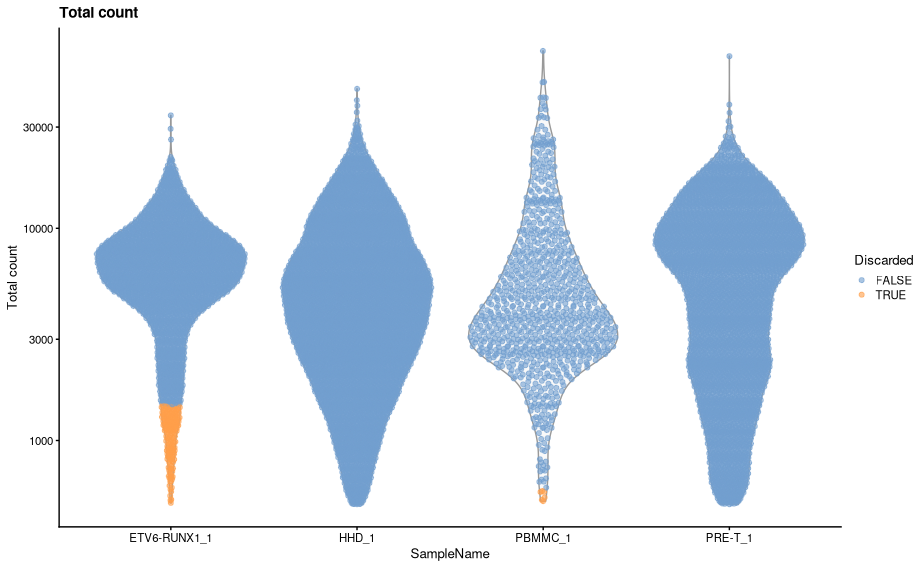{width="600"}


    ```r
    plotColData(sce, x="SampleName", y="detected", colour_by = "low_n_features") + 
        scale_y_log10() + 
        labs(y = "Genes detected", title = "Genes detected") +
        guides(colour=guide_legend(title="Discarded"))
    ```

    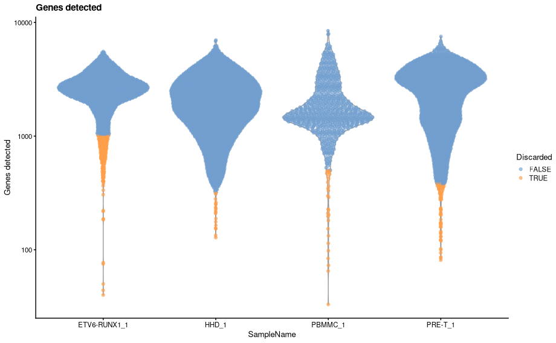{width="600"}

    - There are some distinct differences, most noticeable is that some cells are now being filtered based on library size for both ETV6-RUNX1_1 and PBMMC_1a. The venn diagrams below show how the number of discarded droplets in have changed for each filter in comparison to when the MAD filtering was applied across all samples.

    ```r
    pc1 <- tibble(`All together`=cell_qc_results$low_lib_size, 
                  `By batch`=batch.cell_qc_results$low_lib_size) %>% 
               ggvenn(show_percentage = FALSE) +
                   labs(title="Library Size")
    
    pc2 <- tibble(`All together`=cell_qc_results$low_n_features, 
                  `By batch`=batch.cell_qc_results$low_n_features) %>% 
               ggvenn(show_percentage = FALSE) +
                   labs(title="Genes detected")
    
    pc3 <- tibble(`All together`=cell_qc_results$high_subsets_Mito_percent, 
                     `By batch`=batch.cell_qc_results$high_subsets_Mito_percent) %>% 
               ggvenn(show_percentage = FALSE) +
                   labs(title="Mitochondrial UMIs")
    
    pc1 + pc2 + pc3
    ```
    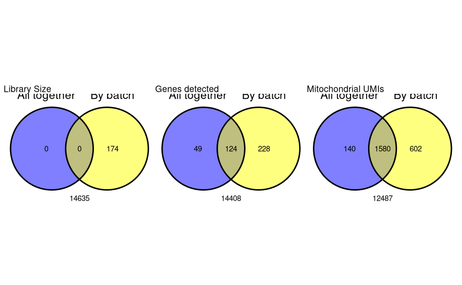{width="600"}

    - The most striking difference is in the filtering by library size. As we can see from the violin plots ETV6-RUNX1_1 has a markedly different library size distribution to the other three samples. When we applied the adaptive filters across all samples, the lower distributions of the other three samples caused the MADs to be distorted and resulted in a threshold that was inappropriately low for the ETV6-RUNX1_1 samples.

### Filtering out poor quality cells
