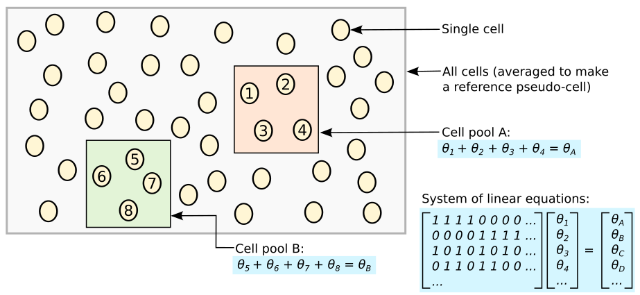
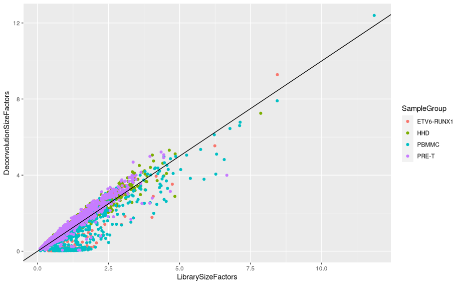
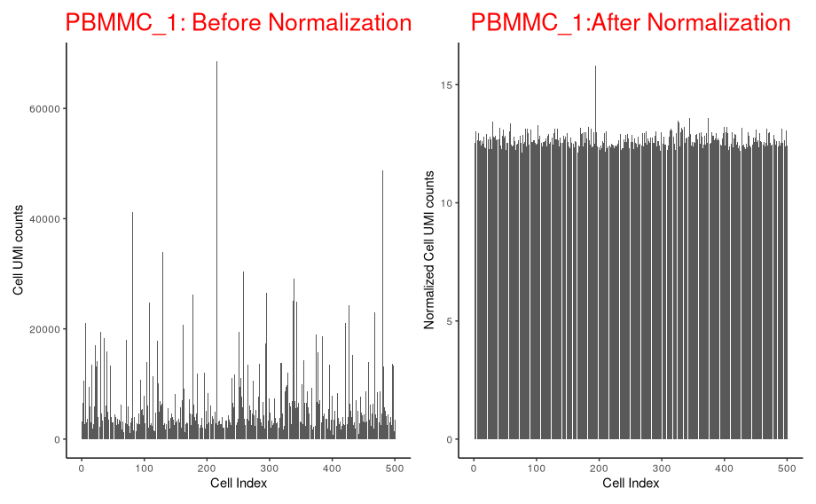
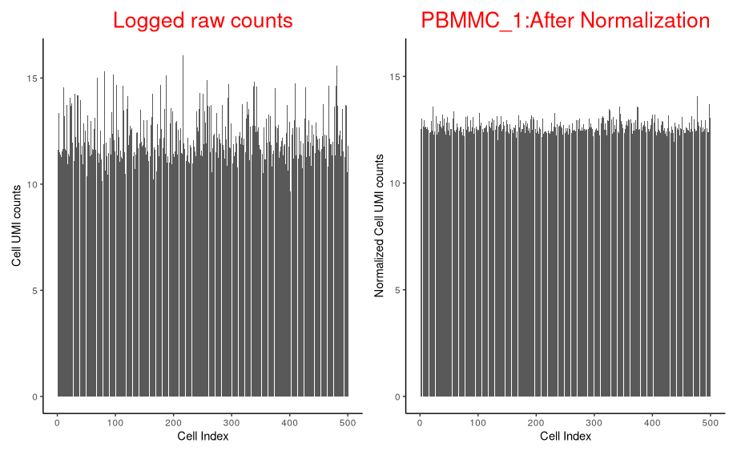
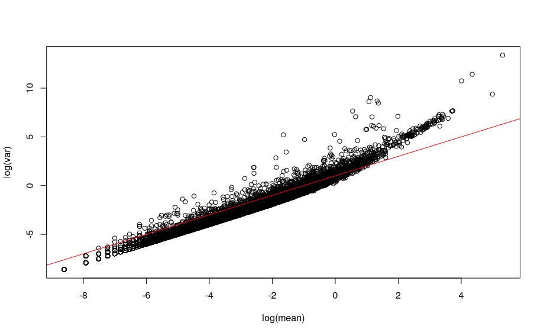
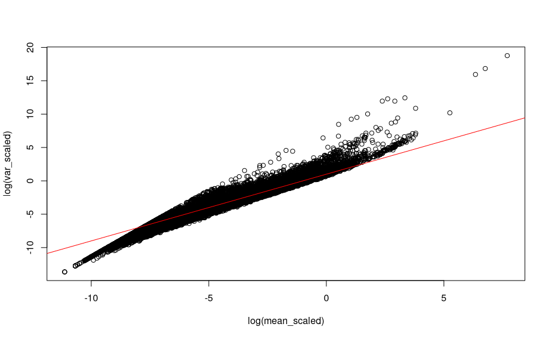
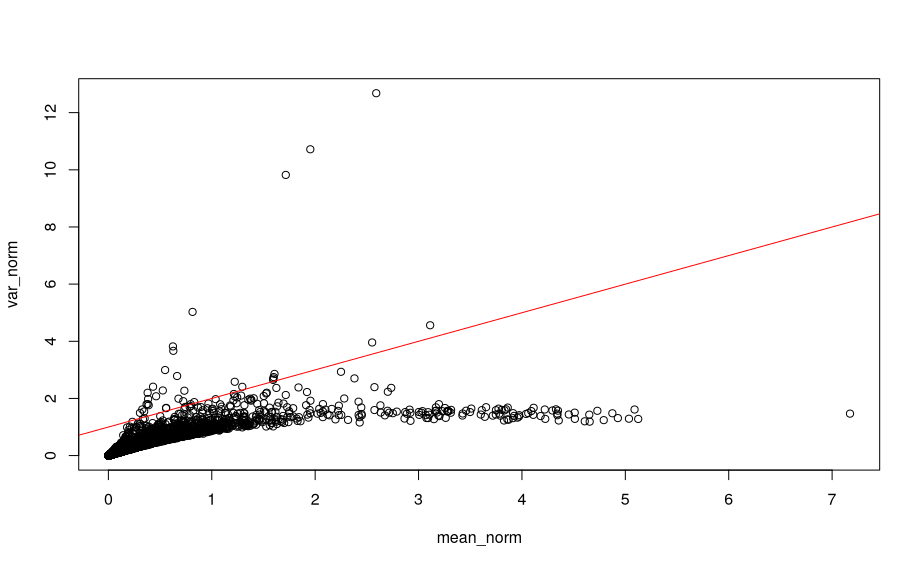

# 3. Normalisation


!!! r-project "code"

    ```r
    library(scater)
    library(scran)
    library(sctransform)
    library(tidyverse)
    library(BiocParallel)
    library(patchwork)
    bpp <- MulticoreParam(7)
    ```

## Load data object 

For the purposes of this demonstration we have generated a smaller data set in which there are only 500 cells per sample. This is so that the code can be run in a reasonable amount of time during the live teaching session. The data were first QC’d and filtered as described in the QC and exploratory analysis session. After this 500 cells were selected at random from each sample.

!!! r-project "code"
    ```r
    sce <- readRDS("R_objects/Caron_filtered.500.rds")
    sce
    ```

    ??? circle-check "Output"
    
        ```
        class: SingleCellExperiment 
        dim: 29346 5500 
        metadata(1): Samples
        assays(1): counts
        rownames(29346): ENSG00000243485 ENSG00000238009 ... ENSG00000275063 ENSG00000278817
        rowData names(4): ID Symbol Type Chromosome
        colnames(5500): 1_CGACTTCGTCCAGTTA-1 1_AGAATAGCATACGCTA-1 ... 8_AGCGTCGAGATGTAAC-1 8_CATGACAAGATAGGAG-1
        colData names(10): Sample Barcode ... subsets_Mito_percent total
        reducedDimNames(0):
        mainExpName: NULL
        altExpNames(0):
        ```
    ```r
    table(sce$SampleName)
    ```
## Why normalise ? 

!!! r-project "code"

    ```r
    oneSamTab <- colData(sce) %>% 
      as.data.frame() %>% 
      filter(SampleName == "PBMMC_1") %>% 
      dplyr::select(SampleName,Barcode, sum) %>% 
      mutate(cell_num = 1:n())
    
    p_before_nom <- ggplot(data=oneSamTab, aes(x=cell_num, y=sum)) +
      geom_bar(stat = 'identity') +
      labs( x= 'Cell Index',
            y='Cell UMI counts',
            title = "PBMMC_1: Before Normalization" ) +
      theme_classic() +
      theme(
        plot.title = element_text(hjust = 0.5, size=20, color = 'red')
      )
    
    p_before_nom
    ```
    {width="600"}

    !!! rectangle-list ""

        - Above plot shows the UMI counts/cell (transcript molecules) for 500 cell from the PBMMC_1 sample
        
        - UMI counts fluctuate
        
        - We derive biological insights downstream by comparing cells against each other.
        
        - But the UMI counts differences makes it harder to compare cells.
        
        - Why total transcript molecules (UMI counts) detected between cells differ?
        
            - Biological:

                - Cell sub type differences, like size and transcription activity etc.

            - Technical: scRNA data is inherently noisy
                - Low mRNA content per cell
                - cell-to-cell differences in mRNA capture efficiency
                - Variable sequencing depth
                - PCR amplification efficiency
        - A normalization technique makes the UMI counts distribution uniform, so that each cell has similar counts.
        
        - Normalization is a critical step that corrects cell-to-cell technical differences.
         
        - By normalizing, downstream comparisons of relative expression between cells are valid.

## Normalization strategies

!!! rectangle-list "The sparse nature of scRNA data makes normalization difficult, unlike bulk RNAseq data"
    
Broadly two classes
        - Spike-in methods
            - Uses spike-in controls for normalisation
            - Not available for droplet based scRNA techniques like 10x.
        - Non-spike-in methods:
            - Using available counts data for normalization
            - DEseq2
            - edgeR - TMM
            - Library size normalization
            - deconvolution
            - sctransform
    
Typical normalization has two steps
        - scaling
            - Estimate size or scaling or normalization factor: computation of a cell-specific ‘scaling’ or ‘size’ factor or “normalization factor” that represents the relative bias in that cell and division of all counts for the cell by that factor to remove that bias. Assumption: any cell specific bias will affect genes the same way.
            - Scale the data by dividing the count for each gene with the appropriate size factor for that cell
        - Transformation
            - log2
            - Square root transformation
            - Pearson residuals (eg. sctransform)

    Scaling methods typically generate normalised counts-per-million (CPM) or transcripts-per-million (TPM) values that address the effect of sequencing depth. These values however typically have a variance that increases with their mean (heteroscedasticity) while most statistical methods assume a stable variance, which does not vary with the mean (homoscedasticity). A widely used ‘variance stabilising transformation’ is the log transformation (often log2). This works well for highly expressed genes (as in bulk RNA-seq) but less so for sparse scRNA-seq data.

    <center></center>
    <small>* DEseq, edgeR-TMM and Library size normalization initially developed for bulk RNAseq * Applying these methods on scRNAseq data systematically under or over estimate size factors. i.e systematically deviate from true size factors. * This deviation is the result of removing zeroes prior to normalization. * Therefore other normalization methods specific to scRNAseq data like deconvolution, sctransform etc. were proposed.</small>

## Deconvolution

Because single-cell data tend to have a substantial number of low and zero counts, these bulk normalization methods may be problematic for single-cell data.

- Deconvolution aims to normalize expression values based on summed values from pools of cells.
- Since cell summation results in fewer zeros, the ensuing normalization is less susceptible to errors than existing methods.
- The estimated size factors are only relevant to the pools of cells, even though normalization accuracy has improved.
- Each pool’s size factor is deconvolved into its constituent cells’ size factors.

!!! stairs "The deconvolution method consists of several key steps:"

    <small>**References:** https://genomebiology.biomedcentral.com/articles/10.1186/s13059-016-0947-7</small>

    - Defining a pool of cells
    - Summing expression values across all cells in the pool
    - Normalizing the cell pool against an average reference, using the summed expression values
    - Repeating this for many different pools of cells to construct a linear system
    - Deconvolving the pool-based size factors to their cell-based counterparts 

    <center>{width="600"}</center>

    <small>Schematic of the deconvolution method. All cells in the data set are averaged to make a reference pseudo-cell. Expression values for cells in pool A are summed together and normalised against the reference to yield a pool-based size factor *θ*<sub>A</sub> . This is equal to the sum of the cell-based factors *θ*<sub>j</sub> for cells *j*=1–4 and can be used to formulate a linear equation. (For simplicity, the *t*<sub>j</sub> term is assumed to be unity here.) Repeating this for multiple pools (e.g., pool B) leads to the construction of a linear system that can be solved to estimate *θ*<sub>j</sub> for each cell *j*</small>

    In order to avoid pooling cells with radically different transcriptomic profiles, the cells are first clustered based on gene expression. The pools are then formed exclusively with each cluster. Size factors are calculated within each cluster and are then scaled so they are comparable across clusters.

### Cluster Cells

The table below show the number and size of clusters found:

!!! r-project "code"

    ```r
    set.seed(100)
    clust <- quickCluster(sce, BPPARAM=bpp)
    table(clust)
    ```
### Compute size factors

!!! r-project "code"

    ```r
    sce <- computePooledFactors(sce,
                 clusters = clust,
                 min.mean = 0.1,
                 BPPARAM = bpp)
    deconv.sf <- sizeFactors(sce)
    summary(deconv.sf)
    ```
    **Note:** min.mean - A numeric scalar specifying the minimum (library size-adjusted) average count of genes to be used for normalization. This means large numbers of very lowly expressed genes will not bias the normalization.

    Plot deconvolution size factors against library size factors:

    ```r
    lib.sf <- librarySizeFactors(sce)
    data.frame(LibrarySizeFactors = lib.sf, 
               DeconvolutionSizeFactors = deconv.sf,
                     SampleGroup = sce$SampleGroup) %>%
      ggplot(aes(x=LibrarySizeFactors, y=DeconvolutionSizeFactors)) +
          geom_point(aes(col=SampleGroup)) +
          geom_abline(slope = 1, intercept = 0)
    ```    
    {width="600"}

### Apply size factors

For each cell, raw counts for genes are divided by the size factor for that cell and log-transformed so downstream analyses focus on genes with strong relative differences. We use `scater::logNormCounts()`.

!!! r-project "code"
    ```r
    sce <- logNormCounts(sce)
    assayNames(sce)
    ```
### Explore the effect of normalisation

Normalised counts are much less variable across cells than raw counts

!!! r-project "code"

    ```r
    norm_counts <- logNormCounts(sce,transform='none' ) %>% 
      assay('normcounts') %>% 
      as.matrix() %>% 
      colSums()
    norm_counts <- tibble(Barcode=names(norm_counts),
                          normCounts = log2(norm_counts)
                          )
    norm_counts <- inner_join(norm_counts, oneSamTab, by='Barcode')
    
    
    p_after_norm <- ggplot(data=norm_counts, aes(x=cell_num, y=normCounts)) +
      geom_bar(stat = 'identity') +
      labs( x= 'Cell Index',
            y='Normalized Cell UMI counts',
            title = "PBMMC_1:After Normalization" ) +
      theme_classic() +
      theme(
        plot.title = element_text(hjust = 0.5, size=20, color = 'red')
      )
    
    p_before_nom + p_after_norm
    ```
    {width="600"}

    Let’s separate out the scaling normalisation from the log transformation

    What do the un-normalised data look like if we log them?

    ```r
    p_before_norm_log <- ggplot(data=oneSamTab, aes(x=cell_num, y=log2(sum))) +
      geom_bar(stat = 'identity') +
      labs( x= 'Cell Index',
            y='Cell UMI counts',
            title = "Logged raw counts" ) +
      theme_classic() +
      theme(
        plot.title = element_text(hjust = 0.5, size=20, color = 'red')
      )
    
    p_before_norm_log + p_after_norm
    ```

    {width="600"}

    Simply logging the sum of counts per cell reduces the variation a lot, but the scaling is required to do the job properly.

    The log transformation is meant to reduce the correlation between mean and variance for genes - has this worked?
    
    We can look at the relationship between the mean gene expression and variance for raw UMI counts, scaled counts and scaled, logged counts.
    
    For raw counts:
    ```r
    # mean and variance for raw counts
    mean <- rowMeans(assay(sce, "counts"))
    var <- rowVars(assay(sce, "counts"))
    ```
    ```r
    # Scatter plot
    plot(log(mean), log(var))
    abline(a=1, b=1, col="red")
    ```
    {width="600"}
    
    There is a strong linear relationship between mean and variance of UMI counts across genes.

    For scaled counts:

    ```r
    # Mean and variance for scaled counts
    mean_scaled <- logNormCounts(sce,transform='none' ) %>% 
      assay('normcounts') %>% 
      rowMeans()
    var_scaled <- logNormCounts(sce,transform='none' ) %>% 
      assay('normcounts') %>% 
      rowVars()
    
    plot(log(mean_scaled), log(var_scaled))
    abline(a=1, b=1, col="red")
    ```
    {width="600"}

    The relationship is still there after scaling the counts.

    For scaled, log transformed counts:

    ```r
    # Mean and variance for scaled, log transformed counts
    mean_norm <- rowMeans(assay(sce, "logcounts"))
    var_norm <- rowVars(assay(sce, "logcounts"))
    
    plot(mean_norm, var_norm)
    abline(a=1, b=1, col="red")
    ```
    {width="600"}
    
    <small>We see that the log transformation removes a large part of the relationship between mean and variance for gene expression values.</small>

## Save the normalised object

Make sure to create the `results` directory first.

!!! r-project "code"

    ```r
    saveRDS(sce, "results/caron_normalised.rds")
    ```
??? clipboard-question "Exercise"

    Apply the deconvolution normalisation on a single sample: ETV6-RUNX1_1.
    
    You will first load the a single cell experiment object containing the entire Caron data set. First it is necessary to select only cells that came from the sample ‘ETV6-RUNX1_1’. You can then apply the normalization by deconvolution by clustering the cells, computing size factors and using these to log-normalize the counts.

