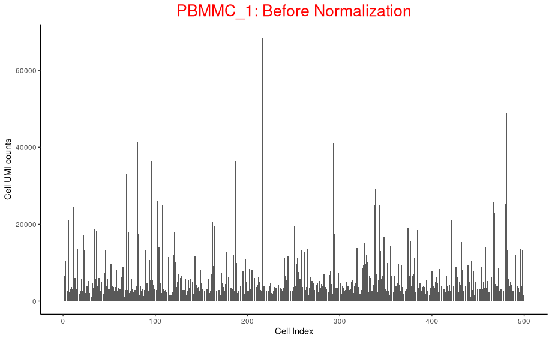
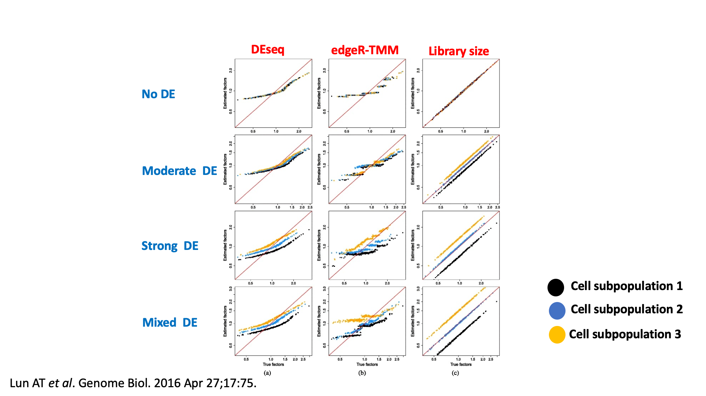

# Normalisation


!!! r-project "code"

    ```r
    library(scater)
    library(scran)
    library(sctransform)
    library(tidyverse)
    library(BiocParallel)
    library(patchwork)
    bpp <- MulticoreParam(7)
    ```

## Load data object 

For the purposes of this demonstration we have generated a smaller data set in which there are only 500 cells per sample. This is so that the code can be run in a reasonable amount of time during the live teaching session. The data were first QC’d and filtered as described in the QC and exploratory analysis session. After this 500 cells were selected at random from each sample.

!!! r-project "code"
    ```r
    sce <- readRDS("R_objects/Caron_filtered.500.rds")
    sce
    ```

    ??? circle-check "Output"
    
        ```
        class: SingleCellExperiment 
        dim: 29346 5500 
        metadata(1): Samples
        assays(1): counts
        rownames(29346): ENSG00000243485 ENSG00000238009 ... ENSG00000275063 ENSG00000278817
        rowData names(4): ID Symbol Type Chromosome
        colnames(5500): 1_CGACTTCGTCCAGTTA-1 1_AGAATAGCATACGCTA-1 ... 8_AGCGTCGAGATGTAAC-1 8_CATGACAAGATAGGAG-1
        colData names(10): Sample Barcode ... subsets_Mito_percent total
        reducedDimNames(0):
        mainExpName: NULL
        altExpNames(0):
        ```
    ```r
    table(sce$SampleName)
    ```
## Why normalise ? 

!!! r-project "code"

    ```r
    oneSamTab <- colData(sce) %>% 
      as.data.frame() %>% 
      filter(SampleName == "PBMMC_1") %>% 
      dplyr::select(SampleName,Barcode, sum) %>% 
      mutate(cell_num = 1:n())
    
    p_before_nom <- ggplot(data=oneSamTab, aes(x=cell_num, y=sum)) +
      geom_bar(stat = 'identity') +
      labs( x= 'Cell Index',
            y='Cell UMI counts',
            title = "PBMMC_1: Before Normalization" ) +
      theme_classic() +
      theme(
        plot.title = element_text(hjust = 0.5, size=20, color = 'red')
      )
    
    p_before_nom
    ```
    {width="600"}

    !!! rectangle-list ""

        - Above plot shows the UMI counts/cell (transcript molecules) for 500 cell from the PBMMC_1 sample
        
        - UMI counts fluctuate
        
        - We derive biological insights downstream by comparing cells against each other.
        
        - But the UMI counts differences makes it harder to compare cells.
        
        - Why total transcript molecules (UMI counts) detected between cells differ?
        
            - Biological:

                - Cell sub type differences, like size and transcription activity etc.

            - Technical: scRNA data is inherently noisy
                - Low mRNA content per cell
                - cell-to-cell differences in mRNA capture efficiency
                - Variable sequencing depth
                - PCR amplification efficiency
        - A normalization technique makes the UMI counts distribution uniform, so that each cell has similar counts.
        
        - Normalization is a critical step that corrects cell-to-cell technical differences.
         
        - By normalizing, downstream comparisons of relative expression between cells are valid.

## Normalization strategies

!!! rectangle-list "The sparse nature of scRNA data makes normalization difficult, unlike bulk RNAseq data"
    
    - Broadly two classes
        - Spike-in methods
            - Uses pike-in controls for normalisation
            - Not available for droplet based scRNA techniques like 10x.
        - Non-spike-in methods:
            - Using available counts data for normalization
            - DEseq2
            - edgeR - TMM
            - Library size normalization
            - deconvolution
            - sctransform
    
    - Typical normalization has two steps
        - scaling
            - Estimate size or scaling or normalization factor: computation of a cell-specific ‘scaling’ or ‘size’ factor or “normalization factor” that represents the relative bias in that cell and division of all counts for the cell by that factor to remove that bias. Assumption: any cell specific bias will affect genes the same way.
            - Scale the data by dividing the count for each gene with the appropriate size factor for that cell
        - Transformation
            - log2
            - Square root transformation
            - Pearson residuals (eg. sctransform)

    Scaling methods typically generate normalised counts-per-million (CPM) or transcripts-per-million (TPM) values that address the effect of sequencing depth. These values however typically have a variance that increases with their mean (heteroscedasticity) while most statistical methods assume a stable variance, which does not vary with the mean (homoscedasticity). A widely used ‘variance stabilising transformation’ is the log transformation (often log2). This works well for highly expressed genes (as in bulk RNA-seq) but less so for sparse scRNA-seq data.

    <center></center>
    <small>* DEseq, edgeR-TMM and Library size normalization initially developed for bulk RNAseq * Applying these methods on scRNAseq data systematically under or over estimate size factors. i.e systematically deviate from true size factors. * This deviation is the result of removing zeroes prior to normalization. * Therefore other normalization methods specific to scRNAseq data like deconvolution, sctransform etc. were proposed.</small>

## Deconvolution