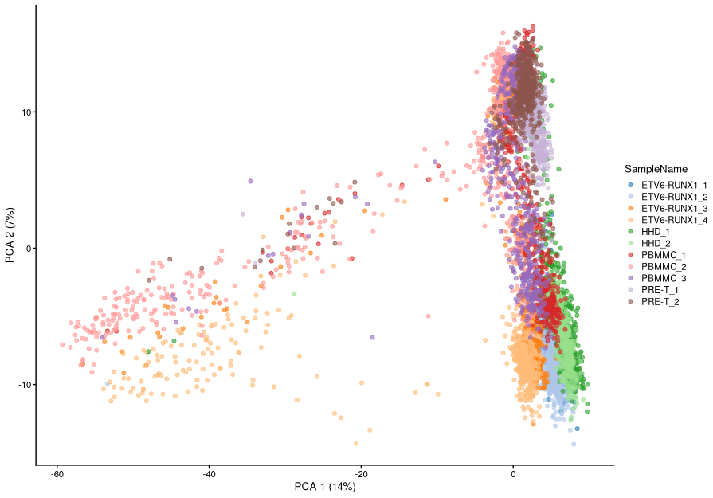
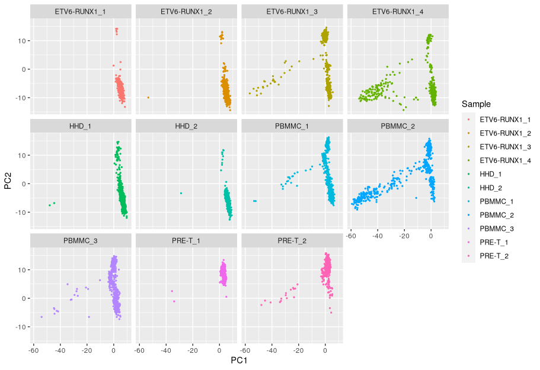
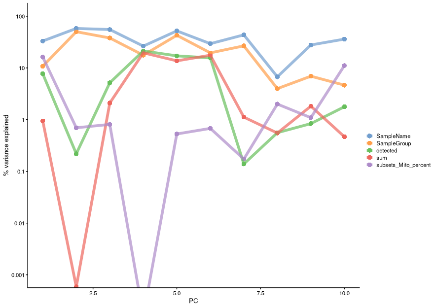
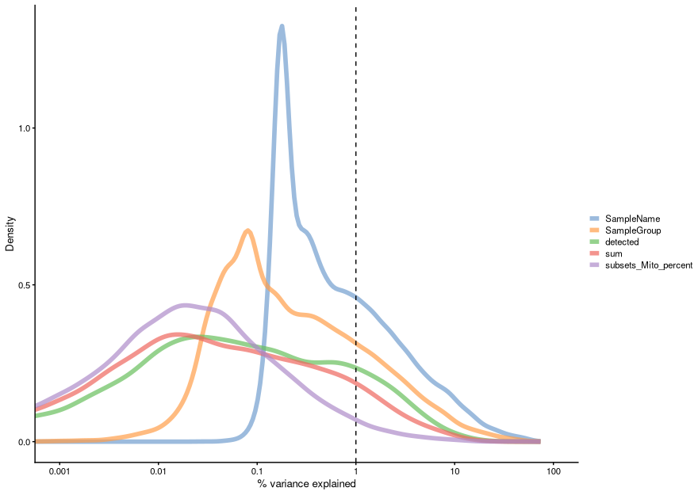

# 5. Feature Selection and Dimensionality Reduction

!!! quote ""
    In this section we are going to cover the basics of feature selection and dimensionality reduction. These methods allow us to represent our multi-dimensional data (with thousands of cells and thousands of genes) in a reduced set of dimensions for visualisation and more efficient downstream analysis.

    In feature selection the principle is to remove those genes which are uninteresting or uninformative to both improve computation and because this ‘noise’ reduction will hopefully enable us to more clearly see the true biology in our data. We make the assumption that most of the low level variance is not caused by real biology and is due to stochastic sampling in the single cell protocol and various other technical effects. The genes which have the most variance are therefore the ones that reflect the real biological difference and are what we want to focus on. This is obviously not a perfect assumption but it is a good way to make informed interpretations from your data that you can hopefully have a little more confidence in.

    In dimensionality reduction we attempt to find a way to represent all the the information we have in expression space in a way that we can easily interpret. High dimensional data has several issues. There is a high computational requirement to performing analysis on 30,000 genes and 48,000 cells (in the Caron dataset). Humans live in a 3D world; we can’t easily visualise all the dimensions. And then there is sparsity. As the number of dimensions increases the distance between two data points increases and becomes more invariant. This invariance causes us problems when we try to cluster the data into biologically similar groupings. By applying some dimensionality reducing methods we can solve these issues to a level where we can make interpretations

!!! screwdriver-wrench "Setup"

    !!! r-project "code"

        ```r
        library(scater) 
        library(scran)
        library(PCAtools)
        library(tidyverse)
        ```

        We will load the SingleCellExperiment object generated in the [Normalisation](./4.md) section, which contains normalised counts for 500 cells per sample. For demonstration purposes we are not using the full dataset but you would in your analyses.

        ```r
        sce <- readRDS("R_objects/Caron_normalized.500.rds")
        sce
        ```
        - To make some of our plots later on easier to interpret, we will replace the rownames of the object (containing Ensembl gene IDs) with the gene symbol. Sometimes it happens that there is no gene symbol and in some cases there are multiple genes with the same symbol (see e.g. RGS5). A safe way to handle these cases is to use the `uniquifyFeatureNames()` function, which will add the Ensembl gene id to symbols where necessary to distinguish between different genes

        ```r
        rownames(sce) <- uniquifyFeatureNames(rownames(sce), rowData(sce)$Symbol)
        ```

## Feature Selection

!!! info ""

    We often use scRNA-seq data in exploratory analyses to characterize heterogeneity across cells. Procedures like clustering and dimensionality reduction compare cells based on their gene expression profiles, which involves aggregating per-gene differences into a single (dis)similarity metric between every pair of cells. The choice of genes to use in this calculation has a major impact on the behavior of the metric and the performance of downstream methods. We want to select genes that contain useful information about the biology of the system while removing genes that contain random noise. This aims to preserve interesting biological structure without the variance that obscures that structure, and to reduce the size of the data to improve computational efficiency of later steps.

    The simplest approach to feature selection is to select the most variable genes based on their expression across the population. This assumes that genuine biological differences will manifest as increased variation in the affected genes, compared to other genes that are only affected by technical noise or a baseline level of “uninteresting” biological variation (e.g., from transcriptional bursting). Several methods are available to quantify the variation per gene and to select an appropriate set of highly variable genes (HVGs).
    
###  Quantifying per-gene variation

Some assays allow the inclusion of known molecules in a known amount covering a wide range, from low to high abundance: spike-ins. The technical noise is assessed based on the amount of spike-ins used, the corresponding read counts obtained and their variation across cells. The variance in expression can then be decomposed into the biological and technical components. There is discussion over whether this step is necessary but like all of the decisions you make in your analyses it would be wise to optimise your parameters and steps over several iterations with a view to existing biological knowlegde and controls.

The commonly used UMI-based assays do not (yet?) allow spike-ins. But one can still identify highly variable genes (HVGs), which likely capture biological variation. Assuming that, for most genes, the observed variance across cells is due to technical noise, we can assess technical variation by fitting a trend line between the mean-variance relationship across all genes. Genes that substantially deviate from this trend may then be considered as highly-variable, i.e. capturing biologically interesting variation. The scran function modelGeneVar with carry out this estimation for us.

The resulting output gives us a dataframe with all our genes and several columns. It has modeled the mean-variance relationship and from there it has estimated our total variance along with what it considers is the biological and technical variance.

!!! r-project "code"

    ```r
    gene_var <- modelGeneVar(sce)

    gene_var
    ```
    ```r
    gene_var %>% 
      as.data.frame() %>% 
      ggplot(aes(mean, total)) +
      geom_point() +
      geom_line(aes(y = tech), colour = "dodgerblue", size = 1) +
      labs(x = "Mean of log-expression", y = "Variance of log-expression")
    ```
    <center>
    {width="450"}
    </center>

### Selecting highly variable genes

Once we have quantified the per-gene variation, the next step is to select the subset of HVGs to use in downstream analyses. A larger subset will reduce the risk of discarding interesting biological signal by retaining more potentially relevant genes, at the cost of increasing noise from irrelevant genes that might obscure said signal. It is difficult to determine the optimal trade-off for any given application as noise in one context may be useful signal in another. 

!!! circle-info "Commonly applied strategies are:"

    - take top X genes with largest (biological) variation

    Top 1000 genes: `getTopHVGs(gene_var, n=1000)`

    Top 10% genes: `getTopHVGs(gene_var, prop=0.1)`

    - based on significance
    
    `getTopHVGs(gene_var, fdr.threshold = 0.05)`

    - keeping all genes above the trend

    `getTopHVGs(gene_var, var.threshold = 0)`

    - selecting a priori genes of interest

In our example, we will define ‘HVGs’ as the top 10% of genes with the highest biological component. This is a fairly arbitrary choice. A common practice is to pick an arbitrary threshold (either based on number of proportion) and proceed with the rest of the analysis, with the intention of testing other choices later, rather than spending much time worrying about obtaining the “optimal” value.

!!! r-project "code"

    ```r
    hvgs <- getTopHVGs(gene_var, prop=0.1)
    length(hvgs)
    ```
    ```r
    hvgs[1:10]
    ```
    - The result is a vector of gene IDs ordered by their biological variance (i.e. highest deviation from the trend line shown above). We can use this with functions that accept a list of genes as option to restrict their analysis to that subset of genes (e.g. when we do PCA later on).

    - We can visualise the expression of the top most-variable genes with a violin plot for each gene using the `plotExpression()` function:

    ```r
    plotExpression(sce, features = hvgs[1:20], point_alpha = 0.05)
    ```
    <center>
    
    </center>


## Dimensionality Reduction

!!! circle-info ""

    Many scRNA-seq analysis procedures involve comparing cells based on their expression values across thousands of genes. Thus, each individual gene represents a dimension of the data (and the total number of genes represents the “dimensionality” of the data). More intuitively, if we had a scRNA-seq data set with only two genes, we could visualise our data in a two-dimensional scatterplot, with each axis representing the expression of a gene and each point in the plot representing a cell. Intuitively, we can imagine the same for 3 genes, represented as a 3D plot. Although it becomes harder to imagine, this concept can be extended to data sets with thousands of genes (dimensions), where each cell’s expression profile defines its location in the high-dimensional expression space.

    As the name suggests, dimensionality reduction aims to reduce the number of separate dimensions in the data. This is possible because different genes are correlated if they are affected by the same biological process. Thus, we do not need to store separate information for individual genes, but can instead compress multiple features into a single dimension, e.g., an “eigengene” (Langfelder and Horvath 2007). This reduces computational work in downstream analyses like clustering, as calculations only need to be performed for a few dimensions, rather than thousands. It also reduces noise by averaging across multiple genes to obtain a more precise representation of the patterns in the data. And finally it enables effective visualisation of the data, for those of us who are not capable of visualizing more than 2 or 3 dimensions.

    Here, we will cover three methods that are most commonly used in scRNA-seq analysis:

    - Principal Components Analysis (PCA)
    - t-Distributed Stochastic Neighbor Embedding (t-SNE)
    - Uniform Manifold Approximation and Projection (UMAP)

    Before we go into the details of each method, it is important to mention that while the first method (PCA) can be used for downstream analysis of the data (such as cell clustering), the latter two methods (t-SNE and UMAP) should only be used for visualisation and not for any other kind of analysis.

### Principal Components Analysis

One of the most used and well-known methods of dimensionality reduction is principal components analysis (PCA). This method performs a linear transformation of the data, such that a set of variables (genes) are turned into new variables called Principal Components (PCs). These principal components combine information across several genes in a way that best captures the variability observed across samples (cells).

!!! video "Watch this [video](https://www.youtube.com/embed/FgakZw6K1QQ) for more details on how PCA works:"

After performing a PCA, there is no data loss, i.e. the total number of variables does not change. Only the fraction of variance captured by each variable differs.

Each PC represents a dimension in the new expression space. The first PC explains the highest proportion of variance possible. The second PC explains the highest proportion of variance not explained by the first PC. And so on: successive PCs each explain a decreasing amount of variance not captured by the previous ones.

The advantage of using PCA is that the total amount of variance explained by the first few PCs is usually enough to capture most of the signal in the data. Therefore, we can exclude the remaining PCs without much loss of information. The stronger the correlation between the initial variables, the stronger the reduction in dimensionality. We will see below how we can choose how many PCs to retain for our downstream analysis.

#### Running PCA

*SingleCellExperiment* objects contain a slot that can store representations of our data in reduced dimensions. This is useful as we can keep all the information about our single-cell data within a single object.

The `runPCA()` function can be used to run PCA on a SCE object, and returns an updated version of the single cell object with the PCA result added to the reducedDim slot.

Importantly, we can also restrict the PCA to use only some of the features (rows) of the object, which in this case we do by using the highly variable genes we identified earlier.

!!! r-project "code"

    ```r
    sce <- runPCA(sce, subset_row = hvgs)
    sce
    ```

    - We can see that the output shows a new `reducedDimNames` value called “PCA”. We can access it by using the `reducedDim()` function:

    ```r
    reducedDim(sce, "PCA")[1:10, 1:5]
    ```
    By default, `runPCA()` returns the first 50 PCs, but you can change this number by specifying the `ncomponents` option.

    One of the first things to investigate after doing a PCA is how much variance is explained by each PC. This information is stored as an “attribute” (think of it as additional information) attached to the PCA matrix above. The typical way to view this information is using what is known as a “scree plot”.

    ```r
    percent.var <- attr(reducedDim(sce), "percentVar")
    plot(percent.var, log="y", xlab="PC", ylab="Variance explained (%)")
    ```
    <center>
    
    </center>

    - We can see how the two first PCs explain a substantial amount of the variance, and very little variation is explained beyond 10-15 PCs. To visualise our cells in the reduced dimension space defined by PC1 and PC2, we can use the`plotReducedDim()` function.

    <center>
    
    </center>

    - The proximity of cells in this plot reflects the similarity of their expression profiles.

    - We can also plot several PCs at once, using the `ncomponents` option:

    <center>
    
    </center>

    Although these plotting functions are useful for quickly visualising our data, more customised visualisations can be used by using the `ggcells()` function, which extends the regular `ggplot()` function, but to work directly from the SCE object. We can use it in a similar manner as we use the regular `ggplot()` function, except we can define aesthetics both from our `reducedDim` slot as well as `colData` and even `assays` (to plot particular gene’s expression). Here is an example, where we facet our plot:

    ```r
    ggcells(sce, aes(x = PCA.1, y = PCA.2, colour = SampleName)) +
      geom_point(size = 0.5) +
      facet_wrap(~ SampleName) +
      labs(x = "PC1", y = "PC2", colour = "Sample")
    ```
    <center>
    
    </center>

#### PCA Diagnostics

There are a large number of potential confounders, artifacts and biases in scRNA-seq data. One of the main challenges stems from the fact that it is difficult to carry out true technical replication to distinguish biological and technical variability. Here we will continue to explore how experimental artifacts can be identified and removed.

One of the ways to achieve this is to calculate the association between our PC scores and different variables associated with our cells such as sample groups, number of detected genes, total reads per cell, percentage of mitochondrial genes, etc. We can achieve this using the `getExplanatoryPCs()` function (and associated plotting function), which calculates the variance in each PC explained by those variables we choose:

!!! r-project "code"

    ```r
    explain_pcs <- getExplanatoryPCs(sce,
                                    variables = c("sum",
                                                  "detected",
                                                  "SampleGroup",
                                                  "SampleName",
                                                  "subsets_Mito_percent")
                                    )

    plotExplanatoryPCs(explain_pcs/100)
    ```
    <center>
    {width="650"}
    </center>

We can see that PC1 can be explained mostly by individual samples (SampleName), mitochondrial expression and mutation group (`SampleGroup`).

We can also compute the marginal R2 for each variable when fitting a linear model regressing expression values for each gene against just that variable, and display a density plot of the gene-wise marginal R2 values for the variables.

!!! r-project "code"

    ```r
    plotExplanatoryVariables(sce,
                             variables = c(
                               "sum",
                               "detected",
                               "SampleGroup",
                               "SampleName",
                               "subsets_Mito_percent"
                             ))
    ```
    <center>
    {width="650"}
    </center>
    
    This analysis indicates that individual and subtype have the highest explanatory power for many genes, and we don’t see technical covariates having as high correlations. If that were the case, we might need to repeat the normalization step while conditioning out for these covariates, or we would include them in downstream analysis.