# 7. Clustering

Once we have normalized the data and removed confounders we can carry out analyses that are relevant to the biological questions at hand. The exact nature of the analysis depends on the data set. One of the most promising applications of scRNA-seq is de novo discovery and annotation of cell-types based on transcription profiles. This requires the identification of groups of cells based on the similarities of the transcriptomes without any prior knowledge of the label a.k.a. unsupervised clustering. To avoid the challenges caused by the noise and high dimensionality of the scRNA-seq data, clustering is performed after feature selection and dimensionality reduction. For data that has not required batch correction this would usually be based on the PCA output. As our data has required batch correction we will use the “corrected” reducedDims data.

We will focus here on graph-based clustering, however, it is also possible to apply hierarchical clustering and k-means clustering on smaller data sets


!!! r-project-2 "We will use the data set generated in the previous session. This contains 7 samples from the Caron data set. For the purposes of these materials, in the interests of time, each sample has been downsampled to only contain 500 cells."

    ```r
    library(scater)
    library(scran)
    library(bluster)
    library(cluster)
    library(igraph)
    library(pheatmap)
    library(patchwork)
    library(tidyverse)
    ```
    ```r
    sce <- readRDS("R_objects/Caron_batch_corrected.500.rds")
    ```
    ```r
    table(sce$SampleName)
    ```

## Introduction to Graph-based clustering

Graph-based clustering entails building a nearest-neighbour (NN) graph using cells as nodes and their similarity as edges, then identifying ‘communities’ of cells within the network. A graph-based clustering method has three key parameters:

- How many neighbors are considered when constructing the graph
- What scheme is used to weight the edges
- Which community detection algorithm is used to define the clusters

### Connecting nodes (cells) based on nearest neighbours
Two types of NN graph may be used: “K nearest-neighbour” (KNN) and “shared nearest-neighbour” (SNN). In a KNN graph, two nodes (cells), say A and B, are connected by an edge if the distance between them is amongst the k smallest distances from A to other cells. In an SNN graph A and B are connected if the distance is amongst the k samllest distances from A to other cells and also among the k smallest distance from B to other cells.

<center>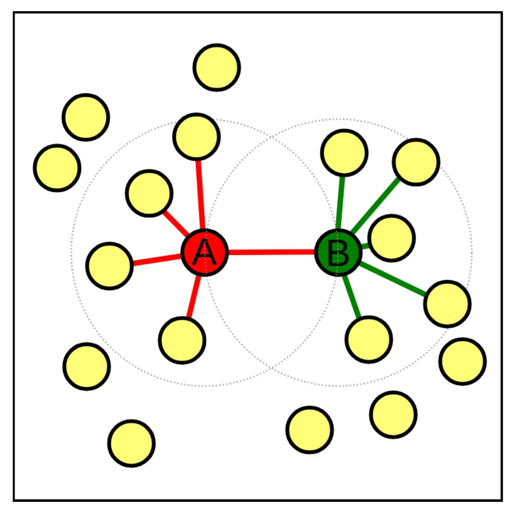{width="300"}</center>

In the figure above, if k is 5, then A and B would be connected in a KNN graph as B is one of the 5 closest cells to A, however, they would not be connected in an SNN graph as B has 5 other cells that are closer to it than A.

The value of k can be roughly interpreted as the anticipated size of the smallest subpopulation” (see `scran`’s `buildSNNGraph()` [manual](https://rdrr.io/bioc/scran/man/buildSNNGraph.html)).

The plot below shows the same data set as a network built using three different numbers of neighbours: 5, 15 and 25 (from [here](https://biocellgen-public.svi.edu.au/mig_2019_scrnaseq-workshop/clustering-and-cell-annotation.html#example-1.-graph-based-clustering-deng-dataset)).

<center>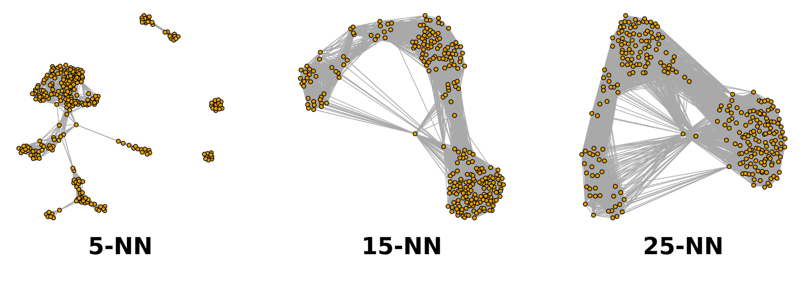{width="600"}</center>

### Weighting the edges
The edges between nodes (cells) can be weighted based on the similarity of the cells; edges connecting cells that are more closely related will have a higher weight. The three common methods for this weighting are (see the bluster package documentation for the makeSNNGraph function):

- rank - the weight is based on the highest rank of the shared nearest neighbours
- number - the weight is based the number of nearest neighbours in common between the two cells
- jaccard - the [Jaccard index](https://en.wikipedia.org/wiki/Jaccard_index) of the two cells’ sets of nearest neighbours.

### Grouping nodes (cells) into clusters
Clusters are identified using an algorithm that interprets the connections of the graph to find groups of highly interconnected cells. A variety of different algorithms are available to do this, in these materials we will focus on three methods: walktrap, louvain and leiden. See the OSCA book for details of others available in scran.

### Modularity
Several methods to detect clusters (‘communities’) in networks rely on a metric called “modularity”. For a given partition of cells into clusters, modularity measures how separated clusters are from each other, based on the difference between the observed and expected weight of edges between nodes. For the whole graph, the closer to 1 the better.

### Pros and Cons of graph based clustering

- Pros:
    - fast and memory efficient (avoids the need to construct a distance matrix for all pairs of cells)
    - no assumptions on the shape of the clusters or the distribution of cells within each cluster
    - no need to specify a number of clusters to identify (but the size of the neighbourhood used affects the size of clusters)

- Cons:
    - loss of information beyond neighboring cells, which can affect community detection in regions with many cells.

## Implementation

The implementation of clustering in R is carried out using functions from a number of different packages, in particular the bluster and igraph packages. scran provides a handy “wrapper” function `clusterCells` that allows us use a variety of different algorithms with one simple command.

By default `clusterCells` just returns a vector containing the cluster number for each cell. We can also retrieve the intermediate statistics (varying according to the algorithm used) and the SNN graph by specifying the bluster argument `full = TRUE`. If you are only interested in retrieving the clusters, this isn’t necessary but in this first instance we will retrieve the graph and visualise it. The default algorithm for clusterCells is Walktrap with k is set to 10 by default. The default edge weighting is “rank”.

!!! r-project "code"

    ```r
    clustering1 <- clusterCells(sce, use.dimred="corrected", full=TRUE)
    This has defined 24 clusters with varying numbers of cells:
    ```
    ```r
    table(clustering1$clusters)
    ```

    The number of cells in the data set is large and plotting all the cells would take too long, so we randomly choose 1000 nodes (cells) in the network before plotting the resulting smaller network. Adding sample data to the graph and plotting the results are done using the igraph package. Cells can be color-coded by sample type:

    ```r
    # extract the graph
    snn.gr <- clustering1$objects$graph

    # Add Sample group to vertices (nodes, ie cells)
    V(snn.gr)$SampleGroup <- as.character(colData(sce)$SampleGroup)

    # pick 1000 nodes randomly
    set.seed(1423)
    selectedNodes <- sample(3500, 1000)

    # subset graph for these 1000 randomly chosen nodes
    snn.gr.subset <- subgraph(snn.gr, selectedNodes)

    # set colors for clusters
    grps <-  V(snn.gr.subset)$SampleGroup
    cols <- c("dodgerblue", "lightyellow")[as.numeric(factor(grps))]
    names(cols) <- grps

    # plot graph
    plot.igraph(snn.gr.subset,
      layout = layout_with_fr(snn.gr.subset),
      vertex.size = 3, 
      vertex.label = NA,
      vertex.color = cols,
      frame.color = cols,
      main = "default parameters"
    )

    # add legend
    legend('bottomright',
           legend=unique(names(cols)),
           pch=21,
           pt.bg=unique(cols),
           pt.cex=1, cex=.6, bty="n", ncol=1)
    ```
    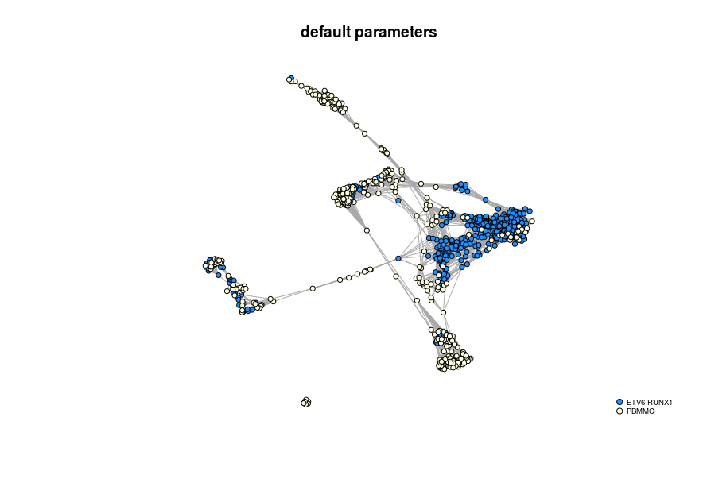

    More commonly we will visualise the clusters by superimposing them on a t-SNE or UMAP plot. We can store the clusters in the sce object colData.

    ```r
    sce$Clusters1 <- clustering1$clusters
    plotReducedDim(sce, 
                   dimred = "TSNE_corrected",
                   colour_by="Clusters1",
                   text_by = "Clusters1")
    ```
    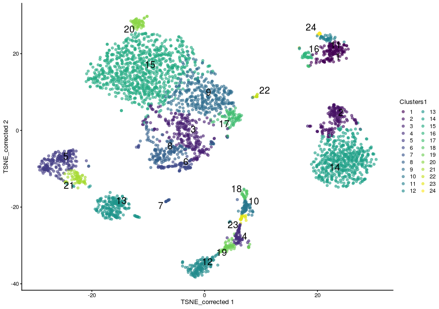

## The Walktrap method

The walktrap method relies on short random walks (a few steps) through the network. These walks tend to be ‘trapped’ in highly-connected regions of the network. Node similarity is measured based on these walks. Nodes are first each assigned their own community. Pairwise distances are computed and the two closest communities are grouped. These steps are repeated a given number of times to produce a dendrogram. Hierarchical clustering is then applied to the distance matrix. The best partition is that with the highest modularity. The original article describing the algorithm is [Pons P, Latapy M (2006) Computing communities in large networks using random walks. J Graph Algorithms Appl 10(2):191–218](https://arxiv.org/abs/physics/0512106)

Walktrap is the default algorithm for `clusterCells`, k is set to 10 by default and the default edge weighting is “rank”. To explicitly request a specific algorithm and to set the k to a different number of nearest neighbours, we use a `SNNGraphParam` object from the bluster package (which is the package clusterCells is using under the hood).

Let’s set the k to 15 but keep the other parameters the same. This time we will just return the clusters:

!!! r-project "code"

    ```r
    sce$walktrap15 <- clusterCells(sce, 
                               use.dimred = "corrected", 
                               BLUSPARAM = SNNGraphParam(k = 15, 
                                                         cluster.fun = "walktrap"))
    ```

    - This time we have defined 16 clustering. As a general rule, increasing k will tend to decrease the number of clusters (not always, but generally).

    ```r
    table(sce$walktrap15)
    ```

    - We can visualise the assignment of cells from different samples to the clusters using a heatmap. This gives us an overview of how well each cluster is represented across the samples and the replicates. Several clusters (2, 8, 9 and 16) are present in the PBMMC samples, but absent from the ETV6_RUNX1 samples for instance.

    ```r
    w15_table <- log(table(sce$walktrap15, sce$SampleName)+1)
    pheatmap(w15_table, cluster_rows = TRUE, cluster_cols = FALSE)
    ```
    <center>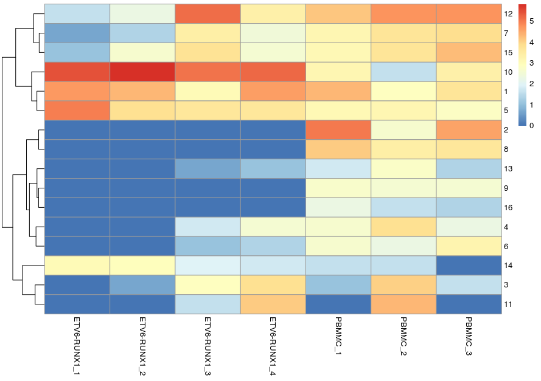{width="500"}</center>

    Most clusters comprise cells from several replicates of the same sample type, cluster 10 appears to be predominantly cells from the ETV6-RUNX samples.
    
    We can visualise this on the TSNE:
    
    ```r
    plotReducedDim(sce, 
                   dimred = "TSNE_corrected",
                   colour_by="walktrap15", 
                   text_by = "walktrap15")
    ```
    <center>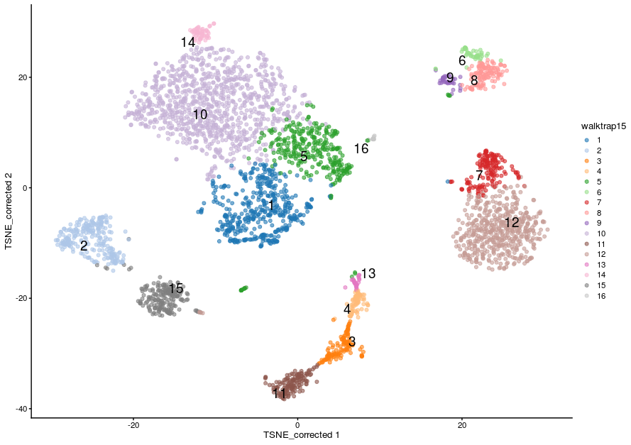{width="500"}</center>
    
    ```r
    plotReducedDim(sce, 
                   dimred = "TSNE_corrected",
                   colour_by="walktrap15", 
                   text_by = "walktrap15",
                   other_fields = list("SampleGroup")) +
      facet_wrap(vars(SampleGroup))
    ```
    
    <center>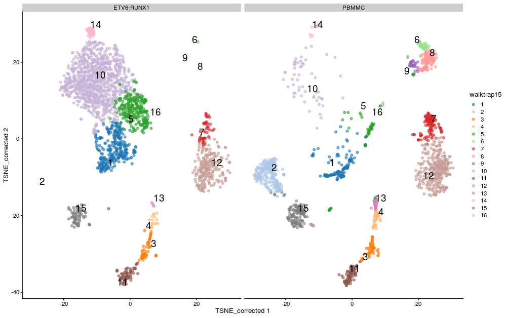{width="500"}</center>

## The Louvain method

With the Louvain method, nodes are also first assigned their own community. This hierarchical agglomerative method then progresses in two-step iterations:

1. nodes are re-assigned one at a time to the community for which they increase modularity the most, if at all.
2. a new, ‘aggregate’ network is built where nodes are the communities formed in the previous step.

These two steps are repeated until modularity stops increasing. The diagram below is copied [from this article](https://www.nature.com/articles/s41598-019-41695-z#Fig1).

<center>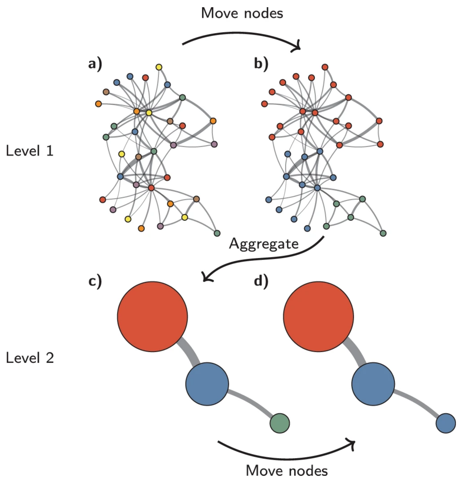{width="370"}</center>
<center><small>Louvain algorithm. The Louvain algorithm starts from a singleton partition in which each node is in its own community **(a)**. The algorithm moves individual nodes from one community to another to find a partition **(b)**. Based on this partition, an aggregate network is created **(c)**. The algorithm then moves individual nodes in the aggregate network **(d)**. These steps are repeated until the quality cannot be increased further.</small>
</center>

!!! r-project-2 "We now apply the Louvain approach, store its outcome in the SCE object and show cluster sizes."

    ```r
    sce$louvain15 <- clusterCells(sce, 
                               use.dimred = "corrected", 
                               BLUSPARAM = SNNGraphParam(k = 15, 
                                                         cluster.fun = "louvain"))
    ```
    ```r
    table(sce$louvain15)
    ```
    <center>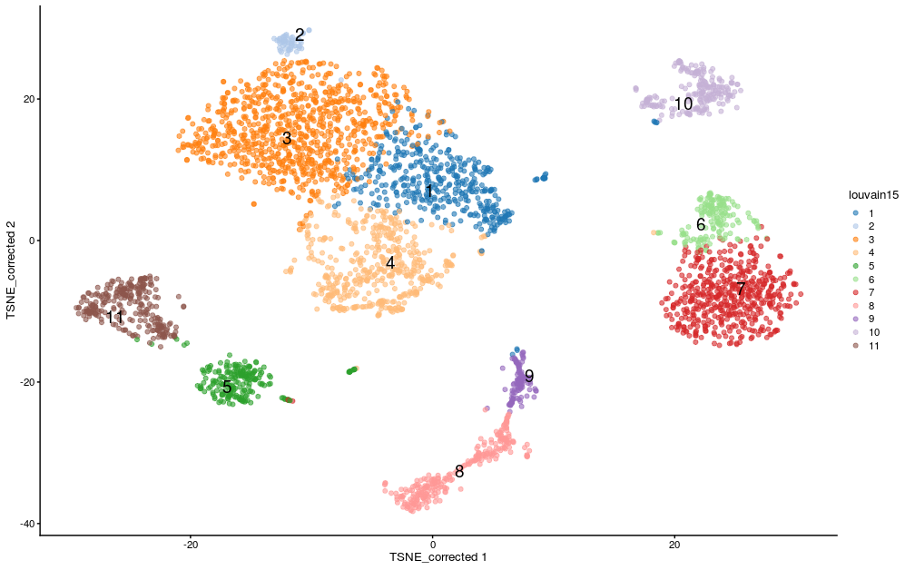{width="600"}</center>

!!! r-project-2 "If we split by sample type we can see differences in the clusters between the sample groups:"

    ```r
    plotReducedDim(sce, 
                   dimred = "TSNE_corrected",
                   colour_by="louvain15", 
                   text_by = "louvain15",
                   other_fields = list("SampleGroup")) +
       facet_wrap(vars(SampleGroup)) 
    ```
    <center>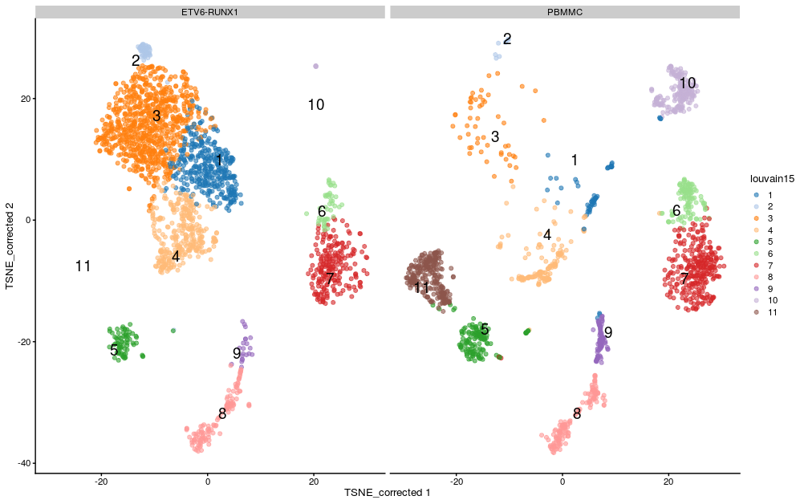{width="600"}</center>

## The Leiden method

The Leiden method improves on the Louvain method by guaranteeing that at each iteration clusters are connected and well-separated. The method includes an extra step in the iterations: after nodes are moved (step 1), the resulting partition is refined (step2) and only then the new aggregate network made, and refined (step 3). The diagram below is copied from this article.

<center>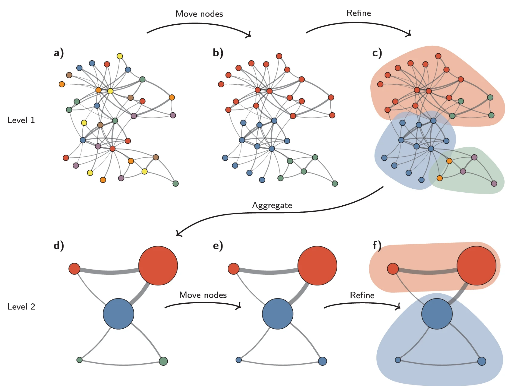{width="370"}</center>
<center><small>Leiden algorithm. The Leiden algorithm starts from a singleton partition **(a)**. The algorithm moves individual nodes from one community to another to find a partition **(b)**, which is then refined **(c)**. An aggregate network **(d)** is created based on the refined partition, using the non-refined partition to create an initial partition for the aggregate network. For example, the red community in **(b)** is refined into two subcommunities in **(c)**, which after aggregation become two separate nodes in **(d)**, both belonging to the same community. The algorithm then moves individual nodes in the aggregate network **(e)**. In this case, refinement does not change the partition **(f)**. These steps are repeated until no further improvements can be made.</small>
</center>

!!! clipboard-question "Exercise"

    run the clustering again, this time using the “leiden” method.

    - Set the k to 20 and add the results of the clustering to the`sce` object in a new column called “leiden20”.

    - How many clusters does this result in?

    - Visualize the clusters by plotting the t-SNE with the cells coloured according to your new clustering.

    ??? circle-check "Answer"

        !!! r-project "code"

            - First run the clustering with `clusterCells:``
            ```r
            sce$leiden20 <- clusterCells(sce, 
                                       use.dimred = "corrected", 
                                       BLUSPARAM = SNNGraphParam(k = 20, 
                                                                 cluster.fun = "leiden"))
            ```

            - We can quickly look at the results by summarising using `table`.
            ```r
            table(sce$leiden20)
            ```

            - There are 15 clusters, although cluster 7 contains only 3 cells and cluster 8 contains only 1 cell. The t-SNE plot shows cells color-coded by cluster membership:
            ```r
            plotReducedDim(sce, 
                           dimred = "TSNE_corrected",
                           colour_by = "leiden20", 
                           text_by = "leiden20")
            ```

## Assessing cluster behaviour

A variety of metrics are available to aid us in assessing the behaviour of a particular clustering method on our data. These can help us in assessing how well defined different clusters within a single clustering are in terms of the relatedness of cells within the cluster and the how well separated that cluster is from cells in other clusters, and to compare the results of different clustering methods or parameter values (e.g. different values for k).

We will consider “Silhouette width” and “Modularity”. 

### Silhouette width

The silhouette width (so named after the look of the traditional graph for plotting the results) is a measure of how closely related cells within cluster are to one another versus how closely related cells in the cluster are to cells in other clusters. This allows us to assess cluster separation.

For each cell in the cluster we calculate the the average distance to all other cells in the cluster and the average distance to all cells not in the cluster. The cells silhouette width is the difference between these divided by the maximum of the two values. Cells with a large silhouette are strongly related to cells in the cluster, cells with a negative silhouette width are more closely related to other clusters.

We will use the `approxSilhouette`` function from the bluster package. The resulting table gives us the silhouette width for each cell, the cluster it belongs to, and which other cluster it is most closely related to.


!!! r-project "code"
    ```r
    sil.approx <- approxSilhouette(reducedDim(sce, "corrected"),
                                   clusters=sce$leiden20)
    ```
    ```r
    sil.approx
    ```
    ```r
    plotSilBeeswarm <- function(silDat){
      silTab <- silDat %>% 
        as.data.frame() %>% 
        mutate(closestCluster = ifelse(width > 0, cluster, other) %>% factor())
    
      plt <- silTab %>% 
          ggplot(aes(x=cluster, y=width, colour=closestCluster)) +
            ggbeeswarm::geom_quasirandom(method="smiley", alpha=0.6) +
            theme_bw()
    
      plt <- scater:::.resolve_plot_colours(plt, silTab$closestCluster, "closestCluster")
      plt
    }

    p1 <- plotSilBeeswarm(sil.approx)
    p2 <- plotReducedDim(sce, 
                         dimred = "TSNE_corrected", 
                         colour_by="leiden20", 
                         text_by = "leiden20")
    p1 + p2
    ```
    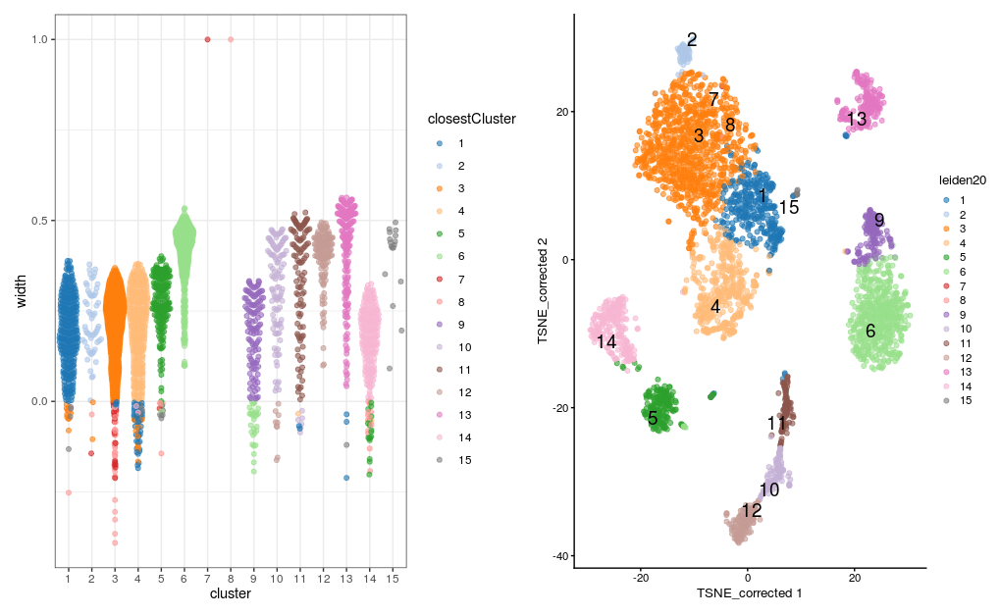

??? r-project-2 "We could also look at the correspondence between different clusters by plotting these numbers on a grid showing for each cluster number of cells in that cluster that are closer to another cluster, colouring each tile by the proportion of the total cells in the cluster that it contains. Ideally we would like to see a strong diagonal band and only a few off-diagonal tiles containing small number of cells."

    ```r
    plotSilGrid <- function(silDat){
      silDat %>% 
        as.data.frame() %>% 
        mutate(closestCluster = ifelse(width > 0, cluster, other) %>% factor()) %>% 
        count(cluster, closestCluster,  name="olap") %>% 
        group_by(cluster) %>% 
        mutate(total  = sum(olap)) %>% 
        mutate(proportion = olap / total) %>% 
        mutate(proportion = ifelse(cluster == closestCluster, proportion, -proportion)) %>% 
        ggplot(aes(x = cluster, y = closestCluster)) +
          geom_tile(aes(fill = proportion)) +
          geom_text(aes(label = olap), size=5) +
          scale_fill_gradientn(colors = c("#fc8d59", "#ffffbf", "#91cf60"),
                                limits = c(-1, 1)) +
          geom_vline(xintercept=seq(0.5, 30.5, by=1)) +
          geom_hline(yintercept=seq(0.5, 30.5, by=1), colour="lightgrey", linetype=2) +
          guides(fill = "none") +
          theme(
              aspect.ratio = 1,
              panel.background = element_blank())
    }
    plotSilGrid(sil.approx)
    ```
    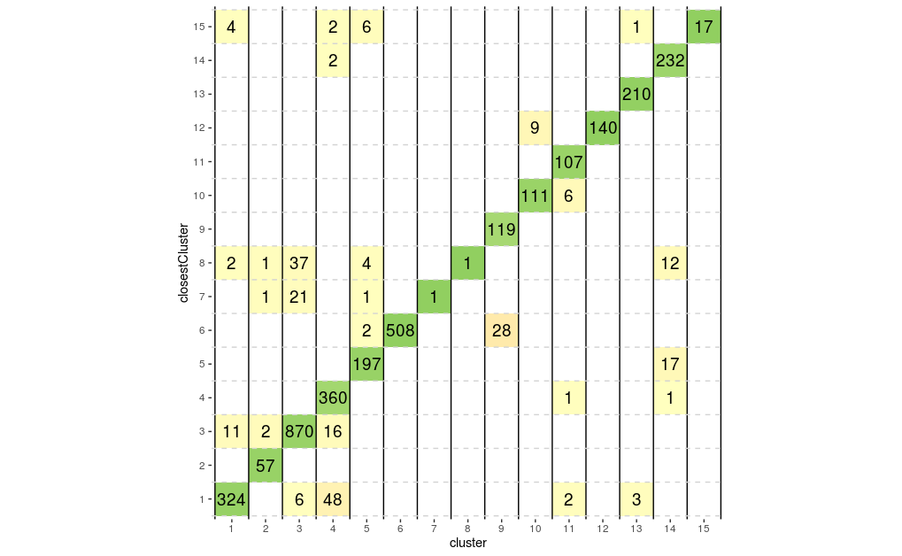

??? r-project-2 "From above plots we can see that clusters 7, 8 and 12 appear to have a good degree of separation, however, clusters 7 and 8 only contains few cells, whilst there are many cells in other clusters that appear closer to them than they are to their assigned cluster. Perhaps clusters 7 and 8 needs to be merged with cluster 1. Let’s do the same plots with the walktrap clusters generated with k=15."

    ```r
    sil.approx <- approxSilhouette(reducedDim(sce, "corrected"),
                                   clusters=sce$walktrap15)

    wp1 <- plotSilBeeswarm(sil.approx)

    wp2 <- plotReducedDim(sce, 
                         dimred = "TSNE_corrected", 
                         colour_by="walktrap15", 
                         text_by = "walktrap15")

    wp3 <- plotSilGrid(sil.approx)

    wp1 + wp2 + wp3
    ```
    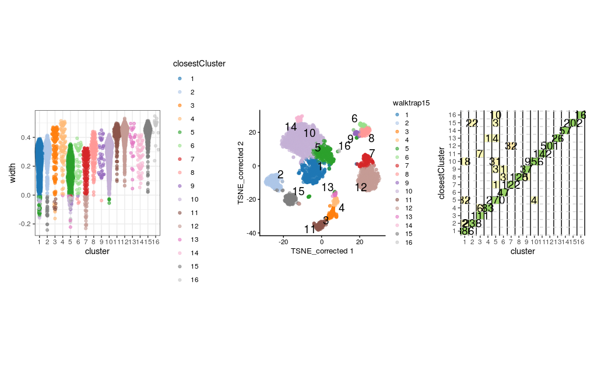

??? r-project-2 "This clustering appears to have generated a set of clusters with slightly better separatedness than the Leiden method with a k of 20. And again with the louvain clusters:"

    ```r
    sil.approx <- approxSilhouette(reducedDim(sce, "corrected"),
                                   clusters=sce$louvain15)

    lp1 <- plotSilBeeswarm(sil.approx)

    lp2 <- plotReducedDim(sce, 
                         dimred = "TSNE_corrected", 
                         colour_by="louvain15", 
                         text_by = "louvain15")

    lp3 <- plotSilGrid(sil.approx)

    lp1 + lp2 + lp3
    ```
    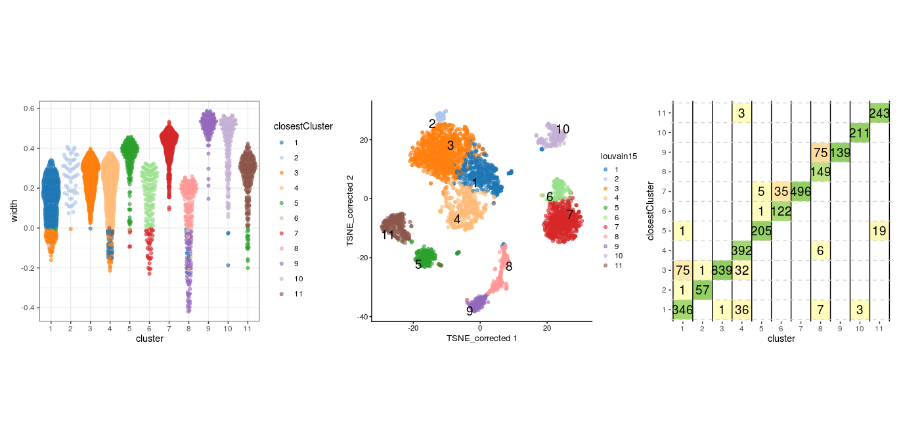