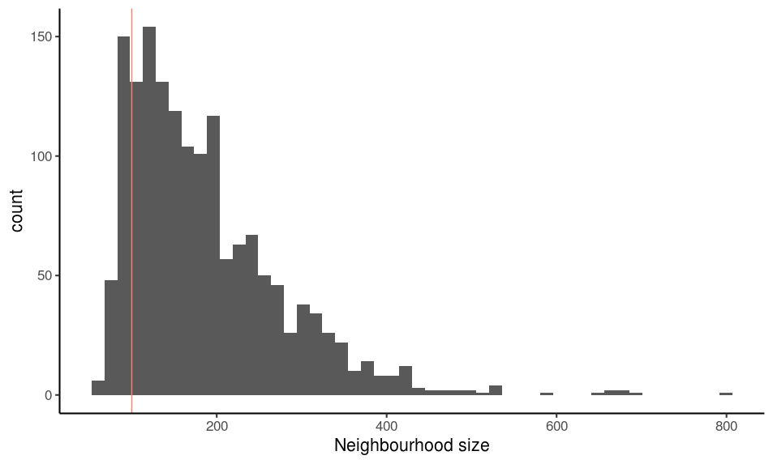
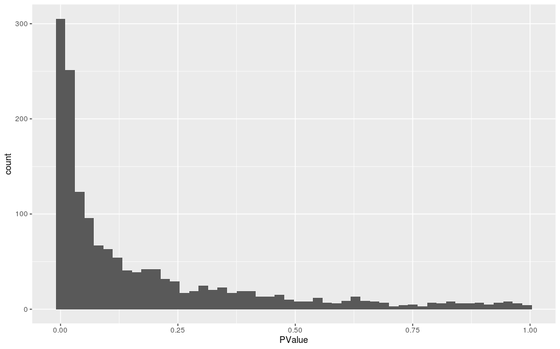
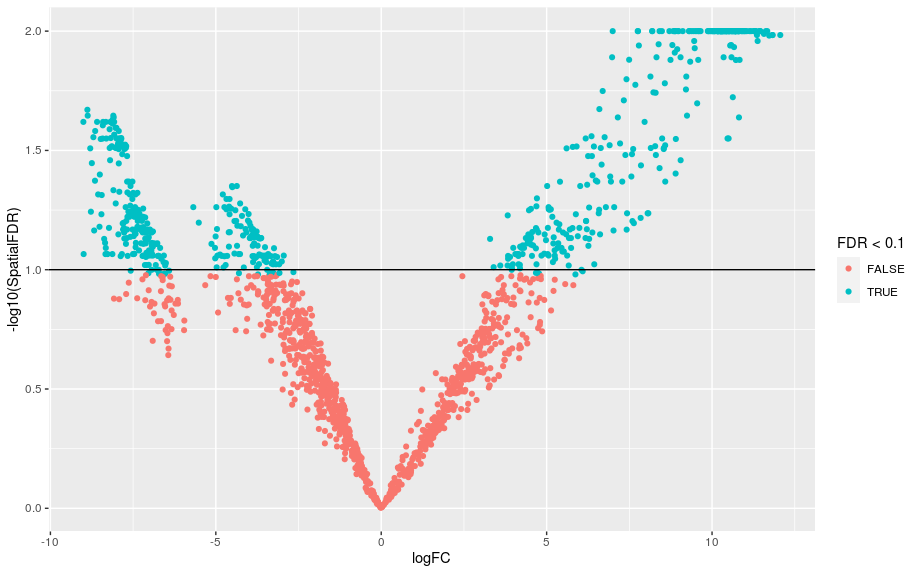
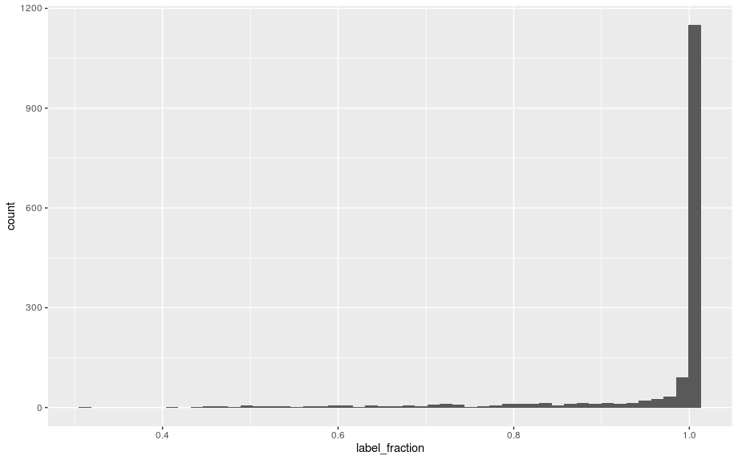

# 10. Differential Abundance


In the previous section we discussed how we can perform differential expression analysis using pseudo-bulk samples, when multiple biological replicates are available in a multi-condition experiment. Differential expression analysis addresses the question of whether a gene has a different average expression between the two groups being compared. However, another useful question to address is whether the cell composition also differs between conditions. We could imagine, for example, that natural killer cells are more abundant in leukemia samples than in healthy samples.

This type of analysis is referred to as **differential abundance analysis**.

??? r-project-2 "Setup"

    ```r
    # load packages
    library(BiocParallel)
    library(scran)
    library(scater)
    library(miloR)
    library(tidyverse)
    library(patchwork)

    # load the SCE object
    sce <- readRDS("R_objects/Caron_clustered.PBMMCandETV6RUNX1.rds")

    # check the contents of the object
    sce

    # plot UMAP done on the batch-corrected data
    plotReducedDim(sce, dimred = "UMAP_corrected", 
                   colour_by = "label", 
                   text_by = "label")
    ```
## Differential abundance between conditions

!!! r-project "code"

    One method to perform DA analysis is to simply count how many cells occur in each label + condition combination and then test for differences in the counts between the two conditions.

    ```r
    table(sce$label, sce$SampleName)
    ```
    - As these are count data, statistical methods used in flow-cytometry have been adapted to test for differences in cell abundance from such a matrix of counts. 
    - However, this approach relies on a fixed set of clusters determined by us beforehand, which can be limiting in cases where the changes in abundance are more continuous (e.g. along a developmental trajectory, or where cell states are not completely discrete). To address this limitation, Dann et al. (2022) developed a method where cell abundance differences are tested along neighbourhoods of cells on a KNN graph. This means that the results aren’t dependent on our clustering results, and are instead treated in a more “continuous” way.

    This method has been implemented by the authors in the R/Bioconductor package MiloR, which we cover in this section. Starting from a graph that faithfully recapitulates the biology of the cell population, the Milo analysis consists of 3 steps:

    - Building a k-nearest neighbours (KNN) graph
    - Sampling representative neighbourhoods in the graph (for computational efficiency)
    - Testing for differential abundance of conditions in all neighbourhoods
    - Accounting for multiple hypothesis testing using a weighted FDR procedure that accounts for the overlap of neighbourhoods

    The first step in the analysis is to turn our single cell object into a Milo object. This is very similar to the SingleCellExperiment object we’ve been working with so far, but also includes information about the neighbourhood graphs that are built during the analysis.

    ```r
    # create the Milo object can be simply converted from a SCE
    milo <- Milo(sce)

    milo
    ```

    - Notice how there are now several slots with prefix `nhoods``, which we will explore as we go through the analysis.

##  Construct KNN graph

!!! r-project-2 "The first step in our analysis is to build a KNN graph from our cells. This is very similar to what we did earlier in the clustering session, except now the graph will be stored inside the object:"

    ```r
    # add KNN graph to Milo object
    milo <- buildGraph(milo, 
                       k = 60, 
                       d = 50, 
                       reduced.dim = "corrected", 
                       BPPARAM = MulticoreParam(7))
    ```

    A couple of things to note about this:

    - `k` is the number of nearest neighbours to build the graph. This can be adjusted depending on how much of a fine resolution you want. If you use too high a number, you will end up loosing resolution as a higher diversity of cells will be connected in the graph. On the other hand, if you use too low a number, you may increase noise in the data and loose statistical power, as only very few cells will be connected to each other in a neighbourhood. The author’s recommendation is to use a value of k as you did for clustering and UMAP visualisation - this is what we’ve done in this case.
    - `d` is the number of dimensions from our dimensionality reduction matrix to use. In this case we’re using the MNN-corrected matrix, which contains 50 dimensions, and we use all of them (50 is also the default, so we could have left this option out).

    The object now has a new object inside the graph slot, which a standard object type from the [igraph package:](https://r.igraph.org/)

    ```r
    # the graph is stored as a standard igraph object
    graph(milo)
    ```

## Define neighbourhoods

The next step in the analysis is to define cell neighbourhoods. This essentially consists of picking a focal cell and counting how many other cells it is connected to in the graph (and how many come from each group under comparison). However, if we did this for every single cell in the data, it could get computationally quite intractable. Instead, Milo implements a sampling step, where so-called “index cells” are sampled from the larger graph, and those will be the neighbourhoods used in the DA analysis.

!!! r-project-2 "This is done with the `makeNhodds()` function:"

    ```r
    # sample index cells to define neighbourhoods
    milo <- makeNhoods(milo, 
                       prop = 0.1, 
                       k = 60, 
                       d = 50, 
                       reduced_dims = "corrected")

    # check our object again
    milo
    ```
    Some things to note:

    - prop is the proportion of cells to sample (the authors advise 0.1 - 0.2).
    - `k` and `d` should be set the same as the k value used to build the original KNN graph. These values will be used for the graph-sampling algorithm used behind the scenes.
    We can also see that our Milo object now has the nhoods slots populated. In this case, it indicates that the sampling algorithm picked 1575 index cells to form neighbourhoods for DA analysis.

    One good QC metric to check at this stage is to create a histogram of cell counts per neighbourhood. Like we said earlier, when we set the value of k to define our KNN graph, we want to make sure the value is not too low, such that most neighbourhoods have very few cells, nor for it to be so high that we have very large (and presumably heterogenous) neighbourhoods.

    Conveniently, MiloR has a plotting function just for this purpose:

    ```r
    # distribution of neighbourhood sizes
    plotNhoodSizeHist(milo) +
      geom_vline(xintercept = 100, col = "salmon")
    ```
    <center>{width="500"}</center>

    The authors of Milo have stated several different parameters of deciding if your histogram is correct. Either ‘peaking above 20’, ‘peaking between 50 and 100’ or ‘an average neighbourhood size over 5 x N_samples’. Realistically, all of these statements give numbers in the same ballpark and so we can make a judgement on our data. In our case, we can see that our histogram peaks at ~100, suggesting a good neighbourhood size. If this was not the case, we could re-run the analysis from the start, making a KNN graph with a higher/lower `k` value.


## Counting cells

After defining our sample of neighbourhoods, the next step consists of counting how many cells there are in each neighbourhood for each sample replicate. In this step we need to define which column of our metadata we want to use to do the counting. We should count cells at the biological replicate leve, which in our case is stored in the SampleName column.

!!! r-project "code"

    ```r
    # count cells in each neighbourhood
    milo <- countCells(milo, 
                       meta.data = colData(milo),
                       samples = "SampleName")

    # Milo now has a counts matrix
    head(nhoodCounts(milo))
    ```

    - The dimensions of the counts matrix corresponds to the number of neighbourhoods (rows) and samples (columns), in our case a 1575 by 7 matrix.

## Neighbourhood connectivity

There is one more step that we need to do before we are ready to run our DA analysis. It consists of calculating the distances between each neighbourhood. As we said, the neighbourhoods on our graph may partially overlap, so when Milo corrects our p-values for multiple testing, it takes into account the spatial dependence of our tests. For example, neighbourhoods that are closer to each other may have similar p-values, and so we should avoid penalising them too much, otherwise we will sacrifice statistical power.

!!! r-project "code"

    ```r
    # calculate distances between neighbourhoods - for p-value correction
    milo <- calcNhoodDistance(milo, d = 50, reduced.dim = "corrected")
    ```

    As before, the value of d (number of dimensions to consider from our MNN-corrected matrix) should be the same that was used for building our initial graph.

## Running DA tests

Finally, we are ready to run the actual differential abundance step. Similarly to the pseudo-bulk appproach for differential expression, MiloR takes advantage of the edgeR package and its negative binomial linear model implementation. This provides a suitable statistical model to account for over-dispersed count data, as is common with these kind of datasets.

First, we need to define a simple table with information about our samples - we will use this table to define our model formula (similarly to what we did in the differential expression step). In this case, we want to detect DA between our PBMMC and ETV6-RUNX1 sample groups, so we define a table based on those two groups. We could also include a batch column in this table, but to keep the demonstration simple we will skip this. We would normally do this if we know there is a batch effect that we want to account for it in DA testing.

!!! r-project "code"

    ```r
    # define a table for our model design
    sample_info <- unique(colData(milo)[,c("SampleName", "SampleGroup")])
    rownames(sample_info) <- sample_info$SampleName

    sample_info
    ```

    - Now we can do the DA test, explicitly defining our experimental design. In this case as discussed we will test the difference between sample groups. The testNhoods function calculates a Fold-change and corrected P-value for each neighbourhood, which indicates whether there is significant differential abundance between sample groups.

    !!! warning "Following needs a review as `da_results <- testNhoods...` takes ~10 minutes. data frame `da_results` was exported as a csv to `/nesi/project/nesi02659/sc-rna/R_objects/da_results.csv` " 

    ```r
    # run DA test
    da_results <- testNhoods(milo, 
                             design = ~ SampleGroup, 
                             design.df = sample_info, 
                             reduced.dim = "corrected")

    # results are returned as a data.frame
    da_results %>%
      arrange(SpatialFDR) %>%
      head()
    ```

## Inspecting DA results

A good diagnostic plot to make after running our analysis is a histogram of p-values. We should expect a distribution with a peak close to 0 (corresponding to differentially abundant neighbourhoods) and tailing off towards 1. This blog article explains the different p-value histogram profiles you may see and what they can mean.

!!! r-project "code"

    ```r
    # p-value histogram
    ggplot(da_results, aes(PValue)) + 
      geom_histogram(bins = 50)
    ```
    <center>{width="600"}</center>

!!! r-project-2 "Next, we can get an overview of our results as a volcano plot, marking a significance threshold of 10% FDR:"

    ```r
    # volcano plot
    # each point in this plot corresponds to a neighbourhood (not a cell)
    ggplot(da_results, aes(logFC, -log10(SpatialFDR))) + 
      geom_point(aes(colour = FDR < 0.1)) +
      geom_hline(yintercept = 1) 
    ```
    <center>{width="600"}</center>

As we can see, several neighbourhoods fall below our FDR threshold, indicating significant differential abundance of cells between PBMMC and ETV6-RUNX1 samples.

There is an unsual discontinuity in our logFC axis, suggesting a sudden change in abundance in some of our neighbourhoods. We can get a better idea of the fold changes by visualising them as a graph for our neighbourhoods (rather than the original single-cell graph, which would be too big to display). We can then super-impose this graph on our original UMAP (or t-SNE), to compare with our original analysis.

!!! r-project "code"

    ```r
    # build neighbourhood graph embedding
    milo <- buildNhoodGraph(milo)
    ```
    ```r
    # our original UMAP with our previously annotated cell labels
    umap_plot <- plotReducedDim(milo, 
                                dimred = "UMAP_corrected", 
                                colour_by = "label", 
                                text_by = "label")
    
    # the neighbourhood map adjusted to match UMAP embedding
    nh_graph_plot <- plotNhoodGraphDA(milo, 
                                      da_results, 
                                      layout = "UMAP_corrected",
                                      alpha = 0.05)
    
    # the two plots together side-by-side
    umap_plot + nh_graph_plot +
      plot_layout(guides="collect")
    ```

On the left we have our original UMAP, with cell/cluster annotations we did previously (by standard clustering and using known marker genes to manually annotate our cells). On the right we have the Milo neighbourhood graph, where each node represents a neighbourhood, coloured by the log fold-change in abundance between PBMMC and ETV6-RUNX1 samples (positive values represent higher abundance in ETV6-RUNX1, and vice-versa). We can see, for example, a cluster of cells with negative log fold changes around our large B cell cluster, which likely explains the discontinuity in values we saw earlier in our volcano plot.

Although we have annotations for our cells, these annotations at the moment are not present in the differential abundance table:

!!! r-project "code"

    ```r
    head(da_results)
    ```
    ```r
    # annotate our neighbourhood DA results with our cell labels
    da_results <- annotateNhoods(milo, da_results, coldata_col = "label")
    head(da_results)
    ```
!!! r-project-2 "The result includes the fraction of cells in the neighbourhood that shared that label. We can look at the distribution of this fraction as a quality check:"

    ```r
    # histogram of fraction of cells in the neighbourhood with the same label
    ggplot(da_results, aes(label_fraction)) + 
      geom_histogram(bins = 50)
    ```

    <center>{width="600"}</center>