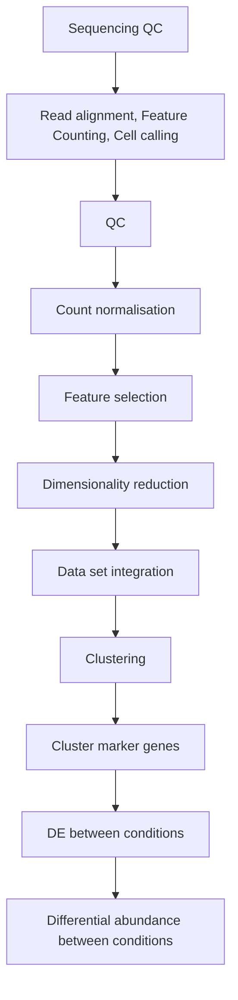

# Workflow

!!! info ""

```mermaid
flowchart TD
    id1["Sequencing QC"] --> id2["Read alignment, Feature Counting, Cell calling"] --> id3["QC"] --> id4["Count normalisation"] --> id5["Feature selection"] --> id6["Dimensionality reduction"] --> id7["Data set integration"] --> id8["Clustering"] --> id9["Cluster marker genes"] --> id10["DE between conditions"] --> id11["Differential abundance between conditions"]
```

