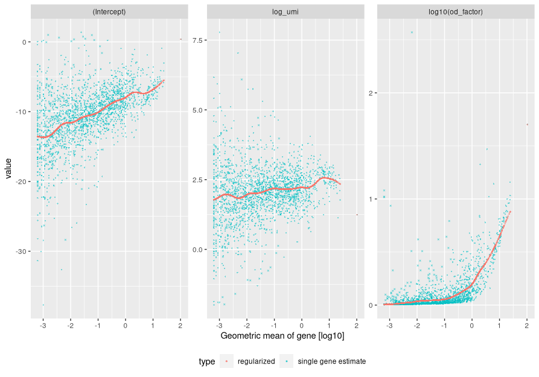
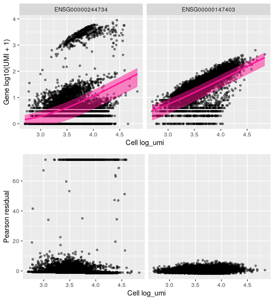
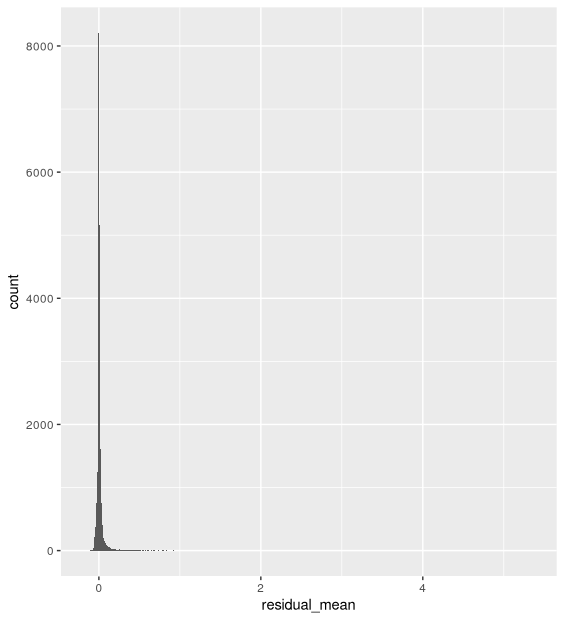
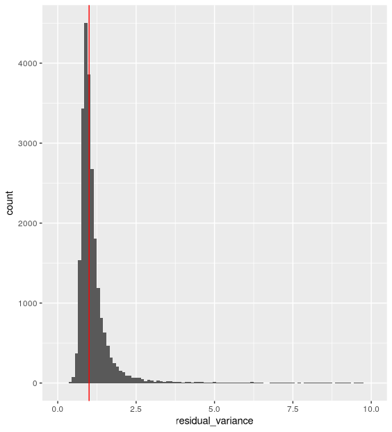

# 4. sctransform: Variant Stabilising Transformation

With scaling normalisation a correlation remains between the mean and variation of expression (heteroskedasticity). This affects downstream dimensionality reduction as the few main new dimensions are usually correlated with library size. `sctransform` addresses the issue by regressing library size out of raw counts and providing residuals to use as normalized and variance-stabilized expression values in some downstream analyses, such as dimensionality reduction.

!!! image ""
    <center>
    
    <small>Effect of scaling normalisation</small>
    </center>

The `sctransform` package is from the Seurat suite of scRNAseq analysis packages. Rather than convert our Single Cell Experiment object into a Seurat object and use the Seurat package’s command `SCTransform`, we will extract the counts matrix from our SCE object and run the variance stabilising transformation (VST) algorithm, using the `sctranform` package’s vst command, directly on the matrix. We can extract the counts matrix - as a dgCMatrix object sparse matrix - using the `counts` function.

!!! r-project "code"

    ```r
    counts <- counts(sce)
    class(counts)
    ```

## Rationale

In order to demonstrate the rationale behind the using the variance stabilising transformation, we will visually inspect various properties of our data. Our main interest is in the general trends, not in individual outliers. Neither genes nor cells that stand out are important at this step; we focus on the global trends.

### Derive gene and cell attributes from the UMI matrix

#### Gene attributes

Each gene has four attributes:

- mean UMI count across cells
- number of cells where the gene is detected
- variance of UMI counts across cells
- the mean and variance above on the log10 scale 

!!! r-project "code"

    ```r
    gene_attr <- data.frame(mean = rowMeans(counts), 
                            detection_rate = rowMeans(counts > 0),
                            var = rowVars(counts)) %>% 
      mutate(log_mean = log10(mean)) %>% 
      mutate(log_var = log10(var))
    ```
    ```r
    dim(gene_attr)
    ```
    ```r
    head(gene_attr)
    ```
#### Cell attributes

Each cell has two attributes:

- total UMI count across genes (library size)
- number of genes detected (with at least 1 UMI)

!!! r-project "code"

    ```r
    cell_attr <- data.frame(n_umi = colSums(counts),
                            n_gene = colSums(counts > 0))
    ```
    ```r
    dim(cell_attr)
    ```
    ```r
    head(cell_attr)
    ```
### Mean-variance relationship

For the genes, on the log10 scale we can see that up to a mean UMI count of 0 the variance follows the line through the origin with slope one, i.e. variance and mean are roughly equal as expected under a Poisson model. However, genes with a higher average UMI count show overdispersion compared to Poisson.

!!! r-project "code"

    ```r
    ggplot(gene_attr, aes(log_mean, log_var)) + 
      geom_point(alpha=0.3, shape=16) +
      geom_abline(intercept = 0, slope = 1, color='red')
    ```

    <center>{width="450"}</center>

### Mean-detection-rate relationship

In line with the previous plot, we see a lower than expected detection rate in the medium expression range. However, for the highly expressed genes, the rate is at or very close to 1.0 suggesting that there is no zero-inflation in the counts for those genes and that zero-inflation is a result of overdispersion, rather than an independent systematic bias.

!!! r-project "code"

    ```r
    x = seq(from = -3, to = 2, length.out = 1000)
    poisson_model <- data.frame(log_mean = x,
                    detection_rate = 1 - dpois(0, lambda = 10^x))
    ```
    ```r
    ggplot(gene_attr, aes(log_mean, detection_rate)) + 
      geom_point(alpha=0.3, shape=16) + 
      geom_line(data=poisson_model, color='red') +
      theme_gray(base_size = 8)
    ```

    <center>{width="400"}</center>

### Cell attributes

The plot below shows the relationship between the two cell attributes computed: library size (n_umi) and number of genes detected (n_gene).

!!! r-project "code"

    ```r
    ggplot(cell_attr, aes(n_umi, n_gene)) + 
      geom_point(alpha=0.3, shape=16) + 
      geom_density_2d(size = 0.3)
    ```

    <center>
    {width="450"}
    </center>

## Method 

From the sctransform vignette: 

“Based on the observations above, which are not unique to this particular data set, we propose to model the expression of each gene as a negative binomial random variable with a mean that depends on other variables. Here the other variables can be used to model the differences in sequencing depth between cells and are used as independent variables in a regression model. In order to avoid overfitting, we will first fit model parameters per gene, and then use the relationship between gene mean and parameter values to fit parameters, thereby combining information across genes. Given the fitted model parameters, we transform each observed UMI count into a Pearson residual which can be interpreted as the number of standard deviations an observed count was away from the expected mean. If the model accurately describes the mean-variance relationship and the dependency of mean and latent factors, then the result should have mean zero and a stable variance across the range of expression.”

!!! quote ""

    **Summary:**

    - expression of a gene is modeled by a negative binomial random variable with a mean that depends on library size.
    - library size is used as the independent variable in a regression model.
    - the model is fit for each gene, then combined data across genes is used to fit parameters.
    - convert UMI counts to residuals akin to the number of standard deviations away from the expected mean.

    **Assumptions:**

    - accurate model of the mean-variance relationship.
    - accurate model of the dependency of mean and latent factors.

    **Outcome:**

    - the mean of the transformed data (residuals) is zero.
    - stable variance across expression range.

## Application

### Estimation and transformation

We will now estimate model parameters and transform data.

The vst function estimates model parameters and performs the variance stabilizing transformation.

!!! circle-info "Here we use the log10 of the total UMI counts of a cell as variable for sequencing depth for each cell. After data transformation we plot the model parameters as a function of gene mean (geometric mean). We will set the following arguments:"

    - `umi` - The matrix of UMI counts with genes as rows and cells as columns
    - `latent_var` - The independent variables to regress out as a character vector
    - `return_gene_attr` - Make cell attributes part of the output
    - `return_cell_attr` - Calculate gene attributes and make part of output

!!! r-project "code"

    ```r
    set.seed(44)
    ```
    ```r
    vst_out <- vst(umi = counts,
                   latent_var = c('log_umi'),
                   return_gene_attr = TRUE,
                   return_cell_attr = TRUE

      )
    ```

### Paramater plots 

We will generate some diagnostic plots in order to inspect the estimated and fitted model parameters.

By default parameters shown are:

- intercept
- latent variables, here log_umi
- overdispersion factor (od_factor)

!!! r-project "code"

    ```r
    plot_model_pars(vst_out)
    ```
    <center>
    {width="750"}
    </center>

!!! r-project "code"

    We check the regression model used is the one the we intended:

    ```r
    vst_out$model_str
    ```
    We will now look at several genes in more detail by plotting observed UMI counts and comparing these to plots using the residuals from the modelling.

    For each gene of interest, we will plot:

    - the observed cell attribute (UMI counts) against the latent variable (library size) (by default), with the fitted model as a pink line showing the expected UMI counts given the model and a shaded region spanning one standard deviation from the expected value.
    - the residuals against the latent variable in the same way.

    We will look at two genes: ‘RPL10’ and ‘HBB’:

    ```r
    ensId <- rowData(sce) %>%
        as.data.frame %>%
        filter(Symbol %in% c('RPL10', 'HBB')) %>%
      pull("ID")

    plot_model(x = vst_out,
               umi = counts,
               goi = ensId,
               plot_residual = TRUE)
    ```
    <center>
    
    </center>


### Overall properties of transformed data


!!! r-project "code"
    - The distribution of residual mean is centered around 0:

    ```r
    ggplot(vst_out$gene_attr, aes(x = residual_mean)) +
        geom_histogram(binwidth=0.01)
    ```
    <center>
    {width="400"}
    </center>

    - The distribution of residual variance is centered around 1:

    ```r
    ggplot(vst_out$gene_attr, aes(residual_variance)) +
        geom_histogram(binwidth=0.1) +
        geom_vline(xintercept=1, color='red') +
        xlim(0, 10)
    ```
    <center>
    {width="400"}
    </center>

    - Plotting the residual variance against the mean shows that after transformation there is no relationship between gene mean and variance.

    ```r
    ggplot(vst_out$gene_attr, aes(x = log10(gmean), y = residual_variance)) +
           geom_point(alpha=0.3, shape=16)
    ```
    <center>
    {width="400"}
    </center>

    - Check genes with large residual variance. These genes would be markers of expected cell populations. Note how they represent a great range of mean UMI and detection rate values.

    ```r
    vst_out$gene_attr %>%
      arrange(desc(residual_variance)) %>% 
        top_n(n = 10) %>%
        mutate(across(where(is.numeric), round, 2)) %>% 
      rownames_to_column("ID") %>%
      left_join(as.data.frame(rowData(sce))[,c("ID", "Symbol")], "ID")
    ```

## Store VST transformed data in the SCE object

In order to store the transformed values in our Single Cell object, we need to add them as a new “assay”. The transformed values are kept as a matrix in the y object within vst_out.

Note that, by default, genes that are expressed in fewer than 5 cells are not used by vst and results for these genes are not returned, so to add the "y" column from the vst_out object as an assay in our single cell object we may need to subset the rows of our sce object to match the rows of the vst_out y column. In our case, about 10,000 genes were expressed in less than 5 cells, so we will need to subset our SCE object before adding the VST normalised counts.

!!! r-project "code"

    ```r
    keepGenes <- rownames(sce)%in%rownames(vst_out$y)
    sce <- sce[keepGenes,]
    vstMat <- as(vst_out$y[rownames(sce),], "dgCMatrix")

    assay(sce, "sctrans_norm", withDimnames=FALSE) <- vstMat
    ```