# 6. Batch correction and data set integration 

!!! quote ""

    Often, single-cell experiments are done by processing samples in multiple batches. This may be related to logistical constraints such as the inability to run all experimental conditions in parallel, or more extreme cases where samples are processed in different laboratories, by different people and even sequenced with different technologies (e.g. samples from human patients collected in different hospitals). These differences across sample batches very often result in global gene expression differences across those batches. Since batch-to-batch transcriptomic differences are likely unrelated to biological differences, we would ideally want “remove” them before drawing inferences about our cell populations.

    Biases due to batch effects are not new to single-cell RNA-seq. Indeed, several methods have been previously developed for standard bulk RNA-seq approaches. Some of those approaches rely on linear models that “regress out” the batch effect, assuming that the cell composition is similar across batches. However, in single-cell RNA-seq we may very often expect changes in cell compositions across batches (e.g. in our course data we have data from cancer samples such as ETV6-RUNX as well as a reference panel of healthy blood cells, PBMMCs). Therefore, methods are necessary that can deal with with heterogeneity across batches.

    In recent years, several methods have been developed to deal with this challenge ([too many to list here!](https://www.scrna-tools.org/tools?sort=name&cats=Integration)). Some of the most popular ones include the Mutual Nearest Neighbours (MNN) algorithm, a Principal Components Analysis-based clustering method implemented in the package HARMONY and a method that combines Canonical Correlation Analysis (CCC) and MNN implemented in the package Seurat 3. These methods have been shown to perform well in several benchmark studies (e.g. Luecken et al 2022 and Tran et al 2020), although one important message from these studies is that no **single method is universally the best in all situations**. For example, some methods may be better at preserving small populations of cells as separate groups in the integrated data at the cost of poorer overall integration, while others may be better at removing batch effects at the cost of also removing some biological signal.

    In this section we will apply the **Mutual Nearest Neighbours (MNN)** algorithm, which is readily available to use with the `SingleCellExperiment`` object we’ve been working with so far. However, other methods can be applied to the data in a similar manner (each package may use a slightly different syntax, but they mostly start with either a matrix of counts or a PCA projection). Therefore, what we will explore in this section - visualisation of the integrated data, looking at mixture of cell populations, etc. - can be done with those other methods as well.

## Example data set - PBMMC_1 technical replicates

To demonstrate the integration process, we will use two samples from the Caron dataset that will illustrate the purposes of dataset integration with batch correction. One is the PBMMC_1 sample that we have already seen, the other is a technical replicate derived from the same sample material (we will use our previous SCE object in a later exercise).

Whilst the two samples come from distinct 10X runs they are derived from the same starting material and therefore, if there was no batch effect, they should be identical. These samples have been processed as discussed up until this point in the course:

- Raw counts were imported from the cellranger output folder (using `DropletUtils::read10xCounts()`).
- Basic quality filtering was performed in each batch to remove cells that were outliers for total counts, number of detected genes and high percentage of mitochondrial counts (using `scuttle::quickPerCellQC()`).
- Reads were log-normalised using the deconvolution method (using `scuttle::computePooledFactors()`).

We already have the necessary objects prepared, and load them for this session:

!!! r-project "code"

    ```r
    library(scater)
    library(scran)
    library(batchelor)
    library(bluster)
    library(pheatmap)
    library(magrittr)
    ```
    ```r
    sce_rep1 <- readRDS("R_objects/PBMMC_1a_dimRed.rds")
    sce_rep2 <- readRDS("R_objects/PBMMC_1b_dimRed.rds")
    ```

    - First we should add information about which technical replicate each sample is. This is added as a new column in the colData DataFrame of the object.

    ```r
    colData(sce_rep1)$batch <- "1"
    colData(sce_rep2)$batch <- "2"
    ```

## Data Preparation

!!! circle-info ""

Before the data integration step, we need to prepare our data (we will later see how we can run all these steps with a single function, but it is good to see all the steps individually).

1. First we need to fit a mean-variance model to each data set separately (using `scran::modelGeneVar()`). This will be used later to identify highly-variable genes (HVGs) in each batch.
2. Subset our objects to only include the set of genes that are common in both samples (in case different genes were filtered out).
3. Rescale the batches to account for different sequencing depths. We had previously log-normalised the counts in each batch. However, this did not take into account differences in total sequencing depth across different batches. This step therefore helps to bring the different batches to a “similar scale”, which helps with the data integration step.
4. Select variable genes (feature selection), by averaging the variance previously estimated in each batch separately. This will gives us genes that are highly variable across both batches.

!!! r-project-2 "Fit mean-variance mode to each data set"

    ```r
    gene_var_rep1 <- modelGeneVar(sce_rep1)
    gene_var_rep2 <- modelGeneVar(sce_rep2)
    ```
!!! r-project-2 "Identify common genes and subset both the sce objects and the mean-variance model objects"

    The two samples have been QC’d and filtered independently. Removing undetected genes from each set independently has results in slightly different genes being retained in each dataset:
    ```r
    nrow(sce_rep1)
    ```
    ```r
    nrow(sce_rep2)
    ```
    ```r
    sum(rowData(sce_rep1)$ID%in%rowData(sce_rep2)$ID)
    ```
    ```r
    common_genes <- intersect(rownames(sce_rep1), rownames(sce_rep2))
    ```

    - Subset the SCE object

    ```r
    sce_rep1 <- sce_rep1[common_genes, ]
    sce_rep2 <- sce_rep2[common_genes, ]
    ```

    - Subset the mean-variance results

    ```r
    gene_var_rep1 <- gene_var_rep1[common_genes, ]
    gene_var_rep2 <- gene_var_rep2[common_genes, ]
    ```

!!! r-project-2 "Rescale and combine data"

    ```r
    rescaled_sces <- multiBatchNorm(sce_rep1, sce_rep2)

    sce <- cbind(rescaled_sces[[1]], 
                 rescaled_sces[[2]])
    ```

!!! r-project-2 "Combine gene variance models and identify HVGs"

    ```r
    gene_var_combined <- combineVar(gene_var_rep1, gene_var_rep2)

    hvgs <- gene_var_combined$bio > 0
    sum(hvgs)
    ```
## Visualising Uncorrected Data

Before running the data integration procedure, it is always good to check how much of a problem the batch effect might be. This is typically done by visualising the combined data in a reduced dimensionality projection such as t-SNE or UMAP.

Another strategy to check for batch effects, involves clustering the cells (we will cover cell clustering in detail later) and checking whether both batches are represented in each cluster. If clusters contain cells from only one of the clusters, this may indicate a batch effect is present.

!!! r-project "code"

    ```r
    sce <- runPCA(sce, subset_row = hvgs)

    sce$cluster_uncorrected <- clusterCells(sce, use.dimred = "PCA")

    sce <- runTSNE(sce, dimred = "PCA", name = "TSNE_uncorrected")

    plotReducedDim(sce, dimred = "TSNE_uncorrected",
                   colour_by = "batch",
                   text_by = "cluster_uncorrected")

    plotReducedDim(sce, dimred = "PCA",
               colour_by = "batch",
               text_by = "cluster_uncorrected")               
    ```
    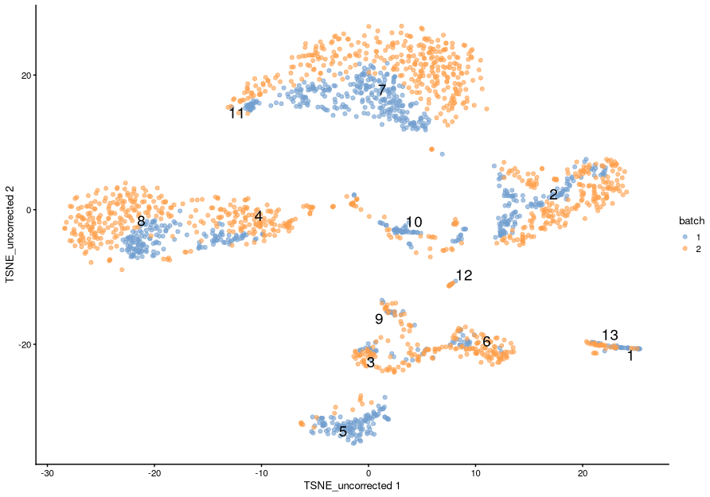

    - We can also assess cluster occupancy data as a table.
    ```r
    table(Cluster = sce$cluster_uncorrected, Batch = sce$batch)
    ```
!!! quote ""
    As we can see from the t-SNE, cells seem to somewhat separate according to batch (although distinct groups of cells are still visible at a more global scale).
    
    We can also see that some of the clusters identified in the data contain an unbalanced number of cells from each batch.
    
    However, from the t-SNE, there is some suggestion that these could be the same cell type. Another example is cluster 7, which contains cells from both batches, but on the t-SNE there is still some within-batch separation of these cells (if we formed sub-clusters they would likely separate by batch).
    
    It is worth noting that, although this suggests a batch effect (and in the case of technical replicates this is a good assumption), there might be cases where there are genuine differences in cell populations across batches (e.g. if the different batches represent samples from different tissues).
    
    Data integration algorithms designed for single-cell RNA-seq do allow for unique cell types existing across batches, however, it’s always good to check the results of the integration using independent information (e.g. prior information about genes that are specific to particular cell types).


## Correct the data - Mutual Nearest Neighbour (MNN)

The *Mutual Nearest Neighbours* (MNN) algorithm works by determining if pairs of cells from two different batches are within the top K closest neighbours of each other.

!!! image "Schematic of the MNN algorithm  - Reference: [Haghverdi et al 2018](https://www.nature.com/articles/nbt.4091)"

    Here are the assumptions of this approach (taken from Haghverdi et al 2018):

    1. There is at least one cell population that is present in both batches,
    2. The batch effect is almost orthogonal [i.e. uncorrelated] to the biological subspace
    3. The batch-effect variation is much smaller than the biological-effect variation between different cell types

    <center>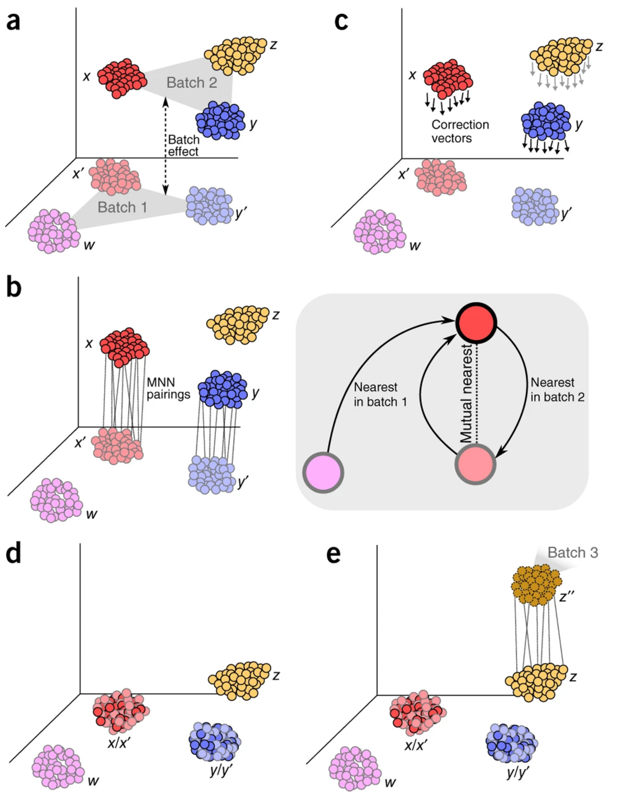{width="600"}</center>

!!! r-project-2 "We will use the `fastMNN()`` function. We will need to provide the following:"

    - The SCE object(s) with the log-normalised counts to correct.
    - `batch`` - A variable specifying the batch labels for each cell (usually we include that information as a column in the colData slot of the object).
    - `d`` - The number of dimensions to use from a PCA projection of the data (the method uses PCA values for computational efficiency - and it has also been shown to often perform better than using the full matrix of logcounts).
    - `k` - The number of cells to consider when calculating the mutual nearest neighbours between each pair of cells.
    - `subset.row`` - The genes to use for the PCA step of the algorithm. We use the highly-variable genes determined earlier from the pooled mean-variance model.

    ```r
    mnn_corrected <- fastMNN(sce, 
                             batch = sce$batch,
                             d = 50,
                             k = 20, 
                             subset.row = hvgs)
    mnn_corrected
    ```

The result of the function is a new `SingleCellExperiment` object with a “corrected” matrix in the reducedDims slot, containing corrected low-dimensional coordinates for each cell. This “corrected” matrix can be used in downstream analyses such as clustering.

The new object also contains a “reconstructed” matrix in the assays slot. This can be viewed as per-gene corrected log-expression values, but should not be used for any quantitative analyses as the magnitude and even the direction of differences in expression between cells may not have been preserved.

!!! r-project-2 "We can add the “corrected” matrix to our original SCE object, so that we keep all the data together in the same object."

    ```r
    reducedDim(sce, "corrected") <- reducedDim(mnn_corrected, "corrected")
    ```

??? clipboard-question "How many neighbours (k) should we consider?"

    The answer to this question - as is often the case in bioinformatics! - is that this will depend on the dataset. One heuristic to use is to think about what is the minimum number a given cell type that you expect to be shared between the batches. For example, the value `k = 20` is approximately equivalent to assuming that we expect there to be a group of a least 20 cells of one type in one batch that have an equivalent group of 20 or more cells of the same type in the other batch.

    Sometimes, based on the analysis of known cell-specific marker genes, we may notice that some batch-specific clusters should have been merged, but are not. In those cases, increasing the number of k neighbours will result in a stronger integration (we are effectively increasing the chance that a given pair of cells are mutual neighbours of each other).

## Visualising the Corrected Data 


!!! r-project-2 "Now that we have batch corrected the data, we can visualise the impact of this using a tSNE as we did for the uncorrected data."

    ```r
    sce$cluster_corrected <- clusterCells(sce, use.dimred = "corrected")

    sce <- runTSNE(sce, dimred = "corrected", name = "TSNE_corrected")

    plotReducedDim(sce, 
                   dimred = "TSNE_corrected", 
                   colour_by = "batch", 
                   text_by = "cluster_corrected")
    ```
    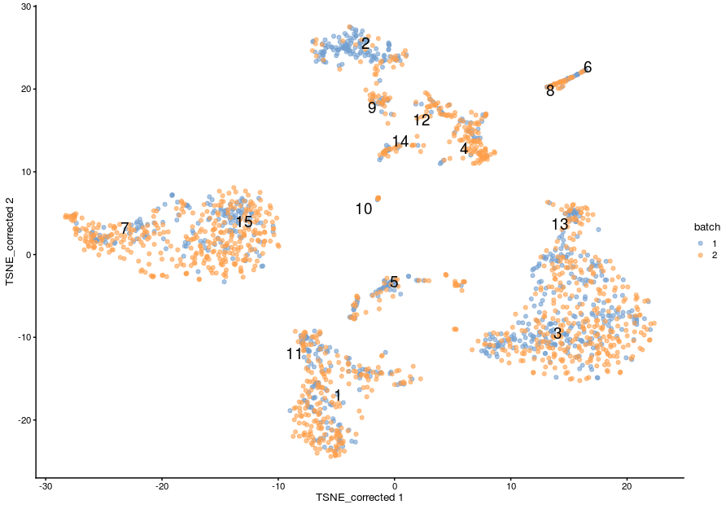

From this new t-SNE, we can see that the cells from the two batches seem to be much better mixed with each other. There is still some apparent separation, which could indicate that we should use a higher value of k with `fastMNN()`, or could be real biological differences between the samples. If in doubt, it may be better to avoid over-correcting the data, and rather to come back to the analysis after we did some more investigation of what kind of genes separate those cells (a topic for the next session).

!!! r-project-2 "We can also compare the mixing of cells in the clusters before and after correction."

    We can confirm from this visualisation that there is more mixing of cells within a batch in the corrected data compared to the original one.

    === "Uncorrected batches"

        ```r
        data.frame(Cluster = sce$cluster_corrected, Batch = sce$batch) %>%
          ggplot(aes(x = Cluster)) +
            geom_bar(aes(fill = Batch), position = "fill") +
            labs(title = "MNN-corrected data") +
          scale_y_continuous(labels = scales::percent)
        ```
        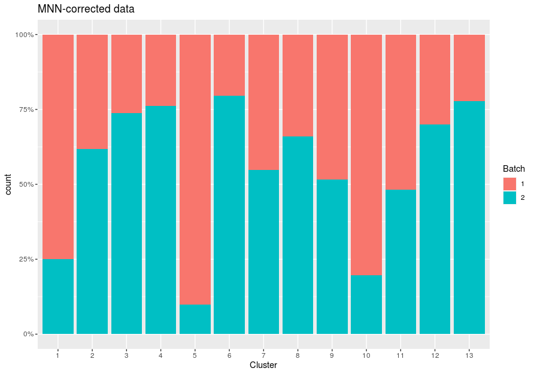

    === "Corrected batches"

        ```r
        data.frame(Cluster = sce$cluster_corrected, Batch = sce$batch) %>%
          ggplot(aes(x = Cluster)) +
            geom_bar(aes(fill = Batch), position = "fill") +
            labs(title = "MNN-corrected data") +
          scale_y_continuous(labels = scales::percent)
        ```
        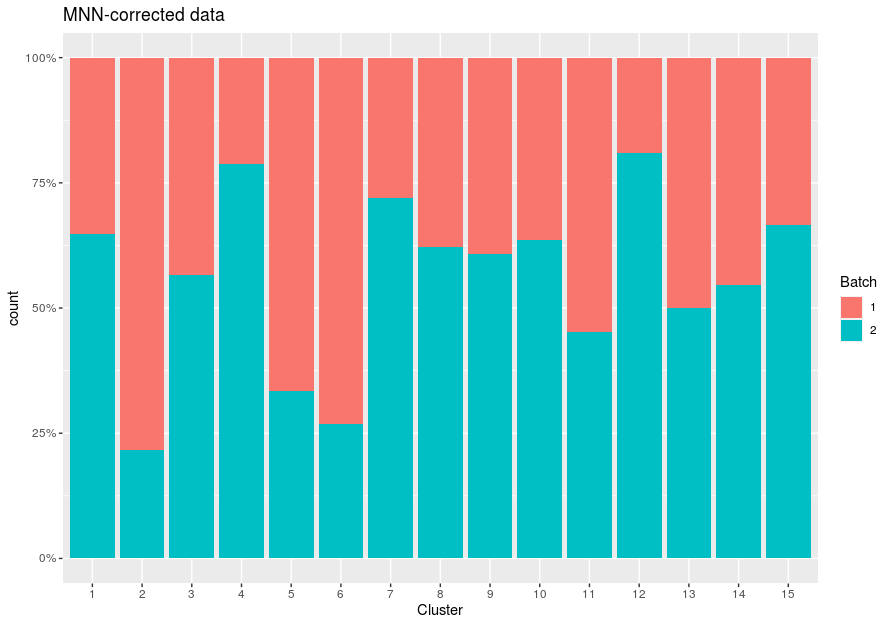


## The `quickCorrect()` function

The `batchelor`` package has made the data integration procedure easier by having a wrapper function called `quickCorrect``, which automates the individual steps we went through to prepare the data before MNN correction. This includes intersecting the batches for common genes, log-normalising the batches, and identifying highly variable genes across batches. By default, `quickCorrect` will use the fastMNN method, but you can change it to use other correction algorithms by modifying the PARAM argument (see more details in the function’s help page).

!!! r-project-2 "Let’s visualise the results to check that it is similar to what we obtained previously."

    ```r
    sce_quick_mnn <- quickCorrect(sce_rep1, sce_rep2)$corrected
    ```
    ```r
    sce_quick_mnn$batch <- factor(sce_quick_mnn$batch)
    sce_quick_mnn %>%
      runTSNE(dimred = "corrected") %>%
      plotTSNE(colour_by = "batch")
    ```

    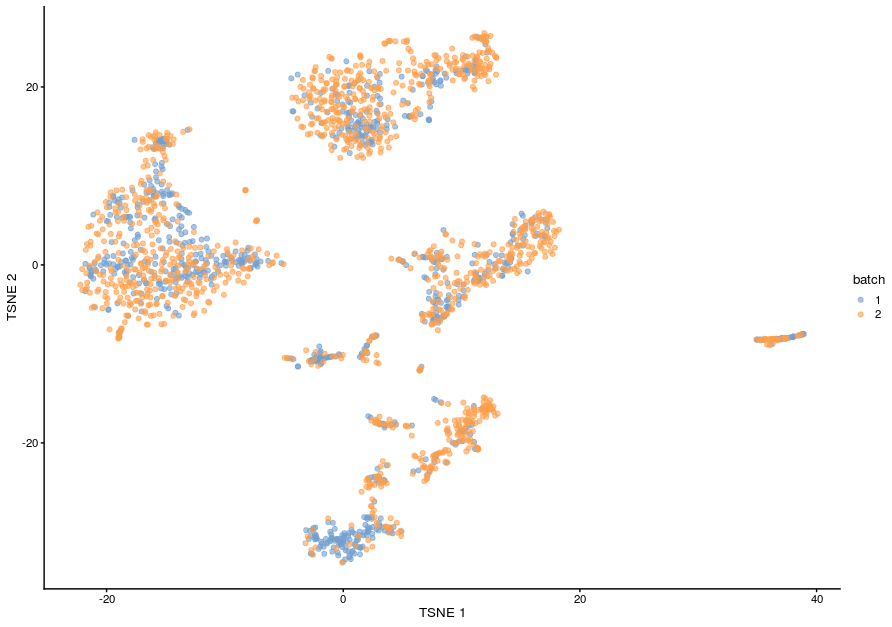


## Multiple batches

The above example used only two samples (batches), but it will often be the case that we have many samples or batches. It is straightforward to simultaneously perform correction across >2 batches with `quickCorrect()`, either by using the batch= option or by providing several separate `SingleCellExperiment`` objects. Lets try this out with all of the samples from the Caron dataset.

!!! clipboard-question "Exercise"

    In this exercise we will work with a `SingleCellExperiment` that contains the 11 samples that we have worked with so far.

    This object has been processed as discussed in the previous sections, but we down-sampled the data to 500 cells per sample for processing speed (in real analysis you would not do this).

    In the “Exercises” directory there is an R script called 07_Dataset_Integration_Exercise.R. This contains some code to get you started by reading the data and checking how many cells we have in each sample.

    You should then add the rest of the code in order to:

    1. Batch correct the data using the quickCorrect() wrapper, treating each individual sample as a batch. See the Help page (?quickCorrect) for details on how to specify batch when only providing one single cell experiment object.
    2. Add the “corrected” matrix from the new object into the “reducedDim” slot of the original single cell experiment object
    3. Plot a tSNE of your corrected data and compare it to the uncorrected data.

    Note that the object we have loaded already contains a tSNE computed from the uncorrected logcounts (in the default reducedDim slot called “tSNE”).

    ??? circle-check "Answer"

        !!! r-project "code"

        ```r
        # obtain a batch-corrected SCE object
        sce_all_corrected <- quickCorrect(sce_all, batch = sce_all$SampleName)$corrected

        # add the corrected matrix to the original object - to keep it all together
        reducedDim(sce_all, "corrected") <- reducedDim(sce_all_corrected, "corrected")

        #  add a tSNE using the corrected data
        set.seed(323)
        sce_all <- runTSNE(sce_all, 
                           dimred = "corrected",
                           name = "TSNE_corrected")

        # visualise both corrected and uncorrected
        plotReducedDim(sce_all, dimred = "TSNE", colour_by = "SampleName")
        ```
        ```r
        plotReducedDim(sce_all, dimred = "TSNE_corrected", colour_by = "SampleName")
        ```

[[[Collapse all this down!]]]

### Specifying merge order

During the batch correction, batches are merged in a pairwise manner. If we have more than two batches, first two batches are merged to create a new cohort, then the next batch is merged with this new cohort, and so on until all batches have been integrated. The order is which this is done by default is the order in which the batches are provided to the command.

Batch correction will work more effectively between batches with large number of cells and between batches that have many cells of the same cell type. As a result it is often beneficial to specify the order in which batches should be combined. If we are expecting differences in cell populations present between different sample groups it is probably advisable to integrate replicates within sample groups first, and then integrate the different sample groups.

This can be specified using the merge.order argument of `fastMNN`. This, and any other `fastMNN` arguments you wish to control such as `d` or `k`, can be provided to `quickCorrect``` using it’s `Param = FastMnnParam()` argument.

The merge.order argument should be provided a nested list object that determines the merge order. Please see the fastMNN help page for a detailed explanation of how this can be constructed. In short, each batch within a list will be merged (in the order provided) before batches in different lists are merged.

In our case, we have four sample groups: ETV6-RUNX1, HHD, PBMMC, PRE-T. We might decide that it makes sense to integrate replicates from the same sample group before integrating between sample groups. To do this we want to integrate the samples in the following order

!!! circle-info "In our case, we have four sample groups: ETV6-RUNX1, HHD, PBMMC, PRE-T. We might decide that it makes sense to integrate replicates from the same sample group before integrating between sample groups. To do this we want to integrate the samples in the following order"

    1. ETV6-RUNX1_1 + ETV6-RUNX1_2 --> + ETV6-RUNX1_3 --> + ETV6-RUNX1_4 --> ETV6-RUNX1_batch

    2. HHD_1 + HHD_2 --> HHD_batch

    3. PBMMC_1 & PBMMC_2 --> + PBMMC_3 --> PBMMC_batch

    4. PRE-T_1 + PRE-T_2 --> PRE-T_batch  

    5. ETV6-RUNX1_batch + HHD_batch ->  + PBMMC_batch --> + T_batch --> Integrated_data_set

    !!! note ""

    To do this we need a nested list that looks like this:

    ```bash
    list(
    list("ETV6-RUNX1_1", "ETV6-RUNX1_2", "ETV6-RUNX1_3", "ETV6-RUNX1_4"),
    list("HHD_1", "HHD_2"),
    list("PBMMC_1", "PBMMC_2", "PBMMC_3"),
    list("PRE-T_1", "PRE-T_2")
    )
    ```
    !!! r-project-2 "So, to apply this we would use the following:"

        ```r
        sce_all <- readRDS("R_objects/Caron_dimRed.500.rds")
        table(sce_all$SampleName)
        merge_order <- list(
                  list("ETV6-RUNX1_1", "ETV6-RUNX1_2", "ETV6-RUNX1_3", "ETV6-RUNX1_4"),
                  list("HHD_1", "HHD_2"),
                  list("PBMMC_1", "PBMMC_2", "PBMMC_3"),
                  list("PRE-T_1", "PRE-T_2")
                           )

        sce_all_corrected <- quickCorrect(sce_all,
                                          batch = sce_all$SampleName,
                                          PARAM = FastMnnParam(merge.order = merge_order)
                                          )$corrected

        # add the corrected matrix to the original object - to keep it all together
        reducedDim(sce_all, "corrected_mo") <- reducedDim(sce_all_corrected, "corrected")

        #  add a tSNE using the corrected data
        set.seed(323)
        sce_all <- runTSNE(sce_all, 
                           dimred = "corrected_mo",
                           name = "TSNE_corrected_mo")
        ```
        !!! note ""
        <br>

        === "Uncorrected TSNE"
            ```r
            plotReducedDim(sce_all, dimred = "TSNE", colour_by = "SampleName")
            ```
            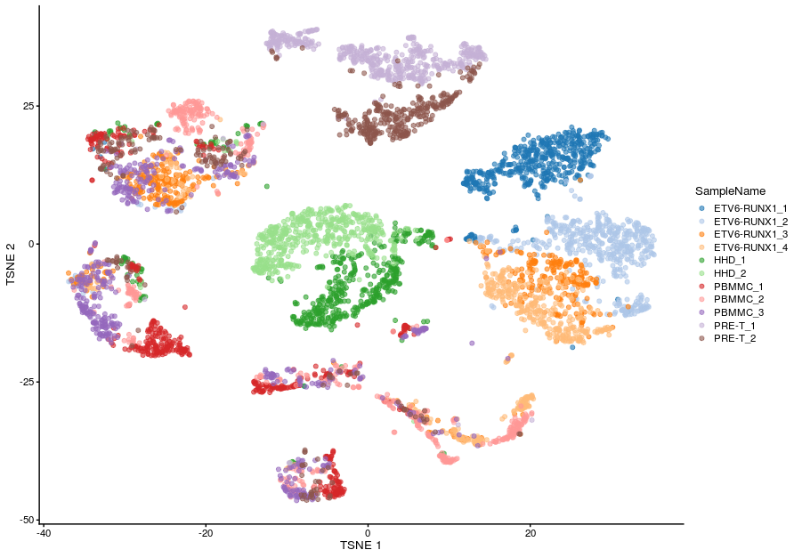

        === "Corrected TSNE - default merge order"

            ```r
            plotReducedDim(sce_all, dimred = "TSNE_corrected", colour_by = "SampleName")
            ```
            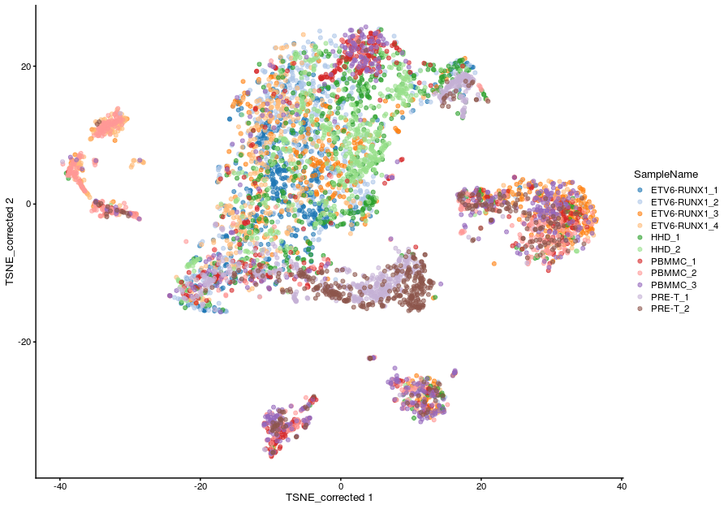
            
        === "Corrected TSNE - merger by sample group"

            ```r
            plotReducedDim(sce_all, dimred = "TSNE_corrected_mo", colour_by = "SampleName")
            ```
            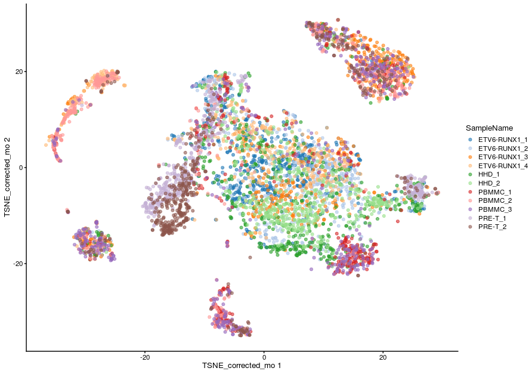

## Correction Diagnostics

### Mixing Between Batches - Bar plots

As before, we can explore our data to see if clustering the cells using the corrected data results in batches containing cells from multiple samples/batches, rather than being skewed to having one-batch-per-cluster.

This clustering serves as a proxy for the population structure. So, if the batch effect is successfully corrected, clusters corresponding to shared cell types or states should contain cells from multiple batches.


=== "Uncorrected batches"

    !!! r-project ""

        ```r
        sce_all$cluster_uncorrected <- clusterCells(sce_all, use.dimred = "PCA")

        data.frame(Cluster = sce_all$cluster_uncorrected, Sample = sce_all$SampleName) %>%
          ggplot(aes(x = Cluster)) +
            geom_bar(aes(fill = Sample), position = "fill") +
            labs(title = "MNN-corrected data") +
          scale_y_continuous(labels = scales::percent)
        ```
        
=== "Corrected batches"


    !!! r-project ""
        
        ```r
        sce_all$cluster_corrected <- clusterCells(sce_all, use.dimred = "corrected")

        data.frame(Cluster = sce_all$cluster_corrected, Sample = sce_all$SampleName) %>%
          ggplot(aes(x = Cluster)) +
            geom_bar(aes(fill = Sample), position = "fill") +
            labs(title = "MNN-corrected data") +
          scale_y_continuous(labels = scales::percent)
        ```
        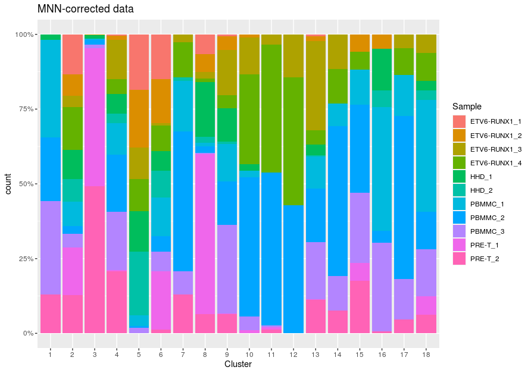
    
### Mixing Between Batches - variance of batch abundancies in clusters

One approach to assess the degree of mixing between clusters is to calculate the variance in the log-normalized cell abundances across batches for each cluster. A high variance value in this case represents a cluster with unequal representation of cells from each batch. Therefore, those clusters with the highest variance values may be due to incomplete correction. Alternatively, these may be due to true biological differences between batches (which could be investigated, for example, by looking at the expression of known cell-type-specific genes).

!!! r-project "code"

    - This is a qualitative, exploratory method to diagnose issues with batch correction. As we can see from this table, this is a good indication of clusters with an extreme imbalance of cells from different clusters, but we can see that there is a limitation in making strong conclusions from clusters that have an overall low number of cells.
    ```r
    cluster_var <- clusterAbundanceVar(sce_all$cluster_corrected, 
                                       batch = sce_all$SampleName)

    batch_per_cluster <- table(Cluster = sce_all$cluster_corrected, 
                               Batch = sce_all$SampleName)

    batch_per_cluster[order(cluster_var, decreasing = TRUE), ]
    ```
### Preserving Biological Heterogeneity

Another useful diagnostic check is to compare the pre-correction clustering of each batch to the clustering of the same cells in the corrected data. Accurate data integration should preserve population structure within each batch as there is no batch effect to remove between cells in the same batch. This check complements the previously mentioned diagnostics that only focus on the removal of differences between batches. Specifically, it protects us against scenarios where the correction method simply aggregates all cells together, which would achieve perfect mixing but also discard the biological heterogeneity of interest. Lets go back to our simple two sample example to look at some of the ways we can investigate.

!!! r-project "code"
    ```r
    table(colLabels(sce_rep1))
    ```
    ```r
    table(colLabels(sce_rep2))
    ```
#### Nesting of before and after correction clusters

Ideally, we should see a many-to-1 mapping where the post-correction clustering is nested inside the pre-correction clustering. This indicates that any within-batch structure was preserved after correction while acknowledging that greater resolution is possible with more cells. We quantify this mapping using the nestedClusters() function from the bluster package, which identifies the nesting of post-correction clusters within the pre-correction clusters. Well-nested clusters have high max values, indicating that most of their cells are derived from a single pre-correction cluster.

!!! r-project "code"

    ```r
    original_clusters <- colLabels(sce_rep1)
    corrected_clusters_rep1 <- sce[,colnames(sce_rep1)]$cluster_corrected
    tab <- nestedClusters(ref=paste("before", original_clusters),
                          alt=paste("after", corrected_clusters_rep1))

    tab$alt.mapping
    ```
    <center>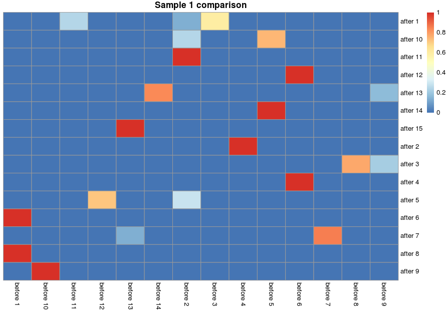{width="600"}</center>

!!! r-project-2 "We can visualize this mapping for the samples"

    ```r
    pheatmap(tab$proportions, 
             cluster_row=FALSE, 
             cluster_col=FALSE,
             main="Sample 1 comparison")
    ```
    <center>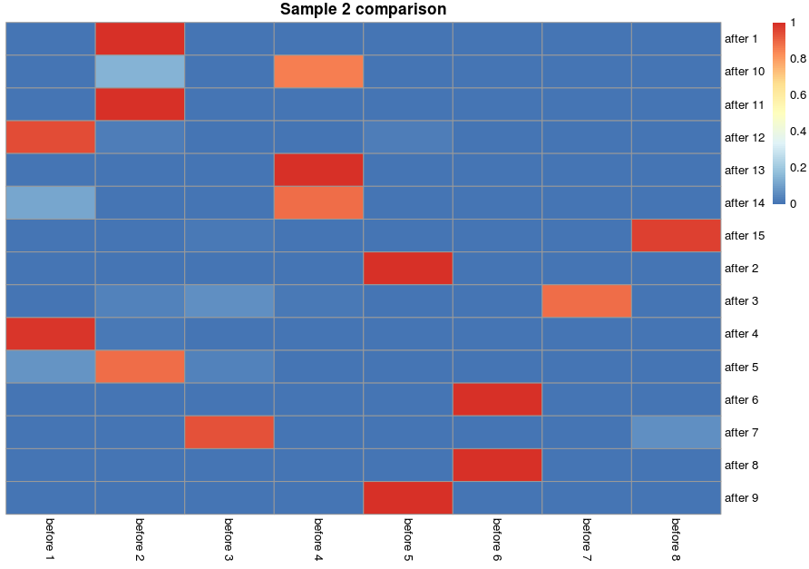{width="600"}</center>


#### Adjusted Rand index

We can use the adjusted Rand index to quantify the agreement between the clusterings before and after batch correction. The adjusted Rand index gives us a measure of the proportion of pairs of cells that have the same relative status in both clusterings - i.e. they were are in the same cluster in both clusterings or they are in different clusters in both clusterings, as oppose to e.g. being in the same cluster in one clustering and different clusters in the other.

Larger indices are more desirable as this indicates that within-batch heterogeneity is preserved, though this must be balanced against the ability of each method to actually perform batch correction.

!!! r-project "code"

    ```r
    pairwiseRand(corrected_clusters_rep1, colLabels(sce_rep1), mode="index")
    pairwiseRand(corrected_clusters_rep2, colLabels(sce_rep2), mode="index")
   
    ```
    ```r
    tab <- pairwiseRand(colLabels(sce_rep1), corrected_clusters_rep1)
    pheatmap(tab, 
             cluster_row=FALSE, 
             cluster_col=FALSE,
             main="Sample 1 probabilities")
    ```
    <center>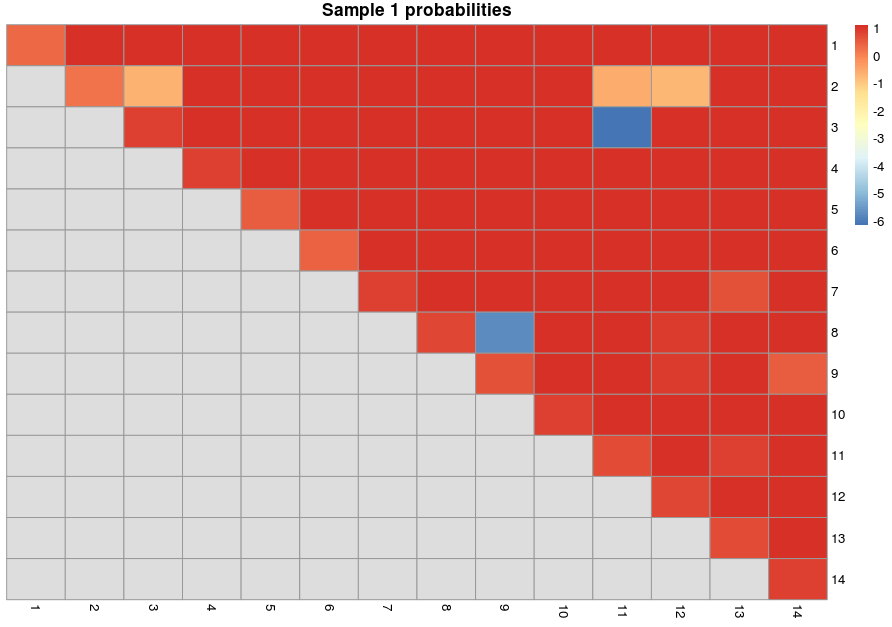{width="600"}</center>

!!! r-project "code"

    ```r
    tab <- pairwiseRand(colLabels(sce_rep2), corrected_clusters_rep2)

    pheatmap(tab, 
             cluster_row=FALSE, 
             cluster_col=FALSE,
             main="Sample 2 probabilities")
    ```
    <center>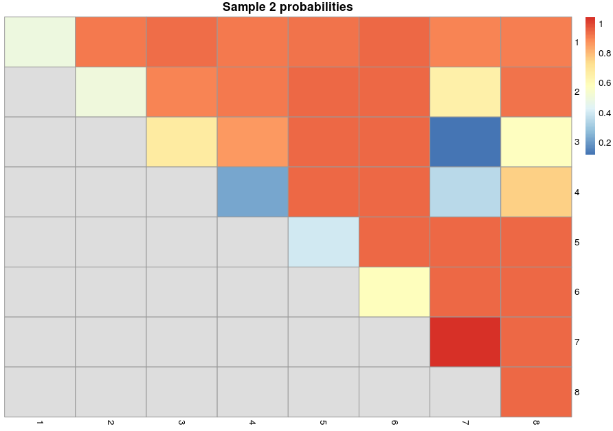{width="600"}</center>

### MNN specific test 

For fastMNN(), one useful diagnostic is the proportion of variance within each batch that is lost during MNN correction. Specifically, this refers to the within-batch variance that is removed during orthogonalization with respect to the average correction vector at each merge step. This is returned via the lost.var field in the metadata of mnn.out, which contains a matrix of the variance lost in each batch (column) at each merge step (row).

!!! r-project "code"
    ```r
    metadata(sce_quick_mnn)$merge.info$lost.var
    ```

    Large proportions of lost variance (>10%) suggest that correction is removing genuine biological heterogeneity. This would occur due to violations of the assumption of orthogonality between the batch effect and the biological subspace (Haghverdi et al. 2018). In this case, the proportion of lost variance is smaller, indicating that non-orthogonality is not to much of a major concern
