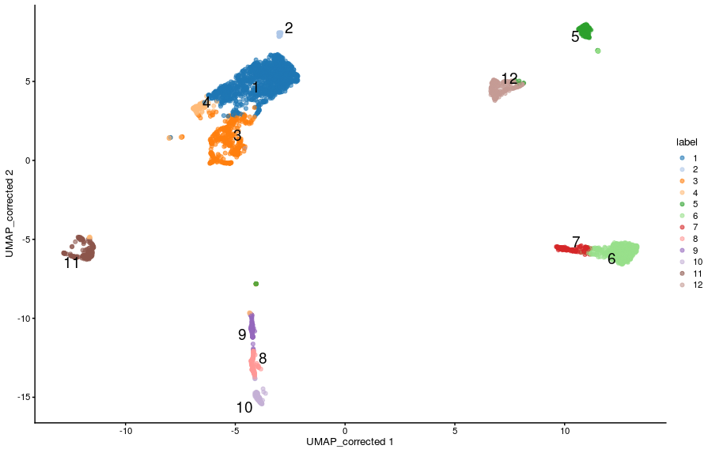
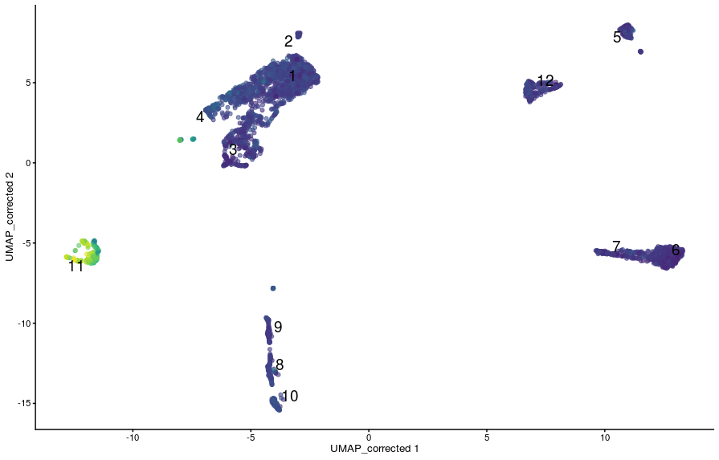
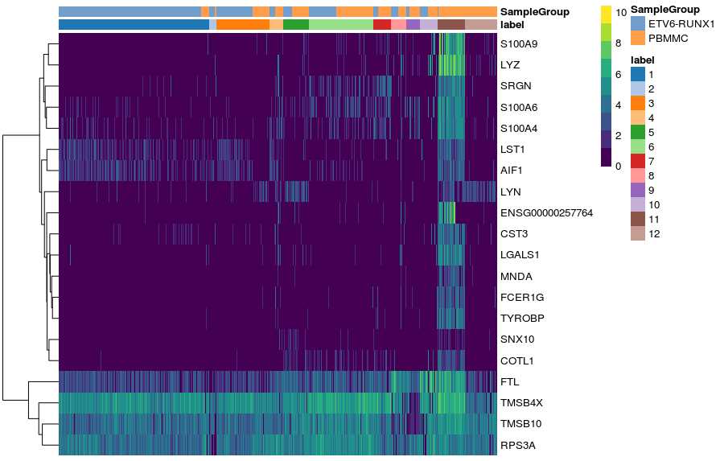
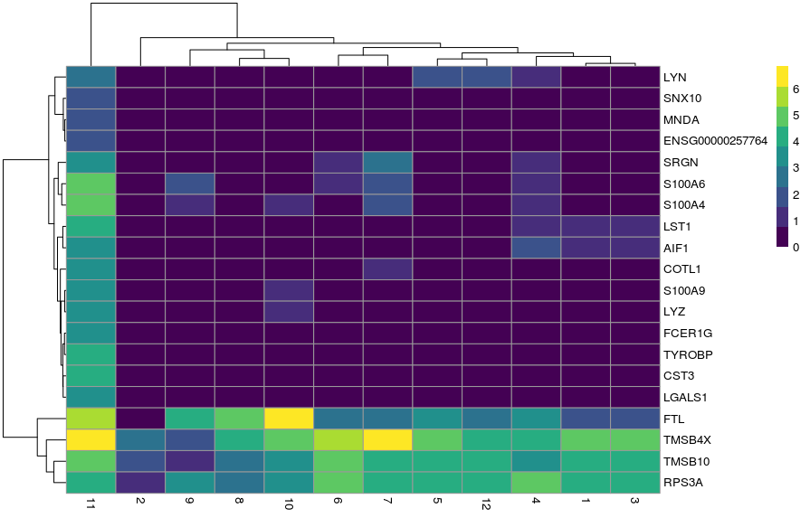
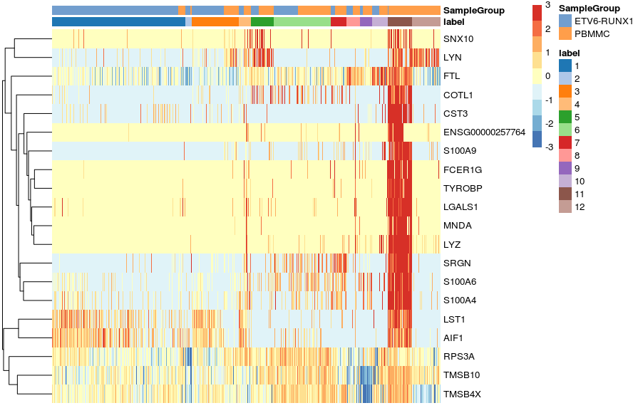
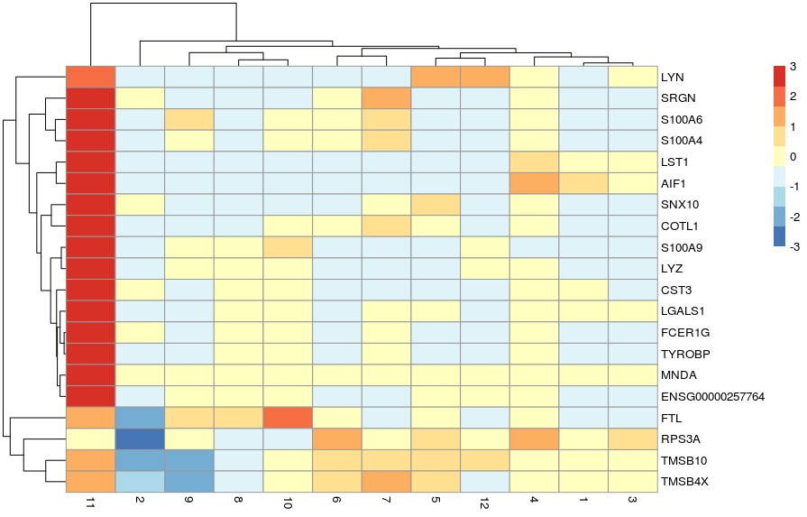
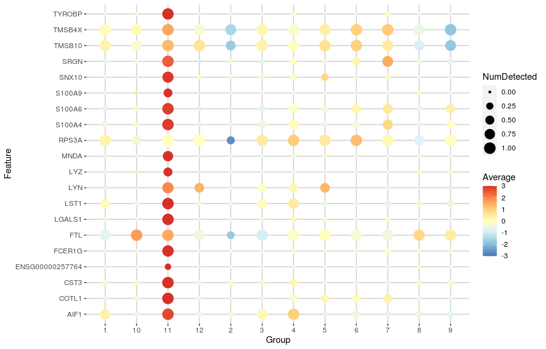
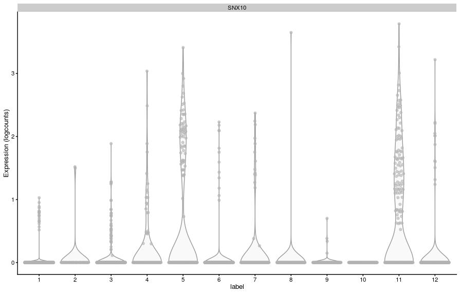
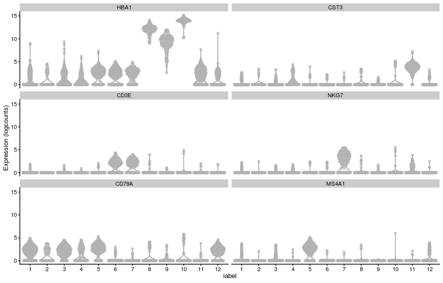
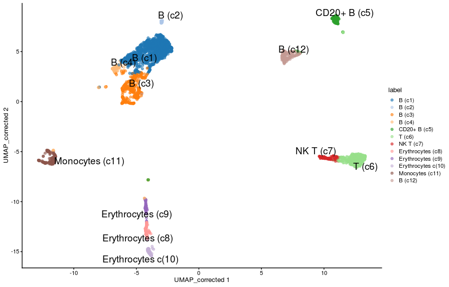

# 8. Identification of cluster marker genes

In order to aid the interpretation of the clustering results that we covered in the previous section, it is helpful to identify genes that contribute to the separation of cells into those clusters.

The main approach to achieve this, is to identify genes that are differently expressed between clusters. These may be, for example, exclusively expressed in a single cluster or perhaps differentiate between a few different clusters. There are different methods to identify expression differences between clusters: using mean expression level, or the ranking of the gene by its expression, or the proportions of cells that express the gene.

Our main objective in this section is to cover some of the methods that can be used to achieve this goal, and obtain a summary table of results

!!! r-project-2 "Setup"

    ```r
    library(scater)
    library(scran)
    library(tidyverse)
    library(patchwork)
    ```

    - We will use the data set generated in the clustering session. This contains 7 samples from the Caron data set. For the purposes of these materials, in the interests of time, each sample has been downsampled to only contain 500 cells.
    - read single cell object

    ```r
    sce <- readRDS("R_objects/Caron_clustered.500.rds")
    ```
    ```r
    rownames(sce)[11:20]
    ```
    ```r
    all(sce$k.25_cluster.fun.leiden == sce$label)
    ```

    - To remind ourselves, we can visualise the clusters on a UMAP:
    ```r
    plotReducedDim(sce, 
                   dimred = "UMAP_corrected",
                   colour_by = "label", 
                   text_by = "label")
    ```
    <center>{width="400"}</center>

    - Our objective is to identify genes that distinguish these clusters from one another - “cluster marker genes”. Intuitively we hope that the clusters relate to specific cell populations, and therefore we are trying to find genes that will allow us to identify the cell types for each cluster.

    - For example genes such as the “CST3” gene, which is a known monocyte marker:

    ```r
    plotReducedDim(sce, 
                   dimred = "UMAP_corrected",
                   colour_by = "CST3", 
                   text_by = "label", 
                   by_exprs_values = "reconstructed",
                   add_legend = FALSE)
    ```
    <center>{width="400"}</center>


## Identifying cluster marker genes

Although we have defined our clusters based on the batch-corrected expression values, these should not be used for for gene-based analyses like marker gene detection. Instead, we should **use the uncorrected (normalised) expression values for differential expression between clusters**. This is because data integration algorithms bring cells together based on their overall gene expression, but for each gene individually the data transformation may introduce artificial agreement between batches, which is not ideal for gene-level differential analysis. Furthermore, the severity of these biases is dependent on the parameters used for data integration (such as the number of nearest neighbours in the `fastMNN()`` method).

Valid assays to use in gene based differential analysis tests are the normalised counts obtained from the deconvolution method (using `scuttle::computePooledFactors() + scuttle::logNormCounts()`) or from the variance stabilising transformation method (using `sctransform::vst(). In our SCE object, we have the normalised counts in the “logcounts” assay, which we can access with assay(`sce, "logcounts"` (or using the shortcut `logcounts(sce)`).

### Paiwise Cluster Comparisons

The basic approach for marker gene identification across clusters is to perform statistical tests for each gene between every pair of clusters. The scoreMarkers() function can do this for us, while accounting for known factors (aka “blocking factors” or “blocks”), such as sample batch.

The `scoreMarkers()` function outputs a list of DataFrame objects, one for each cluster compared to all others. However, note that the blocking assumes that each pair of clusters is present in at least one of the blocks. If there are two clusters which are not both present in at least one block (in our case Samples), then that pairwise comparison will by necessity be omitted.

!!! r-project-2 "By default the `scoreMarkers()` function will use the log-normalised counts as stored in the “logcounts” assay slot of the single cell object, so there is no need for us to specify it."

    -  calculate pairwise marker gene statistics

    ```r
    markers <- scoreMarkers(sce, 
                            groups = sce$label, 
                            block = sce$SampleName)
    ```

    The returned object is a list of the same length as the number of clusters. We can access the results for a particular cluster thus:

    - extract results for cluster 11

    ```r
    c11_markers <- as.data.frame(markers[["11"]])
    head(c11_markers)
    ```

    ??? circle-info "This DataFrame contains the results for cluster 10. The first four columns contain summary statistics:"

        - **self.average** - the mean log-expression in the cluster of interest
        - **other.average** - the grand mean across all other clusters
        - **self.detected** - the proportion of cells with detected expression in the cluster of interest
        - **other.detected** - the mean detected proportion across all other clusters.

    ??? circle-info "The remaining columns contain summaries of three scores from the pairwise comparisons. The three scores are:"

        - **logFC.cohen** - “Cohen’s d” - this is the log fold change of mean gene expression standardized by the average standard deviation across the groups. This can be interpreted in a similar way to log fold change in that a positive value indicates upregulation in the cluster of interest.
        - **AUC** - “Area Under the Curve” - this quantifies the ability to distinguish between two gene expression distributions. It can be interpreted as the likelihood that any random cell in the cluster of interest will have a higher expression of the gene than any random cell in the other cluster. It ranges from 0 to 1, where 1 can be interpreted as upregulation, 0 downregulation, and 0.5 as no difference.
        - **logFC.detected** - this is the log fold change in the proportion of cells in which the gene is detected in the cluster of interest, versus the proportion of cells in which the gene is detected in the other cluster. Positive values indicate that the gene is detected in more cells in the cluster of interest than the other cluster. Note, this takes no account of the magnitude of the gene expression, instead this metric helps to identify presence/absence differences in gene expression between clusters.


### Heatmap of marker genes


We have already seen how we can use the plotExpression() function to visualise the distribution of expression in our data between clusters. We have also seen how to use plotReducedDim() to visualise a gene’s expression on the projected reduced dimensionality space.

Another useful type of visualisation is to use heatmaps to show the expression of these genes of interest. We will demonstrate this using the top marker genes for cluster 11.

!!! r-project-2 "Get top-ranked markers for cluster 11"

    ```r
    c11_top_genes <- c11_markers %>% 
      filter(rank.logFC.cohen <= 5) %>% 
      rownames()
    ```
!!! r-project-2 "Visualise their expression as a heatmap"

    ```r
    plotHeatmap(sce, 
                features = c11_top_genes,
                order_columns_by = c("label", "SampleGroup"))
    ```
    <center>{width="500"}</center>

!!! r-project-2 "Alternatively, we can summarise the expression across sample goups and generate a heatmap showing the average expression across cells within each group using the function plotGroupedHeatmap(). We can specify any factors causing batch effects using the block arguments and the batch effects will be regressed out of the averages."

    - heatmap average per group (cluster)

    ```r
    plotGroupedHeatmap(sce, 
                       features = c11_top_genes,
                       group = "label",
                       block = "SampleGroup")
    ```
    <center>{width="400"}</center>

!!! r-project-2 "In both cases, the colour scale of expression is showing the logcounts in their original scale. However, for this kind of visualisation, it may sometimes be useful to scale the data (aka Z-score), which brings all the genes to the same relative scale."

    ```r
    # scaled heatmap (z-scores)
    plotHeatmap(sce, 
                features = c11_top_genes,
                order_columns_by = c("label", "SampleGroup"),
                scale = TRUE, 
                center = TRUE,
                zlim = c(-3, 3))
    ```
    <center>{width="500"}</center>

    ```r
    plotGroupedHeatmap(sce, 
                       features = c11_top_genes,
                       group = "label",
                       block = "SampleGroup",
                       scale = TRUE, 
                       center = TRUE,
                       zlim = c(-3, 3))
    ```
    <center>{width="500"}</center>


In this case, the colour scale can be interpreted as the number of standard deviations above/below the mean of that gene across all cells.

Another useful visualisation is to use dot plots of expression that show both the average gene expression (as a colour scale) and the number of cells in which the gene is detected (as the size of the points).
We can generate such a plot using the plotDots() function:

!!! r-project "code"

    ```r
    # dot plot of expression showing average expression and detection rate
    plotDots(sce, 
             features = c11_top_genes,
             group = "label", 
             block = "SampleGroup",
             scale = TRUE, center = TRUE, zlim = c(-3, 3))
    ```
    <center>{width="600"}</center>


### Adjusting the log-fold change

The AUC and Cohen’s d scores incorporate both the gene expression differences between the clusters and the variance in gene expression scores within each cluster. If a gene has low variance, it is possible that it will be ranked highly even if the magnitude of the difference between the clusters is low. These genes will not necessarily make good marker genes. It may therefore be desirable to favour the detection of genes with larger log-fold changes.

For example, in the results from cluster 11, the gene SNX10 had a min-rank for Cohen’s d of 5:

!!! r-project "code"

    ```r
    c11_markers["SNX10", ] %>% 
      select(min.logFC.cohen, max.logFC.cohen, rank.logFC.cohen)
    ```
!!! r-project-2 "However, we can also see that its LFC goes from 0.3 to 7, which is a large range. Looking at its expression, we can see what might be going on:"

    ```r
    plotExpression(sce,
                   features = "SNX10",
                   x = "label")
    ```
    <center>{width="500"}</center>
    
This gene has very low variation in expression in some clusters (because it’s lowly detected), and because Cohen’s d measures average differences scaled by variance, the gene comes up as having a high value for that metric in some comparisons.

To make our analysis more restrictive, we can instead indicate to the `scoreMarkers()` function what is the minimum LFC threshold we want to use to consider a gene for ranking. For example, a LFC > 2:

!!! r-project "code"

    ```r
    # score markers with LFC threshold of 2
    markers_lfc <- scoreMarkers(sce,
                               groups = sce$label,
                               block = sce$SampleName,
                               lfc = 2)
    
    # extract new results for cluster 11
    c11_markers_lfc2 <- as.data.frame(markers_lfc[["11"]])
    ```
    
    - Now, SNX10’s rank dropped substantially:
    
    ```r
    c11_markers_lfc2["SNX10",  c("rank.logFC.cohen")]
    ```
## Cell Type Labelling

One of the main tasks we often want to perform is annotating our cells as known types of cells ocurring in our sampled tissue. This requires prior knowledge of cell transcriptomic states and therefore becomes easier if there are well-curated resources available. However, for less well-studied tissues these may not be available and so cell type annotation may rely on “manual annotation” using a small set of genes with known cell-specific expression (e.g. from microscopy data, qPCR on cell-sorted samples, etc.).

In this section we will do a very simple manual labelling of our clusters, based on known genes expressed in different blood cell types. However, there are more systematic methods for cell type annotation, in particular when prior information is available for those cells:

- The `SingleR`` package uses previously labelled bulk or single-cell datasets to annotate a new dataset.
- The `AUCcell`` package classifies cells into types based on user-provided lists of “signature” genes for each type. These lists can be generated from literature, or also be based on prior RNA-seq datasets.
- Another strategy is to perform a standard gene set enrichment analysis on the top marker genes for each cluster.

### Manual Annotation

A lot is known about immune cell markers, in particular as many surface markers have been identified as useful for [immunophenotyping](https://en.m.wikipedia.org/wiki/Cluster_of_differentiation#Immunophenotyping).

To help us in our annotation, we start by retrieving the top-ranked genes from each cluster into a list. We do this by looping through the list using the lapply() function and in each case picking the genes with rank < 10 for Cohen’s D statistic:

!!! r-project "code"

    ```r
    # loop through list of marker genes and extract top-ranked gene names
    top_markers_all <- lapply(markers, function(x){
      x %>% 
        as.data.frame() %>% 
        filter(rank.logFC.cohen < 10) %>% 
        rownames()
    })

    # examining this list reveals several known markers of immune cells
    top_markers_all
    ```

    - Let’s visualise these markers’ expression in our clusters:

    ```r
    # cell type specific genes
    known_genes <- c(
      "HBA1", # erythrocytes
      "CST3", # monocytes
      "CD3E", # T cells
      "NKG7", # NK T cells
      "CD79A",  # B cells
      "MS4A1" # CD20 B cells
      )

    # violin plot
    plotExpression(sce, x = "label", features = known_genes)
    ```
    <center>{width="600"}</center>

    ```r
    # scaled heatmap of expression
    plotGroupedHeatmap(sce, 
                       features = known_genes,
                       group = "label",
                       block = "SampleGroup", 
                       scale = TRUE, center = TRUE, 
                       zlim = c(-3, 3))
    ```
    <center>{width="500"}</center>

    - Now that we have a more meaningful annotation for our clusters, let’s add this to our `SingleCellExperiment` object. We will also add the original cluster ID in parenthesis to remind ourselves that this annotation was done based on the clusters.

    - The cell labels are stored in the `SingleCellExperiment` object as a factor (a type of object in R to store categorical data), and so we can change the labels using the `levels()` function, like so:

    ```r
    # re-label the cells - original cluster in parenthesis
    levels(colLabels(sce)) <- c("B (c1)", "B (c2)", 
                                "B (c3)", "B (c4)",
                                "CD20+ B (c5)", 
                                "T (c6)", "NK T (c7)", 
                                "Erythrocytes (c8)", "Erythrocytes (c9)", 
                                "Erythrocytes c(10)",
                                "Monocytes (c11)", "B (c12)")
    ```
    - Now, when we label our UMAP, we can see the new labels, which are more intutitive to interpret:

    ```r
    # visualise UMAP with new labels
    plotReducedDim(sce, dimred = "UMAP_corrected", 
                   colour_by = "label", text_by = "label")
    ```
    <center>{width="600"}</center>