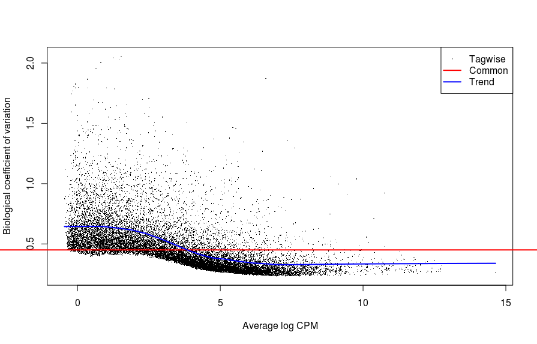
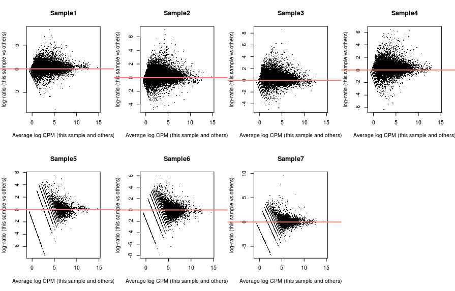
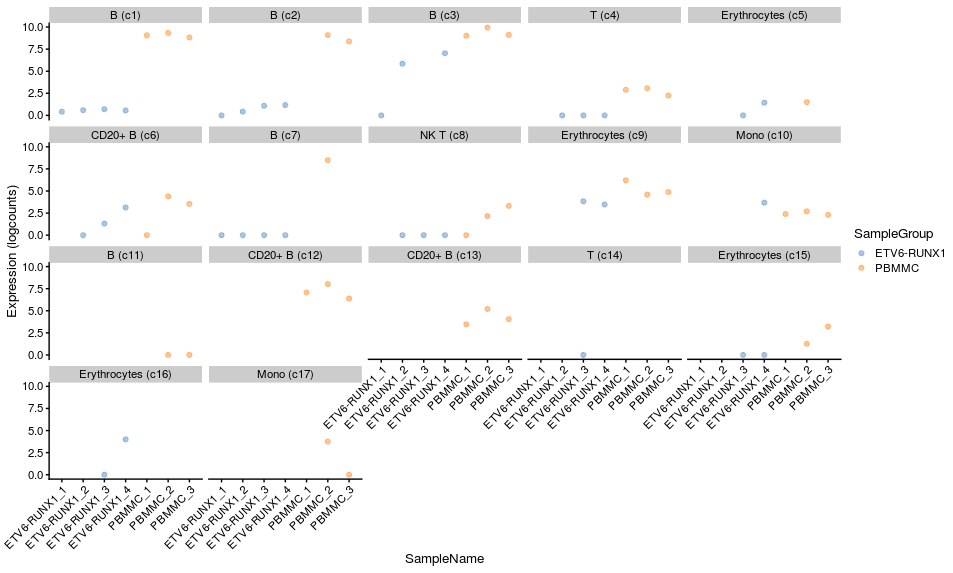

# 9. Differential expression analysis 

When we have data for multiple conditions (e.g. control vs treatment, healthy vs diseased, wild-type vs mutant, etc.) and multiple biological replicates for each of them, we can investigate which genes are differentially expressed between conditions. This is similar to what is done in more conventional bulk RNA-seq analysis, but in this case we have the added benefit of being able to do our analysis focusing on particular cell clusters/types (which would not be possible to do in a bulk experiment, unless we had done cell-sorting before the sequencing).

Differential analyses of multi-condition scRNA-seq experiments can be broadly split into two categories:

- **differential** expression (DE) tests for changes in expression between conditions for cells of the same ‘type’ that are present in both conditions.
- **differential** abundance (DA) tests for changes in the composition of cell types (or states, etc.) between conditions.

In this section we will cover the first of these, i.e. how to do a differential expression analysis for a simple design with a single factor (variable) with two levels (conditions). In our case this corresponds to the comparison between cells from healthy (PBMMC) versus leukemia (ETV6-RUNX1) donors.

There are three main steps for a bulk analysis:

- Creating the pseudo-bulk samples
- Filter low-count cells/samples
- Run the differential analysis


!!! r-project-2 "Setup"

    ```r
    # load packages
    library(scater)
    library(scran)
    library(batchelor)
    library(bluster)
    library(edgeR)
    library(tidyverse)
    
    # load the SCE object
    sce <- readRDS("R_objects/Caron_clustered.PBMMCandETV6RUNX1.rds")
    
    # plot UMAP done on the batch-corrected data
    plotReducedDim(sce, dimred = "UMAP_corrected", 
                   colour_by = "label", 
                   text_by = "label")
    ```
## Creating pseudo-bulk samples

Pseudo-bulk samples consist of summing the counts across all the cells for a given **sample** and **cell label** combination. It is up to you to decide what the cell labels should consist of. In our case, we’re using the Leiden clusters, which were further manually annotated according to cell types. But you may have defined these labels, for example, based on a more systematic cell type annotation using public atlases or reference gene panels

To revise, here is how our sample + label combinations look like:

!!! r-project-2 "Tabulate number of cells per label + sample combination"

    ```r
    table(sce$label, sce$SampleName)
    ```

    We can see that the contribution of each sample to the different labels (clusters) is quite unbalanced for some of them. This may be biologically correct, or it may prompt us to revise our batch correction step. For now, we will proceed with these data as they are.

    We use label and SampleName as the variables to aggregate by. We therefore will have a maximum of 7x17 (119) pseudo-samples. We will have less than this because, as we saw, there are some clusters with no cells from a particular sample.

    ```r
    # sum counts across cells - by label and sample
    summed <- aggregateAcrossCells(sce, 
                                   ids = colData(sce)[, c("label", "SampleName")])

    # the output is a new SCE object with aggregated counts matrix
    summed
    ```

## Run differential expression

Now that we have pseudo-bulk samples, we can proceed to our differential expression analysis. This can be done using standard bulk RNA-seq R/Bioconductor packages, such as edgeR, DESeq2 or limma. In our case, we will use helper functions from scran, which, behind the scenes, use the edgeR package. If you are experienced in this sort of analysis, you could certainly use one of the other packages if you are more familiar with them.

Before we run the actual differential analysis, we will filter pseudo-samples with low number of cells. Conveniently, the `aggregateAcrossCells()` function creates a new variable in our `colData()` slot with this information, so we can use it to do our filtering.

!!! r-project "code"

    ```r
    # "ncells" is added to our colData
    colData(summed)[, c("SampleName", "ncells")]
    ```
    ```r
    # use this to filter our pseudo-bulk object
    summed <- summed[, summed$ncells >= 20]
    ```

We are now ready for our differential analysis. The scran package includes the function pseudoBulkDGE(), which conveniently loops through each label and performs the differential analysis between the two conditions.

!!! r-project-2 "Here is the syntax for this step, with an explanation of the options to follow:"

    ```r
    # perform differential analysis for each label
    # this uses edgeR package behind the scenes.
    de_results <- pseudoBulkDGE(summed, 
                                label = summed$label,
                                design = ~ SampleGroup, 
                                coef = "SampleGroupPBMMC",
                                condition = summed$SampleName)
    ```

There’s a few options here we need to explain.

First, the `design = ~ SampleGroup` option. This is R’s formula syntax for defining linear models. In this case, we are indicating that we want to model the gene expression based on the “SampleGroup” variable of our `colData()`. This formula is converted to a so-called design matrix, which is internally used by the statistical machinery to fit the model to the data and perform a statistical test against a null hypothesis.

It is useful to see what this model matrix looks like, to understand the next argument in this function (`coef = "SampleGroupPBMMC"`).

!!! r-project "code"
    ```r
    # the model matrix being used by edgeR
    head(model.matrix(~ SampleGroup, data = colData(summed)))
    ```
This matrix contains an indicator variable (with 0’s and 1’s) indicating which sample belongs to the PBMMC group. If we want to test for differential expression between our “ETV6-RUNX1” group and “PBMMC”, we need to specify the name of this indicator variable to the pseudoBulkDGE() function, as we did above.

It may seem strange to have to do this, in this case, as we only have two groups. But if you had more than two groups (e.g. if we also had the “HDD” samples), then there would be more possible comparisons to do.

Finally, we specified the option condition = summed$SampleName, which is used to automatically filter low-count genes.

Looking at our output object, we can see that this is a list of DataFrame tables, containing the results of the analysis:

!!! r-project "code"

    ```r
    # the results come as a list for each cell label
    de_results
    ```
    ```r
    # extract one of the tables from the list
    b_c1_res <- de_results[[1]]
    ```

    - These output tables contain metadata with the edgeR object that was used to fit the model, and we can use them for further **quality-control analysis**. For example, looking at the first of these comparisons for B cells present in our original cluster 1:

    ```r
    # extract the edgeR object used for differential expression
    b_c1_dgelist <- metadata(b_c1_res)$y

    # plot mean-CV relationship across genes
    plotBCV(b_c1_dgelist)
    ```

    <center>{width="500"}</center>

    ```r
    # plot mean-difference plot to assess library size normalisation
    # we expect symmetrical distribution centered around zero
    par(mfrow=c(2,4))
    for (i in seq_len(ncol(b_c1_dgelist))) {
      plotMD(b_c1_dgelist, column=i)
      abline(h = 0, col = "salmon", lwd = 2)
    }
    ```
    <center>{width="500"}</center>

    ```r
    # plot MDS 
    plotMDS(cpm(b_c1_dgelist, log = TRUE), 
            col = ifelse(b_c1_dgelist$samples$SampleGroup == "PBMMC", "tomato", "steelblue"))
    ```

    - The latter plot represents a projection of the data on a 2-dimensional plot using a dimensionality reduction method similar to PCA. This is useful to check if our samples separate in the way we may expect, given their different conditions. In this case we can see that the first dimension explains ~40% of the variance in the data and separates our samples according to their sample group, which would make sense biologically if their states are distinct between leukemia and healthy samples.

    We could further loop through all the results to produce a matrix of plots (this code is a little more advanced, but gives you an idea of how you could do this):

    ```r
    # loop through all results
    lapply(de_results, function(current_result){
      # extract the edgeR object from the metadata
      current_result <- metadata(current_result)$y
    
      # make a colour scale
      mds_cols <- ifelse(current_result$samples$SampleGroup == "PBMMC", "tomato", "steelblue")
    
      # identify the cell label this corresponds to
      mds_title <- unique(current_result$samples$label)
    
      # make the plot
      # note the `col` and `main` options are standard options in the base R plot()
      plotMDS(cpm(current_result, log = TRUE), 
              col = mds_cols, main = mds_title)
    })
    ```
    <center>{width="500"}</center>


## Obtaining DE genes

After running the differential expression analysis, we can look at the differentially expressed genes for each cell type label. We can use the decideTestsPerLabel() function to achieve this, which allows us to define a false-discovery rate threshold (adjusted p-value), depending on our desired level of stringency.

!!! r-project "code"

    ```r
    # identify DEGs based on FDR threshold
    is_de <- decideTestsPerLabel(de_results, threshold = 0.05)
    ```
    ```r
    # this outputs a large matrix
    is_de[1:10, 1:5]
    ```
The output is a large matrix (genes x label) containing the following values:

- `-1` and `1`indicating the gene was down- or up-regulated in PBMMC samples, respectively
- `0` indicating the gene was not differentially expressed
- `NA` indicating there wasn’t enough data to carry the test (e.g. all the replicates had zero counts in one of the groups)
This matrix can be hard to interpret by itself, but we can summarise it as follows:

!!! r-project "code"

    ```r
    # summarise the results
    summarizeTestsPerLabel(is_de)
    ```
We can see that there is a very large number of NA values in the results. This reflects the fact that many genes may not be sufficiently expressed in a given cell type to perform the statistical analysis, which should not surprise us given the sparsity often seen in single-cell data.

However, we still get hundreds of genes differentially expressed in some of these clusters, suggesting differences between leukemia and healthy samples.

Let’s look at one of the top genes for one the B cell (cluster 1) label that we extracted out of our results list earlier.

!!! r-project "code"

    ```r
    # filter the results table for DEGs
    b_c1_res %>% 
      as.data.frame() %>% 
      arrange(FDR) %>%
      head()
    ```
    ```r
    # remove size factors from the object (otherwise plotting function complains)
    # and add normalised log counts to the object
    sizeFactors(summed) <- NULL
    summed <- logNormCounts(summed)

    # visualise from our summed single cell object
    plotExpression(summed, 
                   features = "HTR1F",
                   x = "SampleName", colour_by="SampleGroup", 
                   other_fields="label") + 
      facet_wrap(~ label) +
      scale_x_discrete(guide = guide_axis(angle = 45))
    ```
    <center>{width="600"}</center>

??? clipboard-question "Exercise"

    We want to achieve the following:

    - Rerun the differential expression analysis using the PRE-T and HHD samples.
    - Determine which cluster has the most DEGs.
    - Visualise the expression of one of the top genes for that cluster.

    ```r
    # First load in the other two sample groups
    sce_PRET_HHD <- readRDS("R_objects/Caron_clustered.PRETandHHD.rds")
    ```
