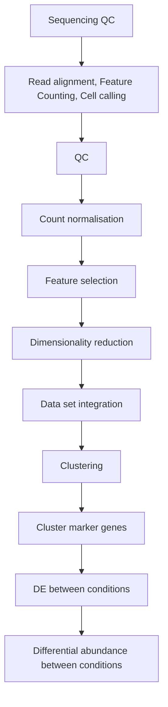

# Analysis of single cell RNA-seq data

!!! circle-info "For Deverlopers"
    - working directory `/nesi/project/nesi02659/sc-rna-data`
    - Use `sc-RNA/2023-07-gimkl-2022a-R-bundle-Bioconductor-3.15-R-4.2.1` ( OR just `sc_RNA`) module which contains all of the required R packahges 

!!! database "Data set"

    - Data used in this workshop is based on [CaronBourque2020](https://www.nature.com/articles/s41598-020-64929-x_) relating to pediatric leukemia, with four sample types, including:
        - pediatric Bone Marrow Mononuclear Cells (PBMMCs)
        - three tumour types: ETV6-RUNX1, HHD, PRE-T

## Workflow for **developers**

!!! info ""

!!! check-to-slot "Prerequisites"
 
    - [x] Inermediate level knowledge on R (programming language)
    - [x] Familiarity with terminal and basic linux commands
    - [x] Some knowledge on shell environment variables and `for` loops
    - [x] Ability to use a terminal based text editor such as `nano` 
        * [ ] This is not much of an issue as we are using JupyterHub which has a more friendlier text editor.   
    - [x] Intermediate level knowledge on Molecular Biology and Genetics

    **Recommended but not required**

    - [ ] Attend [Genomics Data Carpentry](https://datacarpentry.org/genomics-workshop/),  [RNA-Seq Data Analysis](https://genomicsaotearoa.github.io/RNA-seq-workshop/), [Introduction to R](https://genomicsaotearoa.github.io/Introduction-to-R/) and/or [Intermediate R](https://genomicsaotearoa.github.io/Intermediate-R/)

 