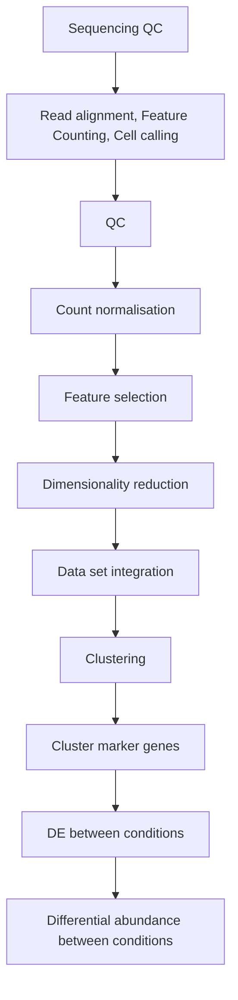

# Analysis of single cell RNA-seq data

!!! circle-info "For Deverlopers"

    Use `sc-RNA/2023-07-gimkl-2022a-R-bundle-Bioconductor-3.15-R-4.2.1` ( OR just `sc_RNA`) module which contains all of the required R packahges 

!!! database "Data set"

    - Data used in this workshop is based on [CaronBourque2020](https://www.nature.com/articles/s41598-020-64929-x_) relating to pediatric leukemia, with four sample types, including:
        - pediatric Bone Marrow Mononuclear Cells (PBMMCs)
        - three tumour types: ETV6-RUNX1, HHD, PRE-T

    

